# CTS-Core Architecture

> **Версия документа**: 1.2.0
> **Обновлено**: 2026-03-10
> **Статус**: Актуализирован (Phase 1.4 завершен, Phase 1.5 частично)

## Оглавление

0. [Статус реализации](#0-статус-реализации)
1. [Обзор системы](#1-обзор-системы)
2. [Принятые решения](#2-принятые-решения)
3. [Целевая архитектура](#3-целевая-архитектура)
4. [Компоненты системы](#4-компоненты-системы)
5. [Протоколы и коммуникация](#5-протоколы-и-коммуникация)
6. [Безопасность](#6-безопасность)
7. [Распределение задач](#7-распределение-задач)
8. [Отказоустойчивость](#8-отказоустойчивость)
9. [API Design](#9-api-design)
10. [База данных](#10-база-данных)
11. [План разработки](#11-план-разработки)

---

## 0. Статус реализации

Срез по коду на 2026-03-10:

- Реализовано: config/logger, MySQL client + repositories, HSM clients (Trading + 2FA), state manager, REST `/health` `/ready` `/live`, WS handler stub.
- Частично: REST/WS integration foundation.
- Не завершено: `/metrics` + Prometheus wiring, полный runtime WS protocol layer (`trader.register`, `trader.heartbeat`), session manager и scheduler runtime logic.

Документ ниже описывает целевую архитектуру. Для фактического статуса приоритет у кода и `DEVELOPMENT_PLAN.md`.

---

## 1. Обзор системы

### 1.1 Назначение CTS-Core

**CTS-Core** (Crypto Trading System Core) — центральный оркестратор для распределённой системы арбитражной торговли криптовалютами.

**Ключевые функции:**
- Центральная точка управления всеми торговыми/мониторинговыми демонами (traders).
- Проксирование доступа к MySQL для traders - сохранение результатов арбитражных сделок, ордеров и транзакций
- Сбор метрик и мониторинг состояния всех traders 
- Интеллектуальное распределение задач между traders в зависимости от скорости соединения с биржами и загруженностью traders
- API для веб-интерфейса, traders и других внешних систем
- Дублирование задач мониторинга

### 1.2 Ограничения и требования

**Архитектурные ограничения:**
- ❌ Не используем брокеры сообщений (Kafka, RabbitMQ) — минимизация задержек
- ✅ mTLS между всеми компонентами
- ✅ Отдельные VM для каждого критического сервиса
- ✅ Масштабирование: поддержка 50+ трейдеров

**Требования к производительности:**
- Latency WebSocket: < 1ms внутри сети
- Время реакции на события биржи: < 10ms
- Downtime при сбое одного трейдера: 0 (failover)

## 2. Принятые решения

### 2.1 Базовые архитектурные решения

| # | Вопрос | Решение | Обоснование |
|---|--------|---------|-------------|
| 1 | Доступ трейдеров к HSM | **Напрямую (A)** | CTS-Core передаёт зашифрованные DEK + credentials бирж, а трейдер сам расшифровывает через HSM. Ничего не передаётся в открытом виде. |
| 2 | Доступ трейдеров к ClickHouse | **Напрямую (A)** | Не перегружаем канал и сервер CTS-Core tick + snapshot data |
| 3 | Failover CTS-Core | **Заложить, но не реализовывать** | Возможность на вырост, пока обходимся быстрым рестартом |
| 4 | Приоритет стратегий | **Cross-exchange → Triangular → Limit+Market** | Cross-exchange: мониторинг N бирж, арбитраж на 2-х самых профитных |
| 5 | Futures/DEX | **Заложить архитектуру, заглушки** | Не реализуем сейчас, но структура должна поддерживать |
| 6 | Инфраструктура | **Dev: Docker, Prod: VM Debian** | Гибкость для разработки, стабильность для production |
| 7 | Глубина стакана, TTL | **Вынести в настройки** | Будет определено позже |
| 8 | Логирование | **JSON + stdout + file (slog + lumberjack)** | Единый стандарт observability в CT-SYSTEM |
| 9 | Сертификаты трейдеров | **Вручную через CA** | Полный контроль над PKI |

### 2.2 Phase 1 архитектурные решения (Январь 2026)

| # | Компонент | Решение | Детали |
|---|-----------|---------|--------|
| 10 | **Trader Registration** | Гибридный подход | Admin pre-registration (TRADER table) + trader auto-connect via WebSocket |
| 11 | **State Persistence** | Local file + MySQL | `daemon.state` (local) + MySQL sync для Phase 1, Redis для Phase 2 |
| 12 | **Failover Strategy** | Single instance + trader resilience | Без Active-Passive кластера, быстрый restart, traders переподключаются автоматически |
| 13 | **Database Schema** | 7 новых таблиц | TRADER, TRADER_SESSION, EXCHANGE_LIMITS, TRADER_EXCHANGE_RESOURCE, ARBITRAGE_ORDER, ORDER_TRANSACTION, MONITORING (ALTER) |
| 14 | **Idempotency** | Core создает ARBITRAGE_TRANS | Минимальная латентность: Core создает ID при task.assign, trader торгует сразу |
| 15 | **API Split** | WebSocket + REST | WebSocket для real-time (traders, monitoring), REST для CRUD/admin |
| 16 | **Retry Policy** | Exponential backoff | По типам операций: API (3 retry, 1s base), DB (5 retry, 100ms base), Exchange (3 retry, 2s base) |
| 17 | **Circuit Breaker** | Отложено на Phase 2 | Не критично для MVP, retry policy достаточно |
| 18 | **Metrics** | Prometheus + Grafana | 20+ метрик, /metrics endpoint, 4 dashboard (overview, performance, errors, system) |
| 19 | **Logging Format** | JSON | Dev: JSON to stdout+file, Prod: JSON file only, библиотека: slog |
| 20 | **Timeout Values** | Стандартизированные | heartbeat=5s, timeout=15s, grace=60s, failover=60s |
| 21 | **Trader Capacity** | Phase 1 ограничения | DEV: 3 traders max, PROD: 2 traders max (инфраструктурные лимиты) |
| 22 | **Load Balancing** | Scoring алгоритм | Latency 50%, Load 30%, Resources 20% (без региона) |
| 23 | **Rate Limiting** | Token bucket | REST: 1000 req/min, WebSocket: 10000 msg/min per connection |
| 24 | **Audit Log** | Гибридный | PRIMARY: JSON файл (/var/log/cts-core/audit.log), SECONDARY: MySQL для Phase 2 (UI) |
| 25 | **Error Codes** | 27 стандартизированных | Группировка: client errors (4xx), server errors (5xx), детали в API_SPECIFICATION.md |

---

## 3. Целевая архитектура

### 3.1 High-Level Architecture - Overview 

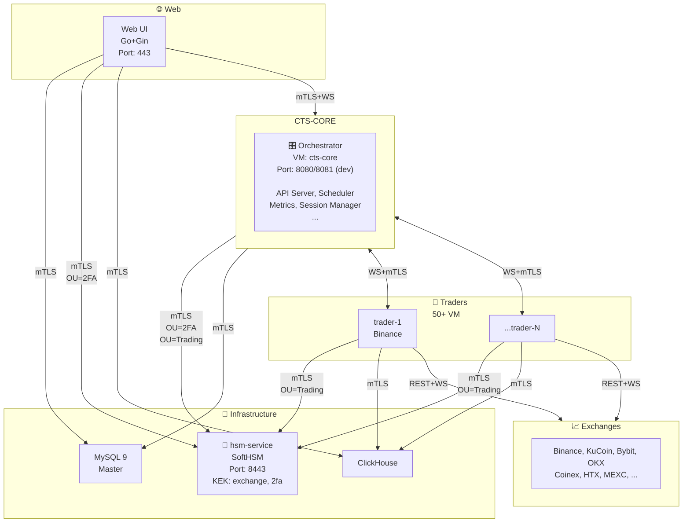

### 3.2 High-Level Architecture - CTS-Core Internal (Mermaid)

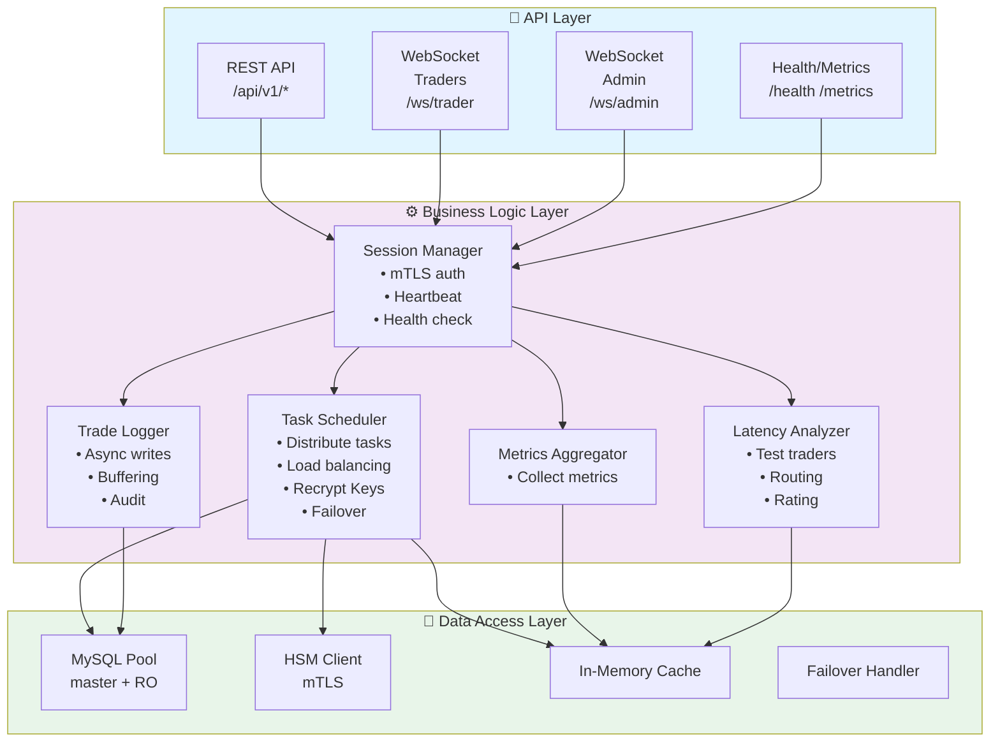

## 4. Компоненты системы

### 4.1 Поток данных 

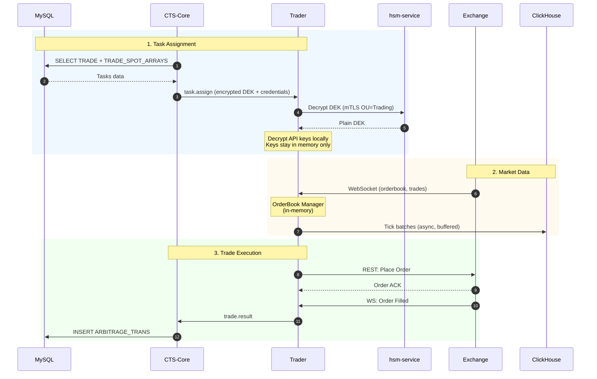

### 4.2 Trader Structure (ASCII)

**Ответственность:**
- Подключение к биржам (WebSocket + REST)
- Сбор рыночных данных (orderbook, trades)
- Исполнение торговых стратегий
- Отправка ордеров
- Запись tick data в ClickHouse

> **Примечание:** Историческая базовая структура trader была в daemon2. Актуальный сервис в этом workspace: `/services/trader/`.

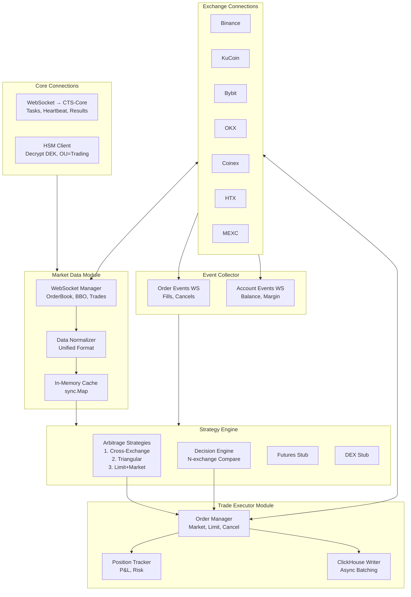

---

## 5. Протоколы и коммуникация

### 5.1 WebSocket Protocol (CTS-Core ↔ Traders)

```
┌─────────────────────────────────────────────────────────────────────────────────────┐
│                           WEBSOCKET MESSAGE PROTOCOL                                │
├─────────────────────────────────────────────────────────────────────────────────────┤
│                                                                                     │
│  Message Format (JSON):                                                             │
│  {                                                                                  │
│      "id": "uuid-v4",                 // Уникальный ID сообщения                    │
│      "type": "request|response|event", // Тип сообщения                             │
│      "action": "string",               // Действие                                  │
│      "payload": { ... },               // Данные                                    │
│      "timestamp": 1737823200000,       // Unix ms                                   │
│      "correlation_id": "uuid"          // Для request/response паттерна             │
│  }                                                                                  │
│                                                                                     │
│  ═══════════════════════════════════════════════════════════════════════════════    │
│                           СООБЩЕНИЯ: TRADER → CORE                                  │
│  ═══════════════════════════════════════════════════════════════════════════════    │
│                                                                                     │
│  1. REGISTRATION (при подключении)                                                  │
│  {                                                                                  │
│      "type": "request",                                                             │
│      "action": "trader.register",                                                   │
│      "payload": {                                                                   │
│          "trader_id": "trader-eu-1",                                                │
│          "version": "1.0.0",                                                        │
│          "capabilities": ["binance", "kucoin"],                                     │
│          "region": "eu-frankfurt",                                                  │
│          "metrics": {                                                               │
│              "cpu_cores": 4,                                                        │
│              "memory_gb": 16,                                                       │
│              "current_load": 0.15                                                   │
│          }                                                                          │
│      }                                                                              │
│  }                                                                                  │
│                                                                                     │
│  2. HEARTBEAT (каждые 5 сек)                                                        │
│  {                                                                                  │
│      "type": "event",                                                               │
│      "action": "trader.heartbeat",                                                  │
│      "payload": {                                                                   │
│          "trader_id": "trader-eu-1",                                                │
│          "status": "active|idle|busy",                                              │
│          "active_tasks": 5,                                                         │
│          "active_ws_connections": 3,                                                │
│          "metrics": {                                                               │
│              "cpu_usage": 0.45,                                                     │
│              "memory_usage": 0.60,                                                  │
│              "orders_per_second": 12.5                                              │
│          }                                                                          │
│      }                                                                              │
│  }                                                                                  │
│                                                                                     │
│  3. TRADE RESULT (после исполнения ордера)                                          │
│  {                                                                                  │
│      "type": "event",                                                               │
│      "action": "trade.result",                                                      │
│      "payload": {                                                                   │
│          "arbitrage_id": 12345,                                                     │
│          "status": "completed|partial|failed",                                      │
│          "orders": [                                                                │
│              {                                                                      │
│                  "exchange": "binance",                                             │
│                  "order_id": "abc123",                                              │
│                  "side": "buy",                                                     │
│                  "price": "50000.00",                                               │
│                  "quantity": "0.5",                                                 │
│                  "filled": "0.5",                                                   │
│                  "status": "filled"                                                 │
│              }                                                                      │
│          ],                                                                         │
│          "profit": "15.50",                                                         │
│          "fees": "2.00"                                                             │
│      }                                                                              │
│  }                                                                                  │
│                                                                                     │
│  4. LATENCY TEST RESPONSE                                                           │
│  {                                                                                  │
│      "type": "response",                                                            │
│      "action": "latency.test",                                                      │
│      "correlation_id": "original-request-id",                                       │
│      "payload": {                                                                   │
│          "exchange": "binance",                                                     │
│          "ping_ms": 45,                                                             │
│          "order_latency_ms": 120,                                                   │
│          "ws_latency_ms": 15                                                        │
│      }                                                                              │
│  }                                                                                  │
│                                                                                     │
│  ═══════════════════════════════════════════════════════════════════════════════    │
│                           СООБЩЕНИЯ: CORE → TRADER                                  │
│  ═══════════════════════════════════════════════════════════════════════════════    │
│                                                                                     │
│  1. TASK ASSIGNMENT (новое задание)                                                 │
│  {                                                                                  │
│      "type": "request",                                                             │
│      "action": "task.assign",                                                       │
│      "payload": {                                                                   │
│          "task_id": "uuid",                                                         │
│          "task_type": "trade|monitor|latency_test",                                 │
│          "trade": {                                                                 │
│              "trade_id": 123,                                                       │
│              "user_id": 1,                                                          │
│              "strategy": "cross_exchange",                                          │
│              "pairs": [                                                             │
│                  {                                                                  │
│                      "exchange_account_id": 1,                                      │
│                      "pair_id": 456,                                                │
│                      "symbol": "BTC/USDT",                                          │
│                      "side": "buy"                                                  │
│                  },                                                                 │
│                  {                                                                  │
│                      "exchange_account_id": 2,                                      │
│                      "pair_id": 789,                                                │
│                      "symbol": "BTC/USDT",                                          │
│                      "side": "sell"                                                 │
│                  }                                                                  │
│              ],                                                                     │
│              "credentials_encrypted": "base64..."                                   │
│          }                                                                          │
│      }                                                                              │
│  }                                                                                  │
│                                                                                     │
│  2. TASK CANCEL                                                                     │
│  {                                                                                  │
│      "type": "request",                                                             │
│      "action": "task.cancel",                                                       │
│      "payload": {                                                                   │
│          "task_id": "uuid",                                                         │
│          "reason": "user_request|failover|rebalance"                                │
│      }                                                                              │
│  }                                                                                  │
│                                                                                     │
│  3. CONFIG UPDATE                                                                   │
│  {                                                                                  │
│      "type": "event",                                                               │
│      "action": "config.update",                                                     │
│      "payload": {                                                                   │
│          "trade_id": 123,                                                           │
│          "changes": {                                                               │
│              "max_amount_trade": "1000.00",                                         │
│              "min_delta_profit": "0.5"                                              │
│          }                                                                          │
│      }                                                                              │
│  }                                                                                  │
│                                                                                     │
│  4. SHUTDOWN REQUEST                                                                │
│  {                                                                                  │
│      "type": "request",                                                             │
│      "action": "trader.shutdown",                                                   │
│      "payload": {                                                                   │
│          "grace_period_ms": 30000,                                                  │
│          "cancel_pending_orders": true                                              │
│      }                                                                              │
│  }                                                                                  │
│                                                                                     │
└─────────────────────────────────────────────────────────────────────────────────────┘
```

### 5.2 Trader Registration & Task Assignment

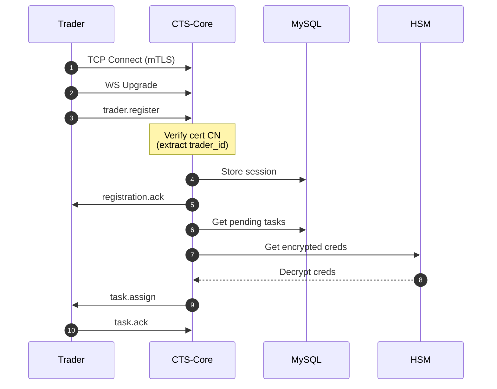

### 5.3 Arbitrage Trade Execution

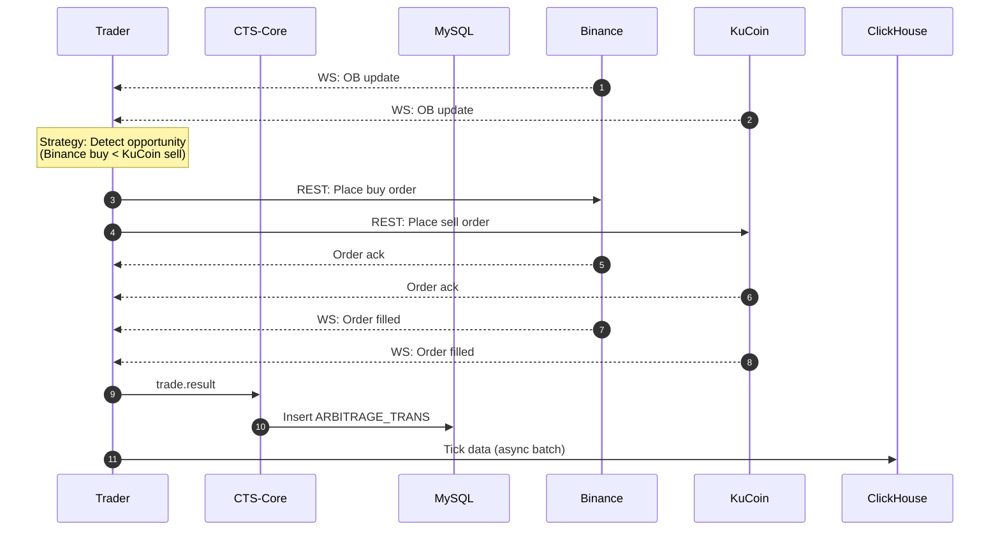

### 5.4 Trader Failover

```mermaid
sequenceDiagram
    autonumber
    participant T1 as Trader-1
    participant T2 as Trader-2
    participant Core as CTS-Core
    participant MySQL
    participant Exchange
    
    T1->>Core: heartbeat
    Note over T1: DISCONNECT / TIMEOUT
    destroy T1
    Note over Core: Detect trader-1 down
    Note over Core: Find backup trader
    Core->>MySQL: Get trader-1 tasks
    Core->>T2: task.assign (failover)
    T2->>Core: task.ack
    T2->>Exchange: Cancel pending orders
    Note over T2: Continue trading
```

---

## 6. Безопасность

### 6.1 Многоуровневая защита (ASCII)

```
┌─────────────────────────────────────────────────────────────────────────────────────┐
│                              SECURITY LAYERS                                        │
├─────────────────────────────────────────────────────────────────────────────────────┤
│                                                                                     │
│  Layer 1: Network (mTLS everywhere)                                                 │
│  ┌────────────────────────────────────────────────────────────────────────────────┐ │
│  │  • TLS 1.3 only                                                                │ │
│  │  • Mutual authentication (клиент и сервер проверяют друг друга)                │ │
│  │  • Certificate-based identity (CN = trader-id / service-name)                  │ │
│  │  • Certificate revocation via revoked.yaml (hot reload)                        │ │
│  │  • Private CA (не публичные сертификаты)                                       │ │
│  │  • Сертификаты трейдеров создаются вручную через CA                            │ │
│  └────────────────────────────────────────────────────────────────────────────────┘ │
│                                                                                     │
│  Layer 2: Authentication                                                            │
│  ┌────────────────────────────────────────────────────────────────────────────────┐ │
│  │  • mTLS certificate = primary identity                                         │ │
│  │  • OU-based access control:                                                    │ │
│  │    - OU=Trading → доступ к context=exchange-key                                │ │
│  │    - OU=2FA     → доступ к context=2fa                                         │ │
│  │    - OU=WebAdmin → доступ к API CTS-Core                                       │ │
│  └────────────────────────────────────────────────────────────────────────────────┘ │
│                                                                                     │
│  Layer 3: Authorization (ACL)                                                       │
│  ┌────────────────────────────────────────────────────────────────────────────────┐ │
│  │  • Trader может работать только с назначенными ему задачами                    │ │
│  │  • Web может только читать статусы и отправлять команды управления             │ │
│  │  • Web напрямую обращается к HSM для 2FA операций                              │ │
│  │  • CTS-Core не имеет доступа к 2FA secrets (разделение контекстов)             │ │
│  └────────────────────────────────────────────────────────────────────────────────┘ │
│                                                                                     │
│  Layer 4: Data Protection                                                           │
│  ┌────────────────────────────────────────────────────────────────────────────────┐ │
│  │  • API keys шифруются в БД (envelope encryption)                               │ │
│  │  • KEK хранится в HSM (никогда не покидает)                                    │ │
│  │  • DEK генерируется для каждого аккаунта биржи                                 │ │
│  │  • CTS-Core передаёт encrypted DEK + credentials трейдеру                      │ │
│  │  • Трейдер расшифровывает DEK напрямую через HSM (OU=Trading)                  │ │
│  │  • Расшифрованные ключи остаются только в памяти трейдера                      │ │
│  └────────────────────────────────────────────────────────────────────────────────┘ │
│                                                                                     │
│  Layer 5: Audit                                                                     │
│  ┌────────────────────────────────────────────────────────────────────────────────┐ │
│  │  • Локальное логирование на каждой VM                                          │ │
│  │  • Trade log отдельно для минимизации задержек                                 │ │
│  │  • Prometheus metrics                                                          │ │
│  └────────────────────────────────────────────────────────────────────────────────┘ │
│                                                                                     │
└─────────────────────────────────────────────────────────────────────────────────────┘
```

### 6.2 Компоненты безопасности и их связи (Mermaid)

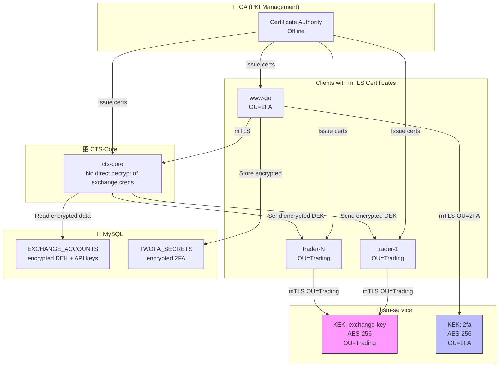

### 6.3 Credential Flow: Trader получает API keys

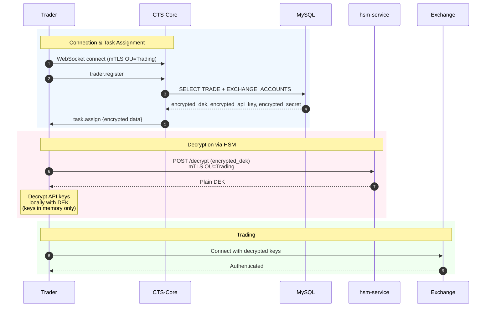

### 6.5 2FA Flow: Web → HSM (Mermaid)

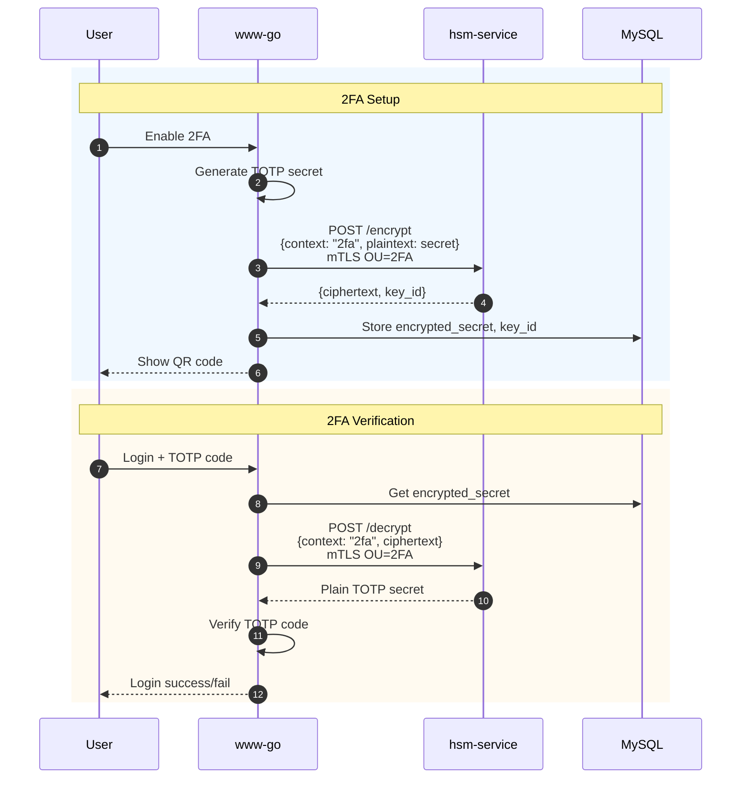

### 6.6 Rate Limiting & Security Policies (Phase 1)

**Rate Limiting (Token Bucket):**

```yaml
REST API:
  /api/v1/* : 1000 requests/min per IP
  /health, /metrics : unlimited (monitoring)
  
WebSocket:
  Connections: 50 per IP
  Messages: 10000 msg/min per connection
  
Response (429 Too Many Requests):
  Headers:
    - X-RateLimit-Limit: 1000
    - X-RateLimit-Remaining: 847
    - X-RateLimit-Reset: 1706454345 (unix timestamp)

Implementation:
  - Library: github.com/ulule/limiter/v3
  - Storage: In-memory для Phase 1, Redis для Phase 2
  - Middleware для Gin router
```

**Retry Policies (Exponential Backoff):**

```yaml
API CALLS (CTS-Core → MySQL/HSM):
  max_retries: 5
  base_delay: 100ms
  max_delay: 5s
  multiplier: 2
  jitter: true
  
DATABASE QUERIES:
  max_retries: 3
  base_delay: 100ms
  max_delay: 2s
  multiplier: 2
  
EXCHANGE API (Trader → Exchange):
  max_retries: 3
  base_delay: 2s
  max_delay: 10s
  multiplier: 2
  timeout: 10s

WEBSOCKET RECONNECT:
  max_retries: infinite
  base_delay: 1s
  max_delay: 60s
  multiplier: 2
```

**Circuit Breaker:** Отложено на Phase 2 (не критично для MVP)

### 6.7 HSM Key Rotation & Re-encryption (Phase 1)

**Проблема:** hsm-service поддерживает key rotation, но нужно перешифровать все данные на новый ключ.

**Затронутые таблицы:**
```yaml
EXCHANGE_ACCOUNTS:
  ✅ Уже готово к rotation
  - ENC_KEY_VERSION (INT) - версия KEK из key_id
  - DEK_ENC, API_KEY_ENC, SECRET_KEY_ENC, ADD_KEY_ENC
  
USER_2FA:
  ⚠️ Требует миграции
  - SECRET_ENC, RECOVERY_CODES_ENC
  - ❌ Не было ENC_KEY_VERSION (добавлено в миграции)
  - ✅ Добавлен флаг needs_reencryption

Note: enc_alg НЕ хранится - HSM API не использует его (всегда AES-256-GCM)
      Алгоритм встроен в key_id: kek-2fa-v1, kek-exchange-key-v2
```

**Key Rotation процесс:**

```
1. ADMIN INITIATES KEY ROTATION:
   - Admin создает новый KEK в hsm-service (key rotation)
   - Новая версия KEK: v2 (старая: v1)
   
2. CTS-CORE SCHEDULER DETECTS:
   - Запрос к HSM: GET /keys/metadata → получает current_version=2
   - Сравнение с данными в БД:
     SELECT DISTINCT enc_key_version FROM EXCHANGE_ACCOUNTS WHERE enc_key_version < 2
     SELECT DISTINCT enc_key_version FROM USER_2FA WHERE enc_key_version < 2
   
3. CREATE RE-ENCRYPTION JOB:
   INSERT INTO REENCRYPTION_JOBS (
       job_type = 'exchange_accounts',
       old_key_version = 1,
       new_key_version = 2,
       context = 'exchange-key',
       total_records = (SELECT COUNT(*) FROM EXCHANGE_ACCOUNTS WHERE enc_key_version = 1)
   )
   
4. BATCH RE-ENCRYPTION (background job):
   LOOP:
     - SELECT id FROM EXCHANGE_ACCOUNTS WHERE enc_key_version = 1 LIMIT 100
     - FOR EACH record:
         a) Read encrypted DEK (with v1)
         b) Decrypt via HSM: POST /decrypt {key_version: 1, ciphertext}
         c) Encrypt via HSM: POST /encrypt {key_version: 2, plaintext}
         d) UPDATE EXCHANGE_ACCOUNTS SET DEK_ENC=new, enc_key_version=2
         e) INSERT INTO REENCRYPTION_PROGRESS (status='completed')
     - IF error: mark failed, continue with next
     - Sleep 100ms between batches (avoid overload)
   UNTIL all records processed
   
5. VERIFICATION:
   - Check all records: enc_key_version = 2
   - Update job status: 'completed'
   - Log to AUDIT_LOG
   
6. OLD KEY DECOMMISSION:
   - Admin can disable old KEK version in hsm-service
   - Keep for 30 days (rollback safety)
```

**Implementation в CTS-Core:**

```go
// internal/scheduler/reencryption.go
type ReencryptionJob struct {
    ID              int
    JobType         string
    OldKeyVersion   int
    NewKeyVersion   int
    Context         string
    Status          string
    TotalRecords    int
    ProcessedRecords int
    FailedRecords   int
    BatchSize       int
}

func (s *Scheduler) CheckReencryptionJobs() {
    // Run every minute (or on-demand via API)
    jobs := s.db.GetPendingReencryptionJobs()
    
    for _, job := range jobs {
        go s.ProcessReencryptionJob(job) // Async
    }
}

func (s *Scheduler) ProcessReencryptionJob(job ReencryptionJob) error {
    // Mark as in_progress
    s.db.UpdateJobStatus(job.ID, "in_progress")
    
    switch job.JobType {
    case "exchange_accounts":
        return s.ReencryptExchangeAccounts(job)
    case "user_2fa":
        return s.ReencryptUser2FA(job)
    }
}

func (s *Scheduler) ReencryptExchangeAccounts(job ReencryptionJob) error {
    for {
        // Get batch
        records := s.db.Query(`
            SELECT ID, DEK_ENC, API_KEY_ENC, SECRET_KEY_ENC, ADD_KEY_ENC
            FROM EXCHANGE_ACCOUNTS
            WHERE enc_key_version = ?
            LIMIT ?
        `, job.OldKeyVersion, job.BatchSize)
        
        if len(records) == 0 {
            break // Done
        }
        
        for _, rec := range records {
            err := s.ReencryptSingleRecord(job, rec)
            if err != nil {
                s.db.MarkRecordFailed(job.ID, rec.ID, err.Error())
                job.FailedRecords++
                continue
            }
            job.ProcessedRecords++
        }
        
        // Update progress
        s.db.UpdateJobProgress(job.ID, job.ProcessedRecords, job.FailedRecords)
        
        // Sleep between batches
        time.Sleep(100 * time.Millisecond)
    }
    
    // Mark complete
    s.db.UpdateJobStatus(job.ID, "completed")
    return nil
}

func (s *Scheduler) ReencryptSingleRecord(job ReencryptionJob, rec Record) error {
    // 1. Decrypt with old key
    dekPlain, err := s.hsm.Decrypt(HSMDecryptRequest{
        Context:    job.Context,
        KeyVersion: job.OldKeyVersion,
        Ciphertext: rec.DEK_ENC,
    })
    if err != nil {
        return fmt.Errorf("decrypt failed: %w", err)
    }
    
    // 2. Encrypt with new key
    dekNew, err := s.hsm.Encrypt(HSMEncryptRequest{
        Context:    job.Context,
        KeyVersion: job.NewKeyVersion,
        Plaintext:  dekPlain,
    })
    if err != nil {
        return fmt.Errorf("encrypt failed: %w", err)
    }
    
    // 3. Update record (within transaction)
    tx := s.db.Begin()
    defer tx.Rollback()
    
    _, err = tx.Exec(`
        UPDATE EXCHANGE_ACCOUNTS
        SET DEK_ENC = ?,
            API_KEY_ENC = ?, -- re-encrypt all fields
            SECRET_KEY_ENC = ?,
            ADD_KEY_ENC = ?,
            enc_key_version = ?
        WHERE ID = ?
    `, dekNew, ..., job.NewKeyVersion, rec.ID)
    
    if err != nil {
        return err
    }
    
    tx.Commit()
    return nil
}
```

**Scheduler Task Registration:**

```sql
-- Проверка на pending re-encryption jobs каждые 60 секунд
INSERT INTO SCHEDULER_TASKS (
    task_name = 'check_reencryption_jobs',
    task_type = 'reencryption',
    schedule_interval_sec = 60,
    enabled = TRUE,
    config = '{"batch_size": 100, "sleep_between_batches_ms": 100}'
);
```

**Admin API для инициации:**

```
POST /api/v1/admin/reencryption/initiate
{
    "job_type": "exchange_accounts",
    "new_key_version": 2,
    "context": "exchange-key"
}

Response:
{
    "job_id": 123,
    "status": "pending",
    "total_records": 1523,
    "estimated_duration_minutes": 15
}

GET /api/v1/admin/reencryption/jobs/{job_id}
{
    "job_id": 123,
    "status": "in_progress",
    "progress_percent": 45.2,
    "processed": 689,
    "failed": 3,
    "total": 1523,
    "started_at": "2026-01-28T15:00:00Z",
    "estimated_completion": "2026-01-28T15:12:00Z"
}
```

**Safety措施:**

1. **Batch processing** - по 100 записей, не перегружаем HSM/DB
2. **Progress tracking** - можно остановить и продолжить
3. **Failed records retry** - не блокирует весь процесс
4. **Rollback safety** - старые ключи хранятся 30 дней
5. **Verification** - после завершения проверяем все записи
6. **Audit trail** - все операции логируются

---

## 7. Распределение задач

### 7.1 Load Balancing Algorithm (Phase 1)

**Алгоритм выбора трейдера для задачи** основан на scoring с тремя факторами:

```go
type AssignmentScore struct {
    TraderID string
    Score    float64
    Details  ScoreBreakdown
}

type ScoreBreakdown struct {
    LatencyScore   float64 // 50% - КРИТИЧНО для арбитража
    LoadScore      float64 // 30% - баланс нагрузки
    ResourceScore  float64 // 20% - доступные лимиты бирж
}

func (s *Scheduler) SelectTrader(task Task, candidates []Trader) *Trader {
    scores := []AssignmentScore{}
    
    for _, trader := range candidates {
        score := s.CalculateScore(trader, task)
        scores = append(scores, score)
    }
    
    // Sort by score DESC
    sort.Slice(scores, func(i, j int) bool {
        return scores[i].Score > scores[j].Score
    })
    
    return scores[0].TraderID
}

func (s *Scheduler) CalculateScore(trader Trader, task Task) AssignmentScore {
    breakdown := ScoreBreakdown{}
    
    // 1. ЛАТЕНТНОСТЬ К БИРЖАМ (вес: 50%)
    var avgLatency float64
    for _, exchangeID := range task.ExchangeIDs {
        latency := s.GetLatency(trader.ID, exchangeID)
        avgLatency += latency
    }
    avgLatency /= float64(len(task.ExchangeIDs))
    
    // Формула: 100 - (latency_ms / 10)
    latencyScore := 100.0 - (avgLatency / 10.0)
    if latencyScore < 0 {
        latencyScore = 0
    }
    breakdown.LatencyScore = latencyScore * 0.5
    
    // 2. ТЕКУЩАЯ ЗАГРУЗКА (вес: 30%)
    loadPercent := float64(trader.ActiveTasks) / float64(trader.MaxTasks) * 100
    loadScore := 100.0 - loadPercent
    breakdown.LoadScore = loadScore * 0.3
    
    // 3. ЛИМИТЫ БИРЖ (вес: 20%)
    resourceScore := s.CheckResourceAvailability(trader, task)
    breakdown.ResourceScore = resourceScore * 0.2
    
    totalScore := breakdown.LatencyScore + breakdown.LoadScore + breakdown.ResourceScore
    
    return AssignmentScore{
        TraderID: trader.ID,
        Score:    totalScore,
        Details:  breakdown,
    }
}
```

**Пример:**
```yaml
ЗАДАЧА: Арбитраж BTC/USDT между Binance + Bybit

TRADER-EU-1 (Frankfurt):
  Latency: (15ms + 20ms) / 2 = 17.5ms → Score: (100 - 1.75) * 0.5 = 49.1
  Load: 30% → Score: 70 * 0.3 = 21.0
  Resources: 92.5% available → Score: 92.5 * 0.2 = 18.5
  TOTAL: 88.6

TRADER-US-1 (New York):
  Latency: (80ms + 90ms) / 2 = 85ms → Score: (100 - 8.5) * 0.5 = 45.75
  Load: 10% → Score: 90 * 0.3 = 27.0
  Resources: 96.5% available → Score: 96.5 * 0.2 = 19.3
  TOTAL: 92.05 ✅ WINNER (несмотря на худшую латентность, свободнее)
```

### 7.2 Task Assignment Algorithm

```
┌─────────────────────────────────────────────────────────────────────────────────────┐
│                         TASK ASSIGNMENT ALGORITHM                                   │
├─────────────────────────────────────────────────────────────────────────────────────┤
│                                                                                     │
│  Input:                                                                             │
│    - TRADE records (from MySQL)                                                     │
│    - Available traders (connected via WebSocket)                                    │
│    - Latency metrics (trader → exchange)                                            │
│    - Load metrics (CPU, memory, active tasks)                                       │
│    - Resource limits (exchange orders/volume per trader)                            │
│                                                                                     │
│  Algorithm:                                                                         │
│                                                                                     │
│  1. LOAD TRADES                                                                     │
│     ┌─────────────────────────────────────────────────────────────────────────────┐ │
│     │  SELECT t.*, tsa.* FROM TRADE t                                             │ │
│     │  JOIN TRADE_SPOT_ARRAYS tsa ON t.ID = tsa.TRADE_ID                          │ │
│     │  WHERE t.ACTIVE = 1                                                         │ │
│     └─────────────────────────────────────────────────────────────────────────────┘ │
│                                                                                     │
│  2. GROUP BY EXCHANGE                                                               │
│     ┌─────────────────────────────────────────────────────────────────────────────┐ │
│     │  Map<ExchangeID, []Trade>                                                   │ │
│     │  {                                                                          │ │
│     │    "binance": [trade_1, trade_5, trade_8],                                  │ │
│     │    "kucoin": [trade_1, trade_2, trade_3],                                   │ │
│     │    "bybit": [trade_4, trade_6]                                              │ │
│     │  }                                                                          │ │
│     └─────────────────────────────────────────────────────────────────────────────┘ │
│                                                                                     │
│  3. SCORE TRADERS (scoring algorithm выше)                                          │
│     ┌─────────────────────────────────────────────────────────────────────────────┐ │
│     │  score = 0.50 * latency_score    // Латентность (50%)                       │ │
│     │        + 0.30 * load_score        // Текущая нагрузка (30%)                 │ │
│     │        + 0.20 * resource_score    // Доступные лимиты (20%)                 │ │
│     └─────────────────────────────────────────────────────────────────────────────┘ │
│                                                                                     │
│  4. ASSIGN TASKS                                                                    │
│     ┌─────────────────────────────────────────────────────────────────────────────┐ │
│     │  for each trade:                                                            │ │
│     │    required_exchanges = trade.exchanges                                     │ │
│     │    best_trader = trader with best combined score for all exchanges          │ │
│     │    assign(trade, best_trader)                                               │ │
│     └─────────────────────────────────────────────────────────────────────────────┘ │
│                                                                                     │
│  5. DUPLICATE MONITORING TASKS                                                      │
│     ┌─────────────────────────────────────────────────────────────────────────────┐ │
│     │  for each exchange:                                                         │ │
│     │    primary_trader = best_trader for exchange                                │ │
│     │    backup_trader = second_best_trader for exchange                          │ │
│     │    assign_monitoring(exchange, primary_trader, backup_trader)               │ │
│     └─────────────────────────────────────────────────────────────────────────────┘ │
│                                                                                     │
└─────────────────────────────────────────────────────────────────────────────────────┘
```

### 7.3 Monitoring Duplication

**Цель:** Обеспечить непрерывность мониторинга при отказе трейдера

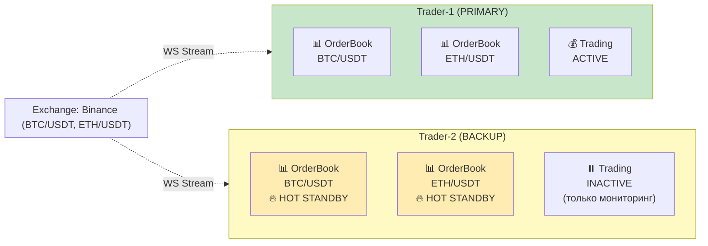

**При отказе Trader-1:**
1. CTS-Core детектирует отказ (heartbeat timeout)
2. Trader-2 уже имеет актуальные данные
3. CTS-Core назначает торговые задачи Trader-2
4. Trader-2 начинает торговать немедленно
5. **Время переключения: < 5 сек**

### 7.3 Task Assignment Flow (Mermaid)

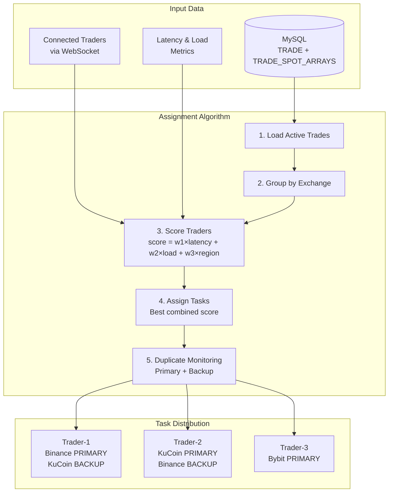

### 7.4 Failover Sequence (Mermaid)

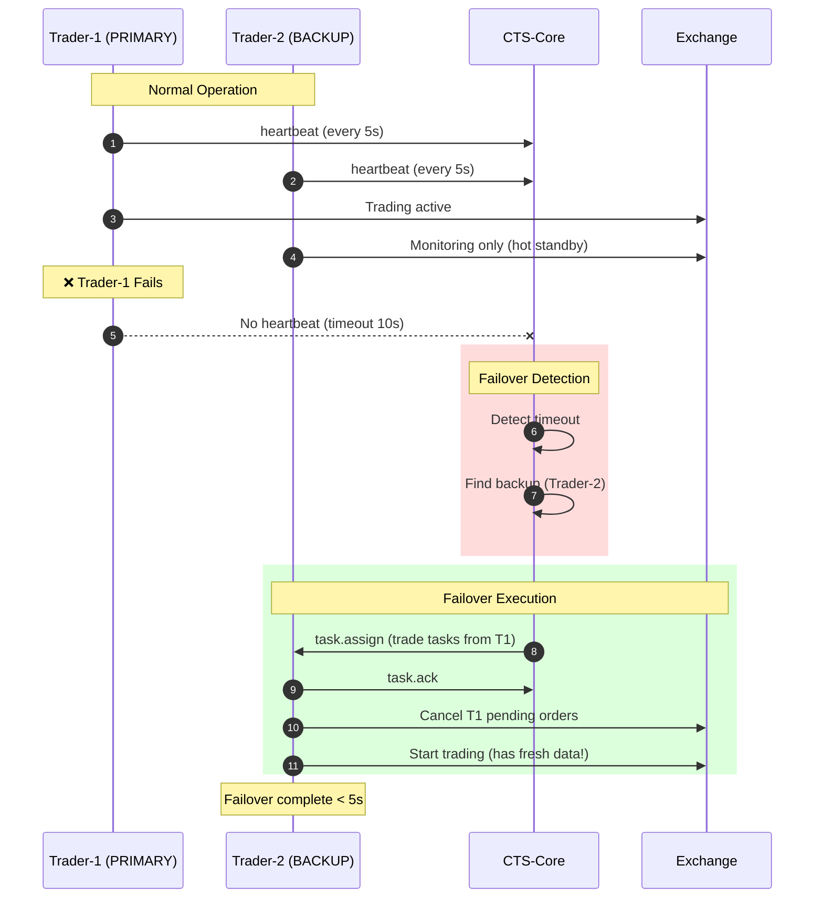

---

## 8. Отказоустойчивость

### 8.1 State Management (Phase 1)

**Двухуровневое хранение состояния:**

```yaml
LOCAL STATE FILE:
  Path: state/daemon.state
  Format: JSON
  Purpose: быстрое восстановление после рестарта
  Content:
    - active_traders: {trader_id: connection_info}
    - task_assignments: {task_id: {trader_id, assigned_at}}
    - last_heartbeats: {trader_id: timestamp}
  
  Update: каждые 5 секунд (debounced)
  Restore: при старте CTS-Core читается first

MYSQL SYNC:
  Tables: TRADER, TRADER_SESSION, MONITORING
  Purpose: persistent storage, cross-restart data
  Content:
    - TRADER: registration info
    - TRADER_SESSION: connection history (7 days)
    - MONITORING: task assignments
  
  Update: async после изменений
  Query: при startup для validation
```

**Восстановление после рестарта:**
```go
// При старте CTS-Core
1. Читать daemon.state (если существует)
2. Восстановить in-memory кеш:
   - active_traders -> SessionManager
   - task_assignments -> Scheduler
3. Reconnect traders:
   - Traders автоматически переподключаются (heartbeat timeout)
   - Восстановление задач через task.reassign
4. Синхронизация с MySQL:
   - UPDATE TRADER_SESSION SET ended_at = NOW() WHERE ended_at IS NULL
   - Cleanup старых сессий (> 7 days)
```

**Преимущества:**
- ✅ Быстрый рестарт (секунды, не минуты)
- ✅ Не зависит от MySQL при старте
- ✅ Persistent хранение для аудита
- ✅ Простота (без Redis для Phase 1)

### 8.2 Trader Registration & Lifecycle

**Гибридный подход:**

```
РЕГИСТРАЦИЯ (Admin):
  1. Admin создает запись в TRADER table:
     INSERT INTO TRADER (id, name, region, max_tasks, status)
     VALUES ('trader-eu-1', 'EU Frankfurt Trader', 'eu', 10, 'registered')
  
  2. CTS-Core знает о трейдере, но он еще offline

ПОДКЛЮЧЕНИЕ (Trader):
  1. Trader запускается с mTLS сертификатом (OU=Trading)
  2. Trader connect к ws://cts-core:8443/ws/trader
  3. CTS-Core проверяет:
     - mTLS certificate (CN=trader-eu-1)
     - Exists в TRADER table
     - Status != 'suspended'
  
  4. CTS-Core создает сессию:
     INSERT INTO TRADER_SESSION (trader_id, connected_at, ip_address)
  
  5. CTS-Core отправляет trader.welcome:
     {
       "action": "trader.welcome",
       "trader_id": "trader-eu-1",
       "assigned_tasks": [...],
       "config": {...}
     }
  
  6. Trader начинает отправлять heartbeat каждые 5s

HEARTBEAT:
  Trader -> CTS-Core: {"action": "heartbeat", "load": 0.3, "active_tasks": 3}
  CTS-Core -> Trader: {"action": "heartbeat.ack"}
  
  Timeout: 15s (3 missed heartbeats)

ОТКЛЮЧЕНИЕ:
  1. Graceful: trader отправляет {"action": "trader.disconnect"}
  2. Force: heartbeat timeout
  3. CTS-Core:
     - Failover задач на других трейдеров
     - UPDATE TRADER_SESSION SET ended_at = NOW()
     - Логирование в audit.log
```

**Timeout Values:**
```yaml
heartbeat_interval: 5s   # Trader sends heartbeat
heartbeat_timeout: 15s   # 3 missed = disconnect
grace_period: 60s        # Wait before cleanup
failover_timeout: 60s    # Max time for task reassignment
```

### 8.3 Failure Scenarios

| Сценарий | Детектирование | Recovery Action | RTO |
|----------|----------------|-----------------|-----|
| Trader disconnect | Heartbeat timeout (15s) | Failover to backup | <20s |
| Trader crash | TCP FIN/RST | Failover + cancel orders | <10s |
| CTS-Core crash | Trader detects disconnect | Trader pauses, waits | 30s |
| MySQL down | Connection pool error | Reconnect with backoff, use local state | <60s |
| HSM down | API timeout | Use cached DEKs | <5s |
| Exchange WS down | Ping timeout | Reconnect + re-subscribe | <30s |

### 8.4 Failure Recovery (Mermaid)

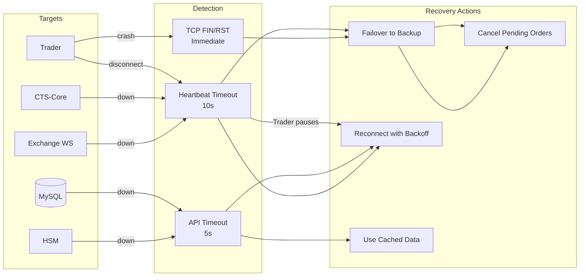

### 8.3 Trader Graceful Shutdown

```
┌─────────────────────────────────────────────────────────────────────────────────────┐
│                         TRADER GRACEFUL SHUTDOWN                                    │
├─────────────────────────────────────────────────────────────────────────────────────┤
│                                                                                     │
│  Trigger: SIGTERM, SIGINT, or shutdown request from CTS-Core                        │
│                                                                                     │
│  Phase 1: STOP ACCEPTING NEW TASKS (0-1s)                                           │
│  ┌────────────────────────────────────────────────────────────────────────────────┐ │
│  │  1. Send "trader.status = draining" to CTS-Core                                │ │
│  │  2. Stop accepting new trade assignments                                       │ │
│  │  3. Continue processing in-flight operations                                   │ │
│  └────────────────────────────────────────────────────────────────────────────────┘ │
│                                                                                     │
│  Phase 2: CANCEL PENDING ORDERS (1-10s)                                             │
│  ┌────────────────────────────────────────────────────────────────────────────────┐ │
│  │  for each active order:                                                        │ │
│  │    1. Send cancel request to exchange                                          │ │
│  │    2. Wait for cancel confirmation (with timeout)                              │ │
│  │    3. Log result                                                               │ │
│  └────────────────────────────────────────────────────────────────────────────────┘ │
│                                                                                     │
│  Phase 3: COMPLETE IN-FLIGHT REQUESTS (10-20s)                                      │
│  ┌────────────────────────────────────────────────────────────────────────────────┐ │
│  │  1. Wait for all REST API requests to complete                                 │ │
│  │  2. Process remaining WebSocket messages                                       │ │
│  │  3. Record all trade results                                                   │ │
│  └────────────────────────────────────────────────────────────────────────────────┘ │
│                                                                                     │
│  Phase 4: FLUSH DATA (20-25s)                                                       │
│  ┌────────────────────────────────────────────────────────────────────────────────┐ │
│  │  1. Send final trade.result to CTS-Core                                        │ │
│  │  2. Flush ClickHouse buffer                                                    │ │
│  │  3. Flush log buffers                                                          │ │
│  └────────────────────────────────────────────────────────────────────────────────┘ │
│                                                                                     │
│  Phase 5: DISCONNECT (25-30s)                                                       │
│  ┌────────────────────────────────────────────────────────────────────────────────┐ │
│  │  1. Close all exchange WebSocket connections                                   │ │
│  │  2. Send "trader.status = offline" to CTS-Core                                 │ │
│  │  3. Close CTS-Core WebSocket connection                                        │ │
│  │  4. Exit process                                                               │ │
│  └────────────────────────────────────────────────────────────────────────────────┘ │
│                                                                                     │
│  Timeout: 30s (configurable)                                                        │
│  Force kill after timeout                                                           │
│                                                                                     │
└─────────────────────────────────────────────────────────────────────────────────────┘
```

### 8.4 Graceful Shutdown Sequence (Mermaid)

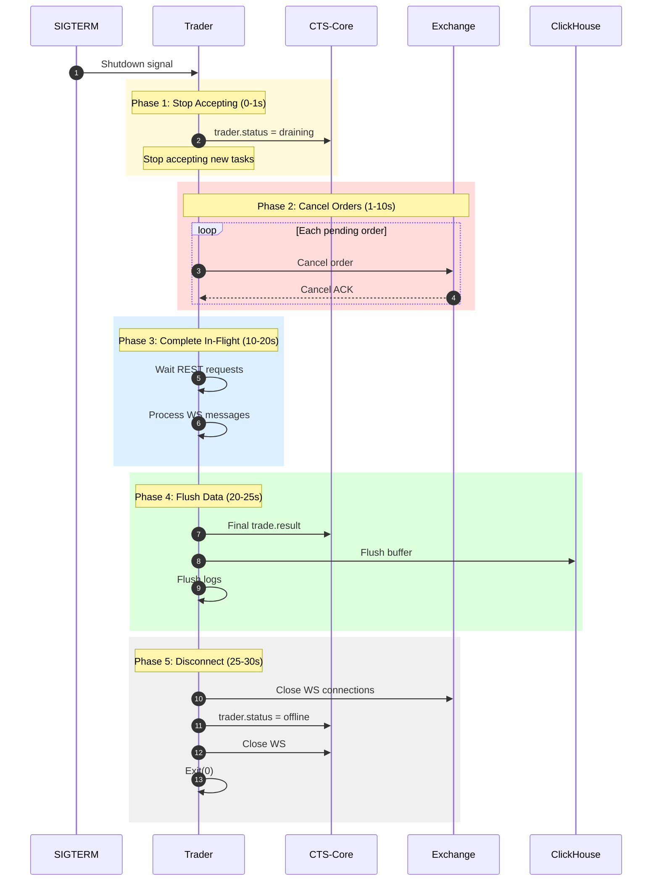

---

## 9. API Design

### 9.1 REST API (CTS-Core)

```
┌─────────────────────────────────────────────────────────────────────────────────────┐
│                              REST API ENDPOINTS                                     │
├─────────────────────────────────────────────────────────────────────────────────────┤
│                                                                                     │
│  Base URL: https://cts-core:8443/api/v1                                             │
│  Auth: mTLS + optional API key                                                      │
│                                                                                     │
│  ═══════════════════════════════════════════════════════════════════════════════    │
│                              SYSTEM STATUS                                          │
│  ═══════════════════════════════════════════════════════════════════════════════    │
│                                                                                     │
│  GET /health                                                                        │
│  Response: { "status": "healthy", "uptime_seconds": 12345 }                         │
│                                                                                     │
│  GET /metrics                                                                       │
│  Response: Prometheus format                                                        │
│                                                                                     │
│  GET /status                                                                        │
│  Response: Full system status tree (JSON)                                           │
│                                                                                     │
│  ═══════════════════════════════════════════════════════════════════════════════    │
│                              TRADERS MANAGEMENT                                     │
│  ═══════════════════════════════════════════════════════════════════════════════    │
│                                                                                     │
│  GET /traders                                                                       │
│  Response: List of all connected traders with status                                │
│                                                                                     │
│  GET /traders/{trader_id}                                                           │
│  Response: Detailed trader info (tasks, metrics, connections)                       │
│                                                                                     │
│  POST /traders/{trader_id}/shutdown                                                 │
│  Body: { "grace_period_ms": 30000 }                                                 │
│                                                                                     │
│  POST /traders/{trader_id}/tasks/{task_id}/cancel                                   │
│                                                                                     │
│  ═══════════════════════════════════════════════════════════════════════════════    │
│                              TRADING (via MySQL proxy)                              │
│  ═══════════════════════════════════════════════════════════════════════════════    │
│                                                                                     │
│  GET /trades                                                                        │
│  Response: List of active trades                                                    │
│                                                                                     │
│  GET /trades/{trade_id}                                                             │
│  Response: Trade details with assigned trader                                       │
│                                                                                     │
│  PUT /trades/{trade_id}                                                             │
│  Body: Updated trade config                                                         │
│  Effect: Propagates to assigned trader                                              │
│                                                                                     │
│  POST /trades/{trade_id}/start                                                      │
│  POST /trades/{trade_id}/stop                                                       │
│                                                                                     │
│  ═══════════════════════════════════════════════════════════════════════════════    │
│                              ARBITRAGE TRANSACTIONS                                 │
│  ═══════════════════════════════════════════════════════════════════════════════    │
│                                                                                     │
│  GET /arbitrage                                                                     │
│  Query: ?user_id=1&from=2026-01-01&to=2026-01-25                                    │
│  Response: List of arbitrage transactions                                           │
│                                                                                     │
│  GET /arbitrage/{arb_id}                                                            │
│  Response: Detailed transaction with all orders                                     │
│                                                                                     │
│  ═══════════════════════════════════════════════════════════════════════════════    │
│                              EXCHANGES                                              │
│  ═══════════════════════════════════════════════════════════════════════════════    │
│                                                                                     │
│  GET /exchanges                                                                     │
│  GET /exchanges/{exchange_id}/pairs                                                 │
│  GET /exchanges/{exchange_id}/latency                                               │
│                                                                                     │
│  ═══════════════════════════════════════════════════════════════════════════════    │
│                              STATISTICS                                             │
│  ═══════════════════════════════════════════════════════════════════════════════    │
│                                                                                     │
│  GET /stats/profit                                                                  │
│  Query: ?user_id=1&period=24h                                                       │
│                                                                                     │
│  GET /stats/orders                                                                  │
│  Query: ?exchange=binance&period=1h                                                 │
│                                                                                     │
└─────────────────────────────────────────────────────────────────────────────────────┘
```

### 9.2 WebSocket API (for Web)

```
┌─────────────────────────────────────────────────────────────────────────────────────┐
│                         WEBSOCKET API FOR WEB                                       │
├─────────────────────────────────────────────────────────────────────────────────────┤
│                                                                                     │
│  Endpoint: wss://cts-core:8443/ws/admin                                             │
│  Auth: mTLS (OU=WebAdmin)                                                           │
│                                                                                     │
│  ═══════════════════════════════════════════════════════════════════════════════    │
│                           SUBSCRIBE TO EVENTS                                       │
│  ═══════════════════════════════════════════════════════════════════════════════    │
│                                                                                     │
│  Client → Server:                                                                   │
│  {                                                                                  │
│      "action": "subscribe",                                                         │
│      "channels": [                                                                  │
│          "traders.status",          // Trader connects/disconnects                  │
│          "trades.updates",          // Trade config changes                         │
│          "arbitrage.new",           // New arbitrage transactions                   │
│          "metrics.realtime"         // Real-time metrics                            │
│      ]                                                                              │
│  }                                                                                  │
│                                                                                     │
│  Server → Client (example events):                                                  │
│  {                                                                                  │
│      "channel": "traders.status",                                                   │
│      "event": "trader.connected",                                                   │
│      "data": {                                                                      │
│          "trader_id": "trader-eu-1",                                                │
│          "region": "eu-frankfurt",                                                  │
│          "connected_at": "2026-01-25T10:00:00Z"                                     │
│      }                                                                              │
│  }                                                                                  │
│                                                                                     │
│  {                                                                                  │
│      "channel": "arbitrage.new",                                                    │
│      "event": "arbitrage.completed",                                                │
│      "data": {                                                                      │
│          "arb_id": 12345,                                                           │
│          "trade_id": 1,                                                             │
│          "profit": "15.50",                                                         │
│          "exchanges": ["binance", "kucoin"]                                         │
│      }                                                                              │
│  }                                                                                  │
│                                                                                     │
└─────────────────────────────────────────────────────────────────────────────────────┘
```

---

## 9.5 Observability Stack (Phase 1)

### Metrics (Prometheus + Grafana)

**Endpoint:** `GET /metrics`

**Метрики (20+):**

```yaml
# CTS-Core Server
cts_core_active_traders (gauge)
cts_core_tasks_assigned_total (counter) [labels: task_type, status]
cts_core_tasks_failed_total (counter) [labels: task_type, reason]
cts_core_websocket_connections (gauge) [labels: client_type]
cts_core_websocket_messages_total (counter) [labels: action, direction]
cts_core_api_requests_total (counter) [labels: endpoint, method, status]
cts_core_api_latency_seconds (histogram) [labels: endpoint]
cts_core_db_queries_total (counter) [labels: query_type, status]
cts_core_db_latency_seconds (histogram)

# Task Scheduler
cts_core_scheduler_queue_size (gauge)
cts_core_scheduler_assignment_latency_seconds (histogram)
cts_core_scheduler_assignment_failures_total (counter) [labels: reason]

# Arbitrage
cts_arbitrage_opportunities_total (counter) [labels: pair, exchanges]
cts_arbitrage_executed_total (counter) [labels: status]
cts_arbitrage_profit_usdt (counter)
cts_arbitrage_execution_latency_seconds (histogram)

# Traders (reported by trader, aggregated by core)
cts_trader_cpu_usage_percent (gauge) [labels: trader_id]
cts_trader_memory_usage_percent (gauge) [labels: trader_id]
cts_trader_active_tasks (gauge) [labels: trader_id, task_type]
cts_trader_orders_per_second (gauge) [labels: trader_id, exchange]
cts_trader_ws_connections (gauge) [labels: trader_id, exchange]
cts_trader_exchange_latency_ms (gauge) [labels: trader_id, exchange]

# System
go_goroutines (gauge)
go_memstats_alloc_bytes (gauge)
process_cpu_seconds_total (counter)
```

**Grafana Dashboards:**
1. **Overview:** active traders, tasks, arbitrage count, profit
2. **Performance:** API latency, DB latency, task assignment latency
3. **Errors:** failures by type, error rate, circuit breaker status
4. **System:** CPU, memory, goroutines, GC pauses

**Библиотека:** `github.com/prometheus/client_golang/prometheus`

### Logging (slog)

**Формат и вывод:**

```yaml
DEVELOPMENT (Docker):
    format: json (machine-readable)
    output: stdout + file
    level: DEBUG
    rotation: lumberjack (size/age/backups)

PRODUCTION (VM Debian):
    format: json (machine-readable)
    output: file only
    level: INFO
    rotation: lumberjack (size/age/backups)
    shipping: Loki/ELK для централизованного хранения
```

**Структура JSON log:**
```json
{
  "timestamp": "2026-01-28T15:04:05.123456Z",
  "level": "INFO",
  "component": "scheduler",
  "message": "Task assigned successfully",
  "trader_id": "trader-eu-1",
  "task_id": "task-12345",
  "task_type": "trade",
  "trade_id": 123,
  "correlation_id": "uuid",
  "latency_ms": 45,
  "error": null
}
```

**Levels:** DEBUG, INFO, WARN, ERROR, FATAL  
**Required fields:** timestamp, level, component, message  
**Optional context:** trader_id, task_id, correlation_id, error, stack_trace

**Библиотека:** `log/slog`

**Стандарт модульности:** использовать атрибут `module` (эквивалентно `slog.With("module", ...)`).

**Стандарт graceful shutdown:** обработка `SIGTERM/SIGINT` + `server.Shutdown(ctx)` + закрытие логгеров.

### Log Files (CTS-Core)

CTS-Core использует 6 файлов логов:
- error.log: системные ошибки и события
- access.log: входящие HTTP запросы
- out_request.log: исходящие HTTP запросы
- ws_in.log: входящие WS события
- ws_out.log: исходящие WS сообщения
- audit.log: аудит админских/системных действий

### WS Log Fields (Standard)

**ws_in.log**
- required: timestamp, level, module, event, conn_id
- recommended: trader_id, session_id, client_ip, user_agent, ws_path
- optional: msg_id, request_id, error, latency_ms, size_bytes

**ws_out.log**
- required: timestamp, level, module, event, conn_id, msg_id
- recommended: trader_id, session_id, target, msg_type, size_bytes
- optional: request_id, latency_ms, error, status

### Audit Log

**Двухуровневый подход:**

```yaml
PRIMARY: JSON файл
    Path: /var/log/cts-core/audit.log
    Format: JSON lines (one event per line)
    Write: Synchronous append-only
    Rotation: logrotate (30 days локально)
    Permissions: 0600 (read/write только daemon)
  
SECONDARY: MySQL (Phase 2)
    Table: AUDIT_LOG
    Purpose: UI для admin панели, быстрые запросы
    Retention: последние 7 дней
    Sync: async worker читает файл → пишет в БД
```

**Logged actions:**
- trader.create, trader.update, trader.delete, trader.enable/disable
- config.update (любое изменение через API)
- limits.update (изменение EXCHANGE_LIMITS)
- monitor.create, monitor.update, monitor.delete, monitor.enable/disable
- system.restart, system.shutdown, emergency.stop

**JSON формат:**
```json
{
    "timestamp": "2026-01-28T15:04:05.123456Z",
    "user_id": 5,
    "username": "admin",
    "action": "TRADER_DELETE",
    "resource_type": "trader",
    "resource_id": "trader-eu-1",
    "old_value": {"id": "trader-eu-1", "status": "active"},
    "new_value": null,
    "ip_address": "192.168.1.10",
    "user_agent": "Mozilla/5.0...",
    "success": true,
    "error_message": null
}
```

---

## 10. База данных

### 10.1 Новые таблицы для CTS-Core

```sql
-- Сессии трейдеров
CREATE TABLE `TRADER_SESSION` (
  `ID` int NOT NULL AUTO_INCREMENT,
  `TRADER_ID` varchar(64) NOT NULL,           -- Из CN сертификата
  `STATUS` enum('online','offline','draining') NOT NULL DEFAULT 'offline',
  `CONNECTED_AT` timestamp NULL,
  `DISCONNECTED_AT` timestamp NULL,
  `LAST_HEARTBEAT` timestamp NULL,
  `REGION` varchar(64) NULL,
  `VERSION` varchar(32) NULL,
  `CAPABILITIES` json NULL,                   -- Поддерживаемые биржи
  `METRICS` json NULL,                        -- Последние метрики
  PRIMARY KEY (`ID`),
  UNIQUE KEY `TRADER_SESSION_TRADER_ID_IDX` (`TRADER_ID`)
) ENGINE=InnoDB;

-- Назначения задач
CREATE TABLE `TASK_ASSIGNMENT` (
  `ID` int NOT NULL AUTO_INCREMENT,
  `TRADE_ID` int NOT NULL,
  `TRADER_ID` varchar(64) NOT NULL,
  `STATUS` enum('pending','active','completed','failed','cancelled') NOT NULL DEFAULT 'pending',
  `ASSIGNED_AT` timestamp NOT NULL DEFAULT CURRENT_TIMESTAMP,
  `STARTED_AT` timestamp NULL,
  `COMPLETED_AT` timestamp NULL,
  `IS_BACKUP` tinyint(1) NOT NULL DEFAULT 0,  -- Для дублирования мониторинга
  PRIMARY KEY (`ID`),
  KEY `TASK_ASSIGNMENT_TRADE_IDX` (`TRADE_ID`),
  KEY `TASK_ASSIGNMENT_TRADER_IDX` (`TRADER_ID`),
  CONSTRAINT `fk_task_trade` FOREIGN KEY (`TRADE_ID`) REFERENCES `TRADE` (`ID`)
) ENGINE=InnoDB;

-- Latency метрики
CREATE TABLE `TRADER_LATENCY` (
  `ID` int NOT NULL AUTO_INCREMENT,
  `TRADER_ID` varchar(64) NOT NULL,
  `EXCHANGE_ID` int NOT NULL,
  `PING_MS` int NOT NULL,
  `ORDER_LATENCY_MS` int NULL,
  `WS_LATENCY_MS` int NULL,
  `MEASURED_AT` timestamp NOT NULL DEFAULT CURRENT_TIMESTAMP,
  PRIMARY KEY (`ID`),
  KEY `TRADER_LATENCY_TRADER_IDX` (`TRADER_ID`, `EXCHANGE_ID`),
  CONSTRAINT `fk_latency_exchange` FOREIGN KEY (`EXCHANGE_ID`) REFERENCES `EXCHANGE` (`ID`)
) ENGINE=InnoDB;

-- Арбитражные транзакции (уже упомянуто в gpt.txt)
CREATE TABLE `ARBITRAGE_TRANS` (
  `ID` int NOT NULL AUTO_INCREMENT,
  `TRADE_ID` int NOT NULL,
  `USER_ID` int NOT NULL,
  `TRADER_ID` varchar(64) NULL,               -- Какой трейдер исполнял
  `STATUS` enum('pending','partial','completed','failed','cancelled') NOT NULL,
  `STRATEGY` varchar(32) NOT NULL,            -- cross_exchange, triangular, etc.
  `PROFIT` decimal(30,12) NULL,
  `FEES` decimal(30,12) NULL,
  `CREATED_AT` timestamp NOT NULL DEFAULT CURRENT_TIMESTAMP,
  `COMPLETED_AT` timestamp NULL,
  PRIMARY KEY (`ID`),
  KEY `ARB_TRANS_TRADE_IDX` (`TRADE_ID`),
  KEY `ARB_TRANS_USER_IDX` (`USER_ID`),
  CONSTRAINT `fk_arb_trade` FOREIGN KEY (`TRADE_ID`) REFERENCES `TRADE` (`ID`),
  CONSTRAINT `fk_arb_user` FOREIGN KEY (`USER_ID`) REFERENCES `USER` (`ID`)
) ENGINE=InnoDB;

-- Ордера внутри арбитражной транзакции
CREATE TABLE `ARBITRAGE_ORDER` (
  `ID` int NOT NULL AUTO_INCREMENT,
  `ARB_TRANS_ID` int NOT NULL,
  `EXCHANGE_ACCOUNT_ID` int NOT NULL,
  `PAIR_ID` int NOT NULL,
  `EXCHANGE_ORDER_ID` varchar(128) NULL,      -- ID от биржи
  `SIDE` enum('buy','sell') NOT NULL,
  `TYPE` enum('market','limit') NOT NULL,
  `PRICE` decimal(30,12) NULL,
  `QUANTITY` decimal(30,12) NOT NULL,
  `FILLED_QUANTITY` decimal(30,12) NULL,
  `AVERAGE_PRICE` decimal(30,12) NULL,
  `FEE` decimal(30,12) NULL,
  `FEE_CURRENCY` varchar(16) NULL,
  `STATUS` enum('pending','open','partial','filled','cancelled','failed') NOT NULL,
  `CREATED_AT` timestamp NOT NULL DEFAULT CURRENT_TIMESTAMP,
  `UPDATED_AT` timestamp NULL ON UPDATE CURRENT_TIMESTAMP,
  PRIMARY KEY (`ID`),
  KEY `ARB_ORDER_TRANS_IDX` (`ARB_TRANS_ID`),
  CONSTRAINT `fk_order_trans` FOREIGN KEY (`ARB_TRANS_ID`) REFERENCES `ARBITRAGE_TRANS` (`ID`),
  CONSTRAINT `fk_order_account` FOREIGN KEY (`EXCHANGE_ACCOUNT_ID`) REFERENCES `EXCHANGE_ACCOUNTS` (`ID`),
  CONSTRAINT `fk_order_pair` FOREIGN KEY (`PAIR_ID`) REFERENCES `SPOT_TRADE_PAIR` (`ID`)
) ENGINE=InnoDB;
```

---

## 11. План разработки

> **См. отдельный документ:** [DEVELOPMENT_PLAN.md](DEVELOPMENT_PLAN.md)

---

*Документ обновляется по мере развития архитектуры*
