# CTS-Core Architecture

> **Версия документа**: 1.1.0
> **Дата**: 2026-01-25
> **Статус**: Проектирование (решения приняты)

## Оглавление

1. [Обзор системы](#1-обзор-системы)
2. [Принятые решения](#2-принятые-решения)
3. [Целевая архитектура](#3-целевая-архитектура)
4. [Компоненты системы](#4-компоненты-системы)
5. [Протоколы и коммуникация](#5-протоколы-и-коммуникация)
6. [Безопасность](#6-безопасность)
7. [Распределение задач](#7-распределение-задач)
8. [Отказоустойчивость](#8-отказоустойчивость)
9. [API Design](#9-api-design)
10. [База данных](#10-база-данных)
11. [План разработки](#11-план-разработки)

---

## 1. Обзор системы

### 1.1 Назначение CTS-Core

**CTS-Core** (Crypto Trading System Core) — центральный оркестратор для распределённой системы арбитражной торговли криптовалютами.

**Ключевые функции:**
- Центральная точка управления всеми торговыми демонами (traders)
- Проксирование доступа к MySQL для трейдеров (зашифрованные credentials)
- Сбор метрик и мониторинг состояния всех узлов
- Интеллектуальное распределение задач между трейдерами
- API для веб-интерфейса и внешних систем
- Дублирование критических задач мониторинга

### 1.2 Ограничения и требования

**Архитектурные ограничения:**
- ❌ Не используем брокеры сообщений (Kafka, RabbitMQ) — минимизация задержек
- ✅ mTLS между всеми компонентами
- ✅ Отдельные VM для каждого критического сервиса
- ✅ Масштабирование: поддержка 25+ трейдеров

**Требования к производительности:**
- Latency WebSocket: < 1ms внутри сети
- Время реакции на события биржи: < 10ms
- Downtime при сбое одного трейдера: 0 (failover)

---

## 2. Принятые решения

| # | Вопрос | Решение | Обоснование |
|---|--------|---------|-------------|
| 1 | Доступ трейдеров к HSM | **Напрямую (A)** | CTS-Core передаёт зашифрованные DEK + credentials, трейдер сам расшифровывает через HSM. Ничего не передаётся в открытом виде. |
| 2 | Доступ трейдеров к ClickHouse | **Напрямую (A)** | Не перегружаем канал и сервер CTS-Core tick data |
| 3 | Failover CTS-Core | **Заложить, но не реализовывать** | Возможность на вырост, пока обходимся быстрым рестартом |
| 4 | Приоритет стратегий | **Cross-exchange → Triangular → Limit+Market** | Cross-exchange: мониторинг N бирж, арбитраж на 2-х самых профитных |
| 5 | Futures/DEX | **Заложить архитектуру, заглушки** | Не реализуем сейчас, но структура должна поддерживать |
| 6 | Инфраструктура | **Dev: Docker, Prod: VM Debian** | Гибкость для разработки, стабильность для production |
| 7 | Глубина стакана, TTL | **Вынести в настройки** | Будет определено позже |
| 8 | Логирование | **Локальные логи** | ELK/Loki можно добавить позже |
| 9 | Сертификаты трейдеров | **Вручную через CA** | Полный контроль над PKI |

---

## 3. Целевая архитектура

### 3.1 High-Level Architecture (ASCII)

```
┌─────────────────────────────────────────────────────────────────────────────────────┐
│                              ЦЕЛЕВАЯ АРХИТЕКТУРА CTS                                │
├─────────────────────────────────────────────────────────────────────────────────────┤
│                                                                                     │
│                              ┌─────────────────────┐                               │
│                              │       www-go        │                               │
│                              │    (Web Interface)  │                               │
│                              │      Port: 8443     │                               │
│                              └──────────┬──────────┘                               │
│                                         │                                           │
│                           ┌─────────────┼─────────────┐                            │
│                           │ WebSocket   │   mTLS      │                            │
│                           │ + REST      │             │                            │
│                           ▼             │             ▼                            │
│  ┌────────────────────────────────────┐ │ ┌─────────────────────┐                  │
│  │           CTS-CORE                 │ │ │    hsm-service      │                  │
│  │        (Оркестратор)               │ │ │    (SoftHSM)        │                  │
│  │       VM: cts-core                 │ │ │   Port: 8443        │                  │
│  │      Port: 8443/8444               │ │ │                     │                  │
│  │                                    │ │ │  KEK: exchange-key  │                  │
│  │  ┌──────────┐  ┌──────────┐       │ │ │  KEK: 2fa           │                  │
│  │  │API Server│  │  Task    │       │ │ └─────────────────────┘                  │
│  │  │(REST+WS) │  │Scheduler │       │ │           ▲                               │
│  │  └──────────┘  └──────────┘       │ │           │ mTLS (OU=Trading)             │
│  │  ┌──────────┐  ┌──────────┐       │ │           │                               │
│  │  │ Metrics  │  │ Session  │       │ │ ┌────────┴────────────────────┐           │
│  │  │Collector │  │ Manager  │       │ │ │                             │           │
│  │  └──────────┘  └──────────┘       │ │ │   TRADER DAEMONS (25+ VM)   │           │
│  │  ┌──────────┐  ┌──────────┐       │ │ │                             │           │
│  │  │DB Proxy  │  │ Latency  │       │ │ │  ┌─────────┐ ┌─────────┐   │           │
│  │  │(MySQL)   │  │ Tester   │       │◄─┼─┤  │trader-1 │ │trader-2 │   │           │
│  │  └──────────┘  └──────────┘       │ │ │  │ Binance │ │ KuCoin  │   │           │
│  └────────────────────────────────────┘ │ │  └────┬────┘ └────┬────┘   │           │
│         │              │                │ │       │          │        │           │
│         │ mTLS         │ mTLS           │ │  ┌────┴────┐ ┌───┴─────┐  │           │
│         ▼              ▼                │ │  │trader-N │ │  ...    │  │           │
│  ┌─────────────┐ ┌─────────────┐        │ │  │  Bybit  │ │         │  │           │
│  │   MySQL 9   │ │ ClickHouse  │◄───────┼─┤  └─────────┘ └─────────┘  │           │
│  │  (Master)   │ │  (Quotes)   │        │ │                           │           │
│  └─────────────┘ └─────────────┘        │ └───────────────────────────┘           │
│                                         │                                          │
└─────────────────────────────────────────┴──────────────────────────────────────────┘
                                          │
                                          ▼
┌─────────────────────────────────────────────────────────────────────────────────────┐
│                                   EXCHANGES                                         │
│  ┌──────────┐ ┌──────────┐ ┌──────────┐ ┌──────────┐ ┌──────────┐ ┌──────────┐     │
│  │ Binance  │ │  KuCoin  │ │  Bybit   │ │   OKX    │ │  Coinex  │ │   HTX    │     │
│  │ (CEX)    │ │  (CEX)   │ │  (CEX)   │ │  (CEX)   │ │  (CEX)   │ │  (CEX)   │     │
│  └──────────┘ └──────────┘ └──────────┘ └──────────┘ └──────────┘ └──────────┘     │
└─────────────────────────────────────────────────────────────────────────────────────┘
```

### 3.2 High-Level Architecture (Mermaid)

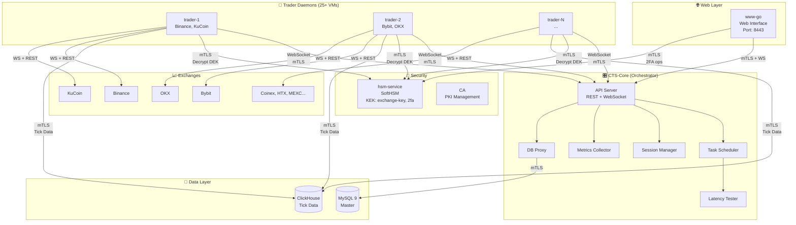

### 3.3 Физическая топология (ASCII)

```
┌─────────────────────────────────────────────────────────────────────────────────────┐
│                           ФИЗИЧЕСКАЯ ТОПОЛОГИЯ                                      │
├─────────────────────────────────────────────────────────────────────────────────────┤
│                                                                                     │
│  Region: Europe (Primary)                                                           │
│  ┌───────────────────────────────────────────────────────────────────────────────┐ │
│  │  DC: Frankfurt                                                                 │ │
│  │  ┌───────────┐ ┌───────────┐ ┌───────────┐ ┌───────────┐ ┌───────────┐        │ │
│  │  │ cts-core  │ │  mysql-1  │ │hsm-service│ │    CA     │ │clickhouse │        │ │
│  │  │ (primary) │ │ (master)  │ │           │ │  (offline)│ │           │        │ │
│  │  └───────────┘ └───────────┘ └───────────┘ └───────────┘ └───────────┘        │ │
│  │                                                                                │ │
│  │  ┌───────────┐ ┌───────────┐ ┌───────────┐                                    │ │
│  │  │ trader-1  │ │ trader-2  │ │ trader-3  │                                    │ │
│  │  │ Binance   │ │  KuCoin   │ │  Bybit    │                                    │ │
│  │  └───────────┘ └───────────┘ └───────────┘                                    │ │
│  └───────────────────────────────────────────────────────────────────────────────┘ │
│                                                                                     │
│  Region: Asia (Secondary)                                                           │
│  ┌───────────────────────────────────────────────────────────────────────────────┐ │
│  │  DC: Singapore                                                                 │ │
│  │  ┌───────────┐ ┌───────────┐ ┌───────────┐                                    │ │
│  │  │ trader-4  │ │ trader-5  │ │ trader-6  │                                    │ │
│  │  │ Binance   │ │   OKX     │ │  Huobi    │                                    │ │
│  │  └───────────┘ └───────────┘ └───────────┘                                    │ │
│  └───────────────────────────────────────────────────────────────────────────────┘ │
│                                                                                     │
│  Region: Americas (Secondary)                                                       │
│  ┌───────────────────────────────────────────────────────────────────────────────┐ │
│  │  DC: New York                                                                  │ │
│  │  ┌───────────┐ ┌───────────┐ ┌───────────┐                                    │ │
│  │  │ trader-7  │ │ trader-8  │ │ trader-9  │                                    │ │
│  │  │ Coinbase  │ │  Kraken   │ │  Gemini   │                                    │ │
│  │  └───────────┘ └───────────┘ └───────────┘                                    │ │
│  └───────────────────────────────────────────────────────────────────────────────┘ │
│                                                                                     │
└─────────────────────────────────────────────────────────────────────────────────────┘
```

### 3.4 Физическая топология (Mermaid)

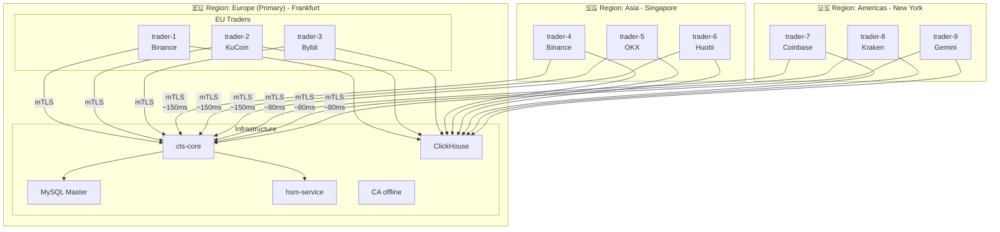

---

## 4. Компоненты системы

### 4.1 Поток данных (ASCII)

```
┌─────────────────────────────────────────────────────────────────────────────────────┐
│                              ПОТОК ДАННЫХ В СИСТЕМЕ                                 │
├─────────────────────────────────────────────────────────────────────────────────────┤
│                                                                                     │
│  1. КОНФИГУРАЦИЯ И ЗАДАЧИ                                                           │
│  ═══════════════════════════════════════════════════════════════════════════════   │
│                                                                                     │
│      MySQL                    CTS-Core                     Trader                   │
│        │                         │                           │                      │
│        │  ◄── SELECT TRADE ──────│                           │                      │
│        │      + TRADE_SPOT_ARRAYS│                           │                      │
│        │                         │                           │                      │
│        │  ── Tasks data ────────►│                           │                      │
│        │                         │                           │                      │
│        │                         │  ── task.assign ─────────►│                      │
│        │                         │     (encrypted DEK +      │                      │
│        │                         │      credentials)         │                      │
│        │                         │                           │                      │
│                                                              │                      │
│                               HSM                            │                      │
│                                │                             │                      │
│                                │  ◄── Decrypt DEK ───────────│                      │
│                                │                             │                      │
│                                │  ── Plain DEK ─────────────►│                      │
│                                                              │                      │
│                                              ┌───────────────┴───────────────┐      │
│                                              │  Trader decrypts API keys     │      │
│                                              │  locally using DEK            │      │
│                                              │  (keys stay in memory only)   │      │
│                                              └───────────────────────────────┘      │
│                                                                                     │
│  2. MARKET DATA                                                                     │
│  ═══════════════════════════════════════════════════════════════════════════════   │
│                                                                                     │
│      Exchange                 Trader                    ClickHouse                  │
│        │                         │                           │                      │
│        │  ── WebSocket ─────────►│                           │                      │
│        │     (orderbook,         │                           │                      │
│        │      trades)            │                           │                      │
│        │                         │                           │                      │
│        │                         │  ── Tick batches ────────►│                      │
│        │                         │     (async, buffered)     │                      │
│        │                         │                           │                      │
│        │                  ┌──────┴──────┐                    │                      │
│        │                  │ OrderBook   │                    │                      │
│        │                  │ Manager     │                    │                      │
│        │                  │ (in-memory) │                    │                      │
│        │                  └──────┬──────┘                    │                      │
│        │                         │                           │                      │
│        │                         ▼                           │                      │
│        │                  ┌─────────────┐                    │                      │
│        │                  │  Strategy   │                    │                      │
│        │                  │  Engine     │                    │                      │
│        │                  └──────┬──────┘                    │                      │
│        │                         │                           │                      │
│                                  ▼                                                  │
│  3. TRADE EXECUTION                                                                 │
│  ═══════════════════════════════════════════════════════════════════════════════   │
│                                                                                     │
│      Trader                  Exchange                    CTS-Core                   │
│        │                         │                           │                      │
│        │  ── REST: Place Order ─►│                           │                      │
│        │                         │                           │                      │
│        │  ◄── Order ACK ─────────│                           │                      │
│        │                         │                           │                      │
│        │  ◄── WS: Order Filled ──│                           │                      │
│        │                         │                           │                      │
│        │  ── trade.result ───────────────────────────────────►                      │
│        │                         │                           │                      │
│        │                         │                     ┌─────┴─────┐                │
│        │                         │                     │  MySQL    │                │
│        │                         │                     │  INSERT   │                │
│        │                         │                     │  ARB_TRANS│                │
│        │                         │                     └───────────┘                │
│                                                                                     │
└─────────────────────────────────────────────────────────────────────────────────────┘
```

### 4.2 Поток данных (Mermaid)

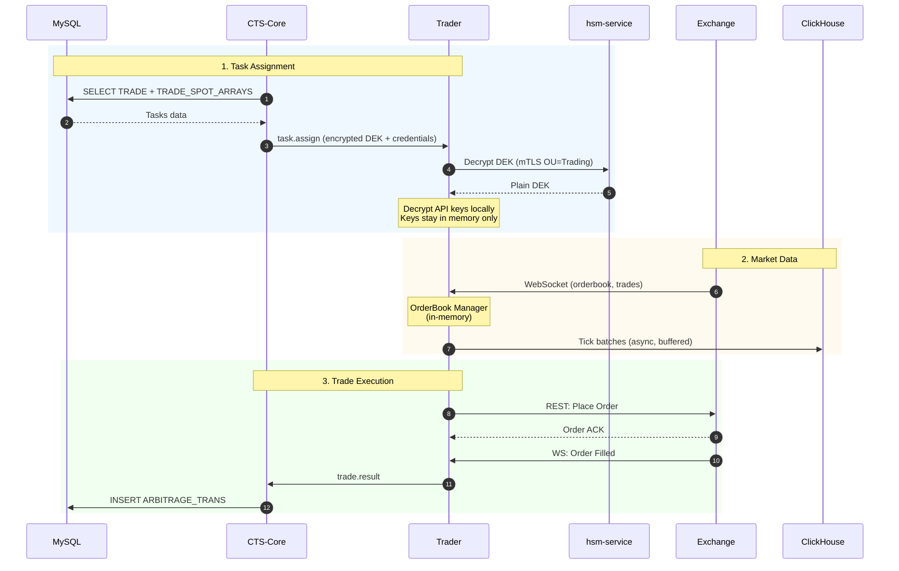

### 4.3 CTS-Core Internal Structure (ASCII)

### 4.3 CTS-Core Internal Structure (ASCII)

**Ответственность:**
- Центральное управление всеми трейдерами
- Проксирование данных из БД (зашифрованные credentials)
- Интеллектуальное распределение задач
- Мониторинг и метрики
- API для веб-интерфейса

```
┌─────────────────────────────────────────────────────────────────────────────────────┐
│                            CTS-CORE ВНУТРЕННЯЯ СТРУКТУРА                            │
├─────────────────────────────────────────────────────────────────────────────────────┤
│                                                                                     │
│  ┌───────────────────────────────────────────────────────────────────────────────┐ │
│  │                              API Layer                                         │ │
│  │  ┌──────────────┐  ┌──────────────┐  ┌──────────────┐  ┌──────────────┐       │ │
│  │  │  REST API    │  │  WebSocket   │  │  WebSocket   │  │  Health/     │       │ │
│  │  │  (external)  │  │  (traders)   │  │  (web)       │  │  Metrics     │       │ │
│  │  │  /api/v1/*   │  │  /ws/trader  │  │  /ws/admin   │  │  /health     │       │ │
│  │  └──────────────┘  └──────────────┘  └──────────────┘  └──────────────┘       │ │
│  └───────────────────────────────────────────────────────────────────────────────┘ │
│                                         │                                           │
│                                         ▼                                           │
│  ┌───────────────────────────────────────────────────────────────────────────────┐ │
│  │                           Business Logic Layer                                 │ │
│  │                                                                                │ │
│  │  ┌──────────────────────────────────────────────────────────────────────────┐ │ │
│  │  │                         Session Manager                                   │ │ │
│  │  │  - Управление сессиями трейдеров                                         │ │ │
│  │  │  - Аутентификация (mTLS + JWT)                                           │ │ │
│  │  │  - Heartbeat и health check                                               │ │ │
│  │  └──────────────────────────────────────────────────────────────────────────┘ │ │
│  │                                                                                │ │
│  │  ┌──────────────────────────────────────────────────────────────────────────┐ │ │
│  │  │                          Task Scheduler                                   │ │ │
│  │  │  - Распределение торговых заданий                                        │ │ │
│  │  │  - Балансировка нагрузки                                                  │ │ │
│  │  │  - Дублирование мониторинговых задач                                     │ │ │
│  │  │  - Failover при отказе трейдера                                          │ │ │
│  │  └──────────────────────────────────────────────────────────────────────────┘ │ │
│  │                                                                                │ │
│  │  ┌──────────────────────────────────────────────────────────────────────────┐ │ │
│  │  │                         Latency Analyzer                                  │ │ │
│  │  │  - Периодическое тестирование latency трейдеров                          │ │ │
│  │  │  - Маршрутизация на основе скорости                                       │ │ │
│  │  │  - Рейтинг трейдеров по производительности                               │ │ │
│  │  └──────────────────────────────────────────────────────────────────────────┘ │ │
│  │                                                                                │ │
│  │  ┌──────────────────────────────────────────────────────────────────────────┐ │ │
│  │  │                         Metrics Aggregator                                │ │ │
│  │  │  - Сбор метрик со всех трейдеров                                         │ │ │
│  │  │  - Prometheus-совместимые метрики                                         │ │ │
│  │  │  - Real-time дашборд для web                                              │ │ │
│  │  └──────────────────────────────────────────────────────────────────────────┘ │ │
│  │                                                                                │ │
│  │  ┌──────────────────────────────────────────────────────────────────────────┐ │ │
│  │  │                           Trade Logger                                    │ │ │
│  │  │  - Асинхронная запись торговых операций                                  │ │ │
│  │  │  - Буферизация для минимизации задержек                                  │ │ │
│  │  │  - Аудит всех действий                                                    │ │ │
│  │  └──────────────────────────────────────────────────────────────────────────┘ │ │
│  │                                                                                │ │
│  └───────────────────────────────────────────────────────────────────────────────┘ │
│                                         │                                           │
│                                         ▼                                           │
│  ┌───────────────────────────────────────────────────────────────────────────────┐ │
│  │                             Data Access Layer                                  │ │
│  │  ┌──────────────┐  ┌──────────────┐  ┌──────────────┐  ┌──────────────┐       │ │
│  │  │ MySQL Pool   │  │  HSM Client  │  │   Cache      │  │  Failover    │       │ │
│  │  │ (master+RO)  │  │  (mTLS)      │  │  (in-memory) │  │  (на вырост) │       │ │
│  │  └──────────────┘  └──────────────┘  └──────────────┘  └──────────────┘       │ │
│  └───────────────────────────────────────────────────────────────────────────────┘ │
│                                                                                     │
└─────────────────────────────────────────────────────────────────────────────────────┘
```

### 4.4 CTS-Core Internal Structure (Mermaid)

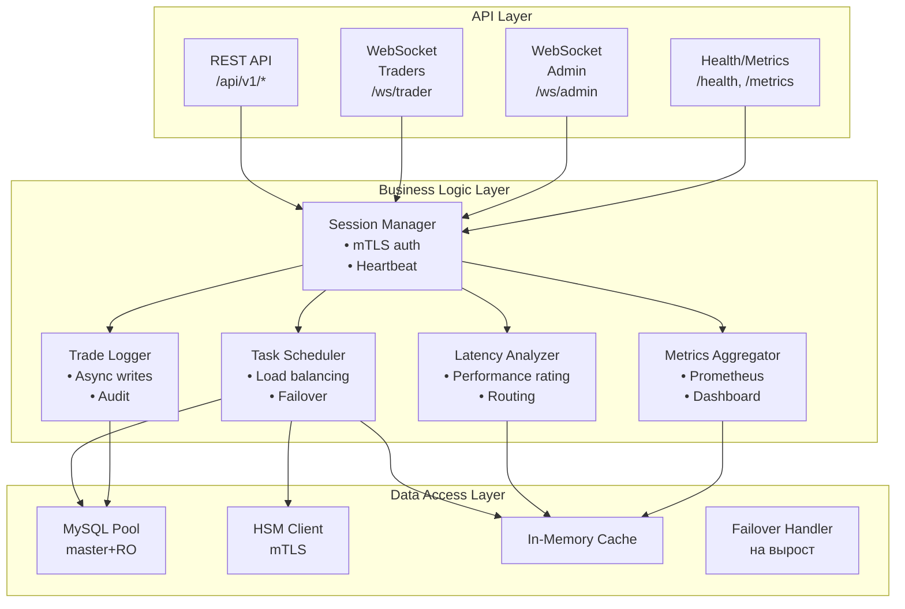

### 4.5 Trader Daemon Structure (ASCII)

### 4.5 Trader Daemon Structure (ASCII)

**Ответственность:**
- Подключение к биржам (WebSocket + REST)
- Сбор рыночных данных (orderbook, trades)
- Исполнение торговых стратегий
- Отправка ордеров
- Запись tick data в ClickHouse

> **Примечание:** Базовая структура daemon2 уже разработана в `/other-sub-system/daemon2/`

```
┌─────────────────────────────────────────────────────────────────────────────────────┐
│                            TRADER DAEMON СТРУКТУРА                                  │
├─────────────────────────────────────────────────────────────────────────────────────┤
│                                                                                     │
│  ┌───────────────────────────────────────────────────────────────────────────────┐ │
│  │                              Core Connection                                   │ │
│  │  ┌──────────────────────────────────────────────────────────────────────────┐ │ │
│  │  │                     WebSocket Client → CTS-Core                          │ │ │
│  │  │  - Получение заданий (encrypted credentials)                             │ │ │
│  │  │  - Отправка метрик и статусов                                            │ │ │
│  │  │  - Heartbeat / Ping-Pong                                                  │ │ │
│  │  │  - Сброс результатов торговли                                            │ │ │
│  │  └──────────────────────────────────────────────────────────────────────────┘ │ │
│  │  ┌──────────────────────────────────────────────────────────────────────────┐ │ │
│  │  │                     HSM Client (Direct mTLS)                             │ │ │
│  │  │  - Расшифровка DEK при получении задания                                 │ │ │
│  │  │  - OU=Trading в сертификате                                               │ │ │
│  │  └──────────────────────────────────────────────────────────────────────────┘ │ │
│  └───────────────────────────────────────────────────────────────────────────────┘ │
│                                         │                                           │
│                                         ▼                                           │
│  ┌───────────────────────────────────────────────────────────────────────────────┐ │
│  │                            Trading Components                                  │ │
│  │                                                                                │ │
│  │  ┌────────────────────────────────┐  ┌────────────────────────────────┐       │ │
│  │  │       Market Data Module       │  │      Trade Executor Module     │       │ │
│  │  │  ┌──────────────────────────┐  │  │  ┌──────────────────────────┐  │       │ │
│  │  │  │   WebSocket Manager     │  │  │  │   Order Manager          │  │       │ │
│  │  │  │   - Order Book (depth)  │  │  │  │   - Market Orders        │  │       │ │
│  │  │  │   - Best Price (BBO)    │  │  │  │   - Limit Orders         │  │       │ │
│  │  │  │   - Trades Stream       │  │  │  │   - Cancel Orders        │  │       │ │
│  │  │  └──────────────────────────┘  │  │  └──────────────────────────┘  │       │ │
│  │  │  ┌──────────────────────────┐  │  │  ┌──────────────────────────┐  │       │ │
│  │  │  │   Data Normalizer       │  │  │  │   Position Tracker       │  │       │ │
│  │  │  │   - Unified format      │  │  │  │   - P&L Calculation      │  │       │ │
│  │  │  │   - Timestamp sync      │  │  │  │   - Risk Management      │  │       │ │
│  │  │  └──────────────────────────┘  │  │  └──────────────────────────┘  │       │ │
│  │  │  ┌──────────────────────────┐  │  │  ┌──────────────────────────┐  │       │ │
│  │  │  │   In-Memory Cache       │  │  │  │   ClickHouse Writer      │  │       │ │
│  │  │  │   - sync.Map for OB     │  │  │  │   - Async batching       │  │       │ │
│  │  │  │   - Lock-free reads     │  │  │  │   - Buffered writes      │  │       │ │
│  │  │  └──────────────────────────┘  │  │  └──────────────────────────┘  │       │ │
│  │  └────────────────────────────────┘  └────────────────────────────────┘       │ │
│  │                                                                                │ │
│  │  ┌────────────────────────────────┐  ┌────────────────────────────────┐       │ │
│  │  │      Strategy Engine           │  │      Event Collector           │       │ │
│  │  │  ┌──────────────────────────┐  │  │  ┌──────────────────────────┐  │       │ │
│  │  │  │   Arbitrage Strategies  │  │  │  │   Order Events (WS)      │  │       │ │
│  │  │  │   1. Cross-Exchange     │  │  │  │   - Fills                │  │       │ │
│  │  │  │   2. Triangular         │  │  │  │   - Partial Fills        │  │       │ │
│  │  │  │   3. Limit+Market       │  │  │  │   - Cancellations        │  │       │ │
│  │  │  │   4. (Futures stub)     │  │  │  └──────────────────────────┘  │       │ │
│  │  │  │   5. (DEX stub)         │  │  │  ┌──────────────────────────┐  │       │ │
│  │  │  └──────────────────────────┘  │  │  │   Account Events (WS)    │  │       │ │
│  │  │  ┌──────────────────────────┐  │  │  │   - Balance updates      │  │       │ │
│  │  │  │   Decision Engine       │  │  │  │   - Margin updates       │  │       │ │
│  │  │  │   - Profit calculation  │  │  │  └──────────────────────────┘  │       │ │
│  │  │  │   - Volume analysis     │  │  │                                │       │ │
│  │  │  │   - N-exchange compare  │  │  │                                │       │ │
│  │  │  └──────────────────────────┘  │  │                                │       │ │
│  │  └────────────────────────────────┘  └────────────────────────────────┘       │ │
│  │                                                                                │ │
│  └───────────────────────────────────────────────────────────────────────────────┘ │
│                                         │                                           │
│                                         ▼                                           │
│  ┌───────────────────────────────────────────────────────────────────────────────┐ │
│  │                           Exchange Connections                                 │ │
│  │  ┌──────────────┐  ┌──────────────┐  ┌──────────────┐  ┌──────────────┐       │ │
│  │  │   Binance    │  │   KuCoin     │  │   Bybit      │  │   OKX        │       │ │
│  │  │  (WS+REST)   │  │  (WS+REST)   │  │  (WS+REST)   │  │  (WS+REST)   │       │ │
│  │  └──────────────┘  └──────────────┘  └──────────────┘  └──────────────┘       │ │
│  │  ┌──────────────┐  ┌──────────────┐  ┌──────────────┐                         │ │
│  │  │   Coinex     │  │   HTX        │  │   MEXC       │                         │ │
│  │  │  (WS+REST)   │  │  (WS+REST)   │  │  (WS+REST)   │                         │ │
│  │  └──────────────┘  └──────────────┘  └──────────────┘                         │ │
│  └───────────────────────────────────────────────────────────────────────────────┘ │
│                                                                                     │
└─────────────────────────────────────────────────────────────────────────────────────┘
```

### 4.6 Trader Daemon Structure (Mermaid)

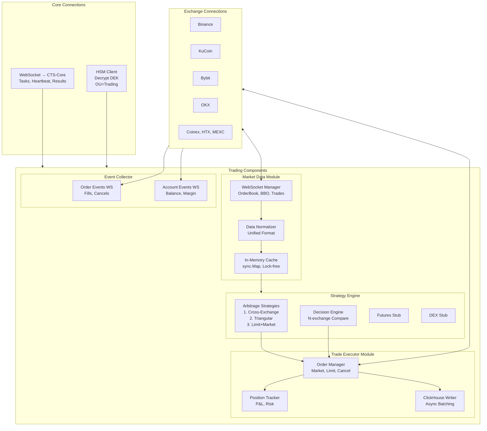

---

## 5. Протоколы и коммуникация

### 5.1 WebSocket Protocol (CTS-Core ↔ Traders)

```
┌─────────────────────────────────────────────────────────────────────────────────────┐
│                           WEBSOCKET MESSAGE PROTOCOL                                │
├─────────────────────────────────────────────────────────────────────────────────────┤
│                                                                                     │
│  Message Format (JSON):                                                             │
│  {                                                                                  │
│      "id": "uuid-v4",                 // Уникальный ID сообщения                   │
│      "type": "request|response|event", // Тип сообщения                            │
│      "action": "string",               // Действие                                  │
│      "payload": { ... },               // Данные                                    │
│      "timestamp": 1737823200000,       // Unix ms                                   │
│      "correlation_id": "uuid"          // Для request/response паттерна            │
│  }                                                                                  │
│                                                                                     │
│  ═══════════════════════════════════════════════════════════════════════════════   │
│                           СООБЩЕНИЯ: TRADER → CORE                                  │
│  ═══════════════════════════════════════════════════════════════════════════════   │
│                                                                                     │
│  1. REGISTRATION (при подключении)                                                  │
│  {                                                                                  │
│      "type": "request",                                                             │
│      "action": "trader.register",                                                   │
│      "payload": {                                                                   │
│          "trader_id": "trader-eu-1",                                               │
│          "version": "1.0.0",                                                        │
│          "capabilities": ["binance", "kucoin"],                                    │
│          "region": "eu-frankfurt",                                                  │
│          "metrics": {                                                               │
│              "cpu_cores": 4,                                                        │
│              "memory_gb": 16,                                                       │
│              "current_load": 0.15                                                   │
│          }                                                                          │
│      }                                                                              │
│  }                                                                                  │
│                                                                                     │
│  2. HEARTBEAT (каждые 5 сек)                                                        │
│  {                                                                                  │
│      "type": "event",                                                               │
│      "action": "trader.heartbeat",                                                  │
│      "payload": {                                                                   │
│          "trader_id": "trader-eu-1",                                               │
│          "status": "active|idle|busy",                                             │
│          "active_tasks": 5,                                                         │
│          "active_ws_connections": 3,                                               │
│          "metrics": {                                                               │
│              "cpu_usage": 0.45,                                                     │
│              "memory_usage": 0.60,                                                  │
│              "orders_per_second": 12.5                                              │
│          }                                                                          │
│      }                                                                              │
│  }                                                                                  │
│                                                                                     │
│  3. TRADE RESULT (после исполнения ордера)                                          │
│  {                                                                                  │
│      "type": "event",                                                               │
│      "action": "trade.result",                                                      │
│      "payload": {                                                                   │
│          "arbitrage_id": 12345,                                                     │
│          "status": "completed|partial|failed",                                     │
│          "orders": [                                                                │
│              {                                                                      │
│                  "exchange": "binance",                                            │
│                  "order_id": "abc123",                                              │
│                  "side": "buy",                                                     │
│                  "price": "50000.00",                                               │
│                  "quantity": "0.5",                                                 │
│                  "filled": "0.5",                                                   │
│                  "status": "filled"                                                 │
│              }                                                                      │
│          ],                                                                         │
│          "profit": "15.50",                                                         │
│          "fees": "2.00"                                                             │
│      }                                                                              │
│  }                                                                                  │
│                                                                                     │
│  4. LATENCY TEST RESPONSE                                                           │
│  {                                                                                  │
│      "type": "response",                                                            │
│      "action": "latency.test",                                                      │
│      "correlation_id": "original-request-id",                                      │
│      "payload": {                                                                   │
│          "exchange": "binance",                                                     │
│          "ping_ms": 45,                                                             │
│          "order_latency_ms": 120,                                                   │
│          "ws_latency_ms": 15                                                        │
│      }                                                                              │
│  }                                                                                  │
│                                                                                     │
│  ═══════════════════════════════════════════════════════════════════════════════   │
│                           СООБЩЕНИЯ: CORE → TRADER                                  │
│  ═══════════════════════════════════════════════════════════════════════════════   │
│                                                                                     │
│  1. TASK ASSIGNMENT (новое задание)                                                 │
│  {                                                                                  │
│      "type": "request",                                                             │
│      "action": "task.assign",                                                       │
│      "payload": {                                                                   │
│          "task_id": "uuid",                                                         │
│          "task_type": "trade|monitor|latency_test",                                │
│          "trade": {                                                                 │
│              "trade_id": 123,                                                       │
│              "user_id": 1,                                                          │
│              "strategy": "cross_exchange",                                          │
│              "pairs": [                                                             │
│                  {                                                                  │
│                      "exchange_account_id": 1,                                     │
│                      "pair_id": 456,                                                │
│                      "symbol": "BTC/USDT",                                          │
│                      "side": "buy"                                                  │
│                  },                                                                 │
│                  {                                                                  │
│                      "exchange_account_id": 2,                                     │
│                      "pair_id": 789,                                                │
│                      "symbol": "BTC/USDT",                                          │
│                      "side": "sell"                                                 │
│                  }                                                                  │
│              ],                                                                     │
│              "credentials_encrypted": "base64..."                                  │
│          }                                                                          │
│      }                                                                              │
│  }                                                                                  │
│                                                                                     │
│  2. TASK CANCEL                                                                     │
│  {                                                                                  │
│      "type": "request",                                                             │
│      "action": "task.cancel",                                                       │
│      "payload": {                                                                   │
│          "task_id": "uuid",                                                         │
│          "reason": "user_request|failover|rebalance"                               │
│      }                                                                              │
│  }                                                                                  │
│                                                                                     │
│  3. CONFIG UPDATE                                                                   │
│  {                                                                                  │
│      "type": "event",                                                               │
│      "action": "config.update",                                                     │
│      "payload": {                                                                   │
│          "trade_id": 123,                                                           │
│          "changes": {                                                               │
│              "max_amount_trade": "1000.00",                                         │
│              "min_delta_profit": "0.5"                                              │
│          }                                                                          │
│      }                                                                              │
│  }                                                                                  │
│                                                                                     │
│  4. SHUTDOWN REQUEST                                                                │
│  {                                                                                  │
│      "type": "request",                                                             │
│      "action": "trader.shutdown",                                                   │
│      "payload": {                                                                   │
│          "grace_period_ms": 30000,                                                  │
│          "cancel_pending_orders": true                                              │
│      }                                                                              │
│  }                                                                                  │
│                                                                                     │
└─────────────────────────────────────────────────────────────────────────────────────┘
```

### 5.2 Sequence Diagrams

```
┌─────────────────────────────────────────────────────────────────────────────────────┐
│                    SEQUENCE: TRADER REGISTRATION & TASK ASSIGNMENT                  │
├─────────────────────────────────────────────────────────────────────────────────────┤
│                                                                                     │
│    Trader                  CTS-Core                  MySQL                HSM       │
│      │                        │                        │                   │        │
│      │  1. TCP Connect (mTLS) │                        │                   │        │
│      │───────────────────────>│                        │                   │        │
│      │                        │                        │                   │        │
│      │  2. WS Upgrade         │                        │                   │        │
│      │───────────────────────>│                        │                   │        │
│      │                        │                        │                   │        │
│      │  3. trader.register    │                        │                   │        │
│      │───────────────────────>│                        │                   │        │
│      │                        │                        │                   │        │
│      │                        │  4. Verify cert CN     │                   │        │
│      │                        │  (extract trader_id)   │                   │        │
│      │                        │                        │                   │        │
│      │                        │  5. Store session      │                   │        │
│      │                        │─ ─ ─ ─ ─ ─ ─ ─ ─ ─ ─ >│                   │        │
│      │                        │                        │                   │        │
│      │  6. registration.ack   │                        │                   │        │
│      │<───────────────────────│                        │                   │        │
│      │                        │                        │                   │        │
│      │                        │  7. Get pending tasks  │                   │        │
│      │                        │─ ─ ─ ─ ─ ─ ─ ─ ─ ─ ─ >│                   │        │
│      │                        │                        │                   │        │
│      │                        │  8. Get encrypted creds│                   │        │
│      │                        │─ ─ ─ ─ ─ ─ ─ ─ ─ ─ ─ ─ ─ ─ ─ ─ ─ ─ ─ ─ ─>│        │
│      │                        │                        │                   │        │
│      │                        │  9. Decrypt creds      │                   │        │
│      │                        │<─ ─ ─ ─ ─ ─ ─ ─ ─ ─ ─ ─ ─ ─ ─ ─ ─ ─ ─ ─ ─│        │
│      │                        │                        │                   │        │
│      │  10. task.assign       │                        │                   │        │
│      │<───────────────────────│                        │                   │        │
│      │                        │                        │                   │        │
│      │  11. task.ack          │                        │                   │        │
│      │───────────────────────>│                        │                   │        │
│      │                        │                        │                   │        │
│    ──┴──                    ──┴──                    ──┴──               ──┴──      │
│                                                                                     │
└─────────────────────────────────────────────────────────────────────────────────────┘
```

```
┌─────────────────────────────────────────────────────────────────────────────────────┐
│                      SEQUENCE: ARBITRAGE TRADE EXECUTION                            │
├─────────────────────────────────────────────────────────────────────────────────────┤
│                                                                                     │
│   Trader        CTS-Core       MySQL      Binance      KuCoin      ClickHouse      │
│     │              │             │           │           │             │            │
│     │              │             │           │           │             │            │
│     │  WS: OB update (Binance)   │           │           │             │            │
│     │<─ ─ ─ ─ ─ ─ ─ ─ ─ ─ ─ ─ ─ ─ ─ ─ ─ ─ ─ ─│           │             │            │
│     │              │             │           │           │             │            │
│     │  WS: OB update (KuCoin)    │           │           │             │            │
│     │<─ ─ ─ ─ ─ ─ ─ ─ ─ ─ ─ ─ ─ ─ ─ ─ ─ ─ ─ ─ ─ ─ ─ ─ ─ ─│             │            │
│     │              │             │           │           │             │            │
│     │  Strategy: Detect opportunity           │           │             │            │
│     │  (Binance buy < KuCoin sell)            │           │             │            │
│     │              │             │           │           │             │            │
│     │  1. REST: Place buy order  │           │           │             │            │
│     │─ ─ ─ ─ ─ ─ ─ ─ ─ ─ ─ ─ ─ ─ ─ ─ ─ ─ ─ ─>│           │             │            │
│     │              │             │           │           │             │            │
│     │  2. REST: Place sell order │           │           │             │            │
│     │─ ─ ─ ─ ─ ─ ─ ─ ─ ─ ─ ─ ─ ─ ─ ─ ─ ─ ─ ─ ─ ─ ─ ─ ─ ─>│             │            │
│     │              │             │           │           │             │            │
│     │  3. Order ack (Binance)    │           │           │             │            │
│     │<─ ─ ─ ─ ─ ─ ─ ─ ─ ─ ─ ─ ─ ─ ─ ─ ─ ─ ─ ─│           │             │            │
│     │              │             │           │           │             │            │
│     │  4. Order ack (KuCoin)     │           │           │             │            │
│     │<─ ─ ─ ─ ─ ─ ─ ─ ─ ─ ─ ─ ─ ─ ─ ─ ─ ─ ─ ─ ─ ─ ─ ─ ─ ─│             │            │
│     │              │             │           │           │             │            │
│     │  5. WS: Order filled (Binance)         │           │             │            │
│     │<─ ─ ─ ─ ─ ─ ─ ─ ─ ─ ─ ─ ─ ─ ─ ─ ─ ─ ─ ─│           │             │            │
│     │              │             │           │           │             │            │
│     │  6. WS: Order filled (KuCoin)          │           │             │            │
│     │<─ ─ ─ ─ ─ ─ ─ ─ ─ ─ ─ ─ ─ ─ ─ ─ ─ ─ ─ ─ ─ ─ ─ ─ ─ ─│             │            │
│     │              │             │           │           │             │            │
│     │  7. trade.result           │           │           │             │            │
│     │──────────────>             │           │           │             │            │
│     │              │             │           │           │             │            │
│     │              │  8. Insert ARBITRAGE_TRANS         │             │            │
│     │              │─────────────>           │           │             │            │
│     │              │             │           │           │             │            │
│     │  9. Tick data (async batch)│           │           │             │            │
│     │─ ─ ─ ─ ─ ─ ─ ─ ─ ─ ─ ─ ─ ─ ─ ─ ─ ─ ─ ─ ─ ─ ─ ─ ─ ─ ─ ─ ─ ─ ─ ─ ─>│            │
│     │              │             │           │           │             │            │
│   ──┴──          ──┴──         ──┴──       ──┴──       ──┴──         ──┴──          │
│                                                                                     │
└─────────────────────────────────────────────────────────────────────────────────────┘
```

```
┌─────────────────────────────────────────────────────────────────────────────────────┐
│                       SEQUENCE: TRADER FAILOVER                                     │
├─────────────────────────────────────────────────────────────────────────────────────┤
│                                                                                     │
│   Trader-1     Trader-2     CTS-Core       MySQL         Exchange                  │
│      │            │            │             │               │                      │
│      │  heartbeat │            │             │               │                      │
│      │───────────────────────>│             │               │                      │
│      │            │            │             │               │                      │
│      │  [DISCONNECT / TIMEOUT] │             │               │                      │
│      X            │            │             │               │                      │
│                   │            │             │               │                      │
│                   │  1. Detect trader-1 down│               │                      │
│                   │            │             │               │                      │
│                   │  2. Find backup trader  │               │                      │
│                   │            │             │               │                      │
│                   │  3. Get trader-1 tasks  │               │                      │
│                   │            │─────────────>               │                      │
│                   │            │             │               │                      │
│                   │  4. task.assign (failover)              │                      │
│                   │<───────────│             │               │                      │
│                   │            │             │               │                      │
│                   │  5. task.ack             │               │                      │
│                   │───────────>│             │               │                      │
│                   │            │             │               │                      │
│                   │  6. Cancel pending orders│               │                      │
│                   │───────────────────────────────────────────>                     │
│                   │            │             │               │                      │
│                   │  7. Continue trading    │               │                      │
│                   │            │             │               │                      │
│                 ──┴──        ──┴──         ──┴──           ──┴──                    │
│                                                                                     │
└─────────────────────────────────────────────────────────────────────────────────────┘
```

---

## 6. Безопасность

### 6.1 Многоуровневая защита (ASCII)

```
┌─────────────────────────────────────────────────────────────────────────────────────┐
│                              SECURITY LAYERS                                        │
├─────────────────────────────────────────────────────────────────────────────────────┤
│                                                                                     │
│  Layer 1: Network (mTLS everywhere)                                                 │
│  ┌───────────────────────────────────────────────────────────────────────────────┐ │
│  │  • TLS 1.3 only                                                                │ │
│  │  • Mutual authentication (клиент и сервер проверяют друг друга)               │ │
│  │  • Certificate-based identity (CN = trader-id / service-name)                  │ │
│  │  • Certificate revocation via revoked.yaml (hot reload)                        │ │
│  │  • Private CA (не публичные сертификаты)                                       │ │
│  │  • Сертификаты трейдеров создаются вручную через CA                           │ │
│  └───────────────────────────────────────────────────────────────────────────────┘ │
│                                                                                     │
│  Layer 2: Authentication                                                            │
│  ┌───────────────────────────────────────────────────────────────────────────────┐ │
│  │  • mTLS certificate = primary identity                                         │ │
│  │  • OU-based access control:                                                    │ │
│  │    - OU=Trading → доступ к context=exchange-key                               │ │
│  │    - OU=2FA     → доступ к context=2fa                                        │ │
│  │    - OU=WebAdmin → доступ к API CTS-Core                                      │ │
│  └───────────────────────────────────────────────────────────────────────────────┘ │
│                                                                                     │
│  Layer 3: Authorization (ACL)                                                       │
│  ┌───────────────────────────────────────────────────────────────────────────────┐ │
│  │  • Trader может работать только с назначенными ему задачами                   │ │
│  │  • Web может только читать статусы и отправлять команды управления           │ │
│  │  • Web напрямую обращается к HSM для 2FA операций                             │ │
│  │  • CTS-Core не имеет доступа к 2FA secrets (разделение контекстов)            │ │
│  └───────────────────────────────────────────────────────────────────────────────┘ │
│                                                                                     │
│  Layer 4: Data Protection                                                           │
│  ┌───────────────────────────────────────────────────────────────────────────────┐ │
│  │  • API keys шифруются в БД (envelope encryption)                              │ │
│  │  • KEK хранится в HSM (никогда не покидает)                                   │ │
│  │  • DEK генерируется для каждого аккаунта биржи                               │ │
│  │  • CTS-Core передаёт encrypted DEK + credentials трейдеру                     │ │
│  │  • Трейдер расшифровывает DEK напрямую через HSM (OU=Trading)                │ │
│  │  • Расшифрованные ключи остаются только в памяти трейдера                    │ │
│  └───────────────────────────────────────────────────────────────────────────────┘ │
│                                                                                     │
│  Layer 5: Audit                                                                     │
│  ┌───────────────────────────────────────────────────────────────────────────────┐ │
│  │  • Локальное логирование на каждой VM                                         │ │
│  │  • Trade log отдельно для минимизации задержек                               │ │
│  │  • Prometheus metrics                                                          │ │
│  └───────────────────────────────────────────────────────────────────────────────┘ │
│                                                                                     │
└─────────────────────────────────────────────────────────────────────────────────────┘
```

### 6.2 Компоненты безопасности и их связи (Mermaid)

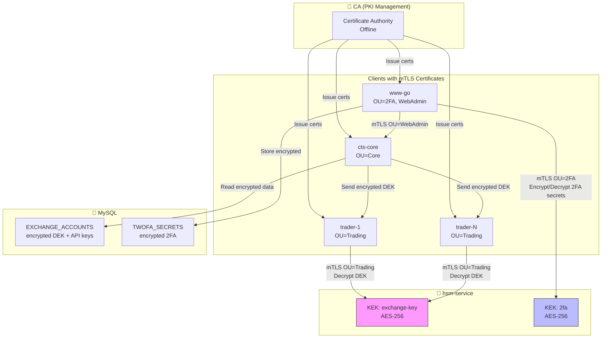

### 6.3 Credential Flow: Trader получает API keys (ASCII)

```
┌─────────────────────────────────────────────────────────────────────────────────────┐
│                     CREDENTIAL DECRYPTION FLOW (Вариант A)                          │
├─────────────────────────────────────────────────────────────────────────────────────┤
│                                                                                     │
│  Трейдер → HSM напрямую (credentials никогда не в открытом виде через CTS-Core)    │
│                                                                                     │
│    Trader                  CTS-Core              MySQL              HSM             │
│      │                        │                    │                 │              │
│      │  1. WebSocket connect  │                    │                 │              │
│      │───────────────────────>│                    │                 │              │
│      │     (mTLS: OU=Trading) │                    │                 │              │
│      │                        │                    │                 │              │
│      │  2. trader.register    │                    │                 │              │
│      │───────────────────────>│                    │                 │              │
│      │                        │                    │                 │              │
│      │                        │  3. SELECT TRADE   │                 │              │
│      │                        │─────────────────-->│                 │              │
│      │                        │                    │                 │              │
│      │                        │  4. SELECT         │                 │              │
│      │                        │     EXCHANGE_ACCOUNTS                │              │
│      │                        │─────────────────-->│                 │              │
│      │                        │  (encrypted DEK,   │                 │              │
│      │                        │   encrypted keys)  │                 │              │
│      │                        │                    │                 │              │
│      │  5. task.assign        │                    │                 │              │
│      │<───────────────────────│                    │                 │              │
│      │   {                    │                    │                 │              │
│      │     encrypted_dek,     │                    │                 │              │
│      │     encrypted_api_key, │                    │                 │              │
│      │     encrypted_secret   │                    │                 │              │
│      │   }                    │                    │                 │              │
│      │                        │                    │                 │              │
│      │  6. POST /decrypt      │                    │                 │              │
│      │     (encrypted_dek)    │                    │                 │              │
│      │───────────────────────────────────────────────────────────────>              │
│      │     (mTLS: OU=Trading) │                    │                 │              │
│      │                        │                    │                 │              │
│      │  7. Plain DEK          │                    │                 │              │
│      │<───────────────────────────────────────────────────────────────              │
│      │                        │                    │                 │              │
│      │  8. Decrypt API keys locally with DEK                        │              │
│      │     (keys only in memory, never logged)                      │              │
│      │                        │                    │                 │              │
│      │  9. Connect to Exchange with decrypted keys                  │              │
│      │                        │                    │                 │              │
│                                                                                     │
│  ✅ CTS-Core НИКОГДА не видит расшифрованные API ключи                              │
│  ✅ HSM проверяет OU=Trading в сертификате трейдера                                 │
│  ✅ Расшифрованные ключи существуют только в памяти трейдера                       │
│                                                                                     │
└─────────────────────────────────────────────────────────────────────────────────────┘
```

### 6.4 Credential Flow (Mermaid)

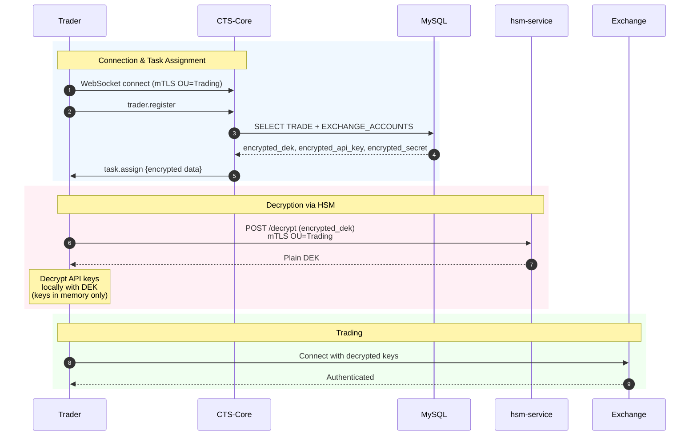

### 6.5 2FA Flow: Web → HSM (Mermaid)

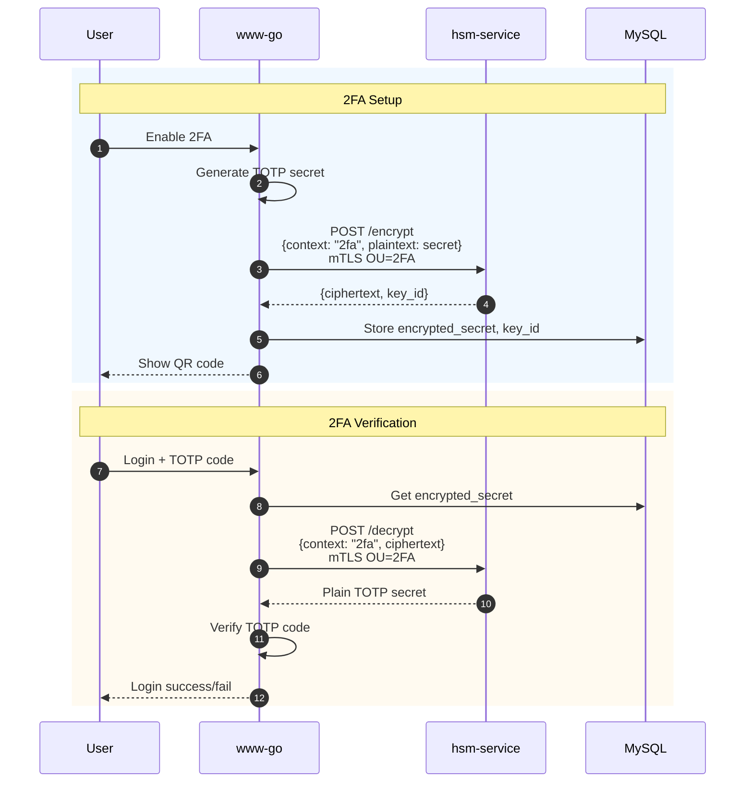

---

## 7. Распределение задач

### 7.1 Task Assignment Algorithm

```
┌─────────────────────────────────────────────────────────────────────────────────────┐
│                         TASK ASSIGNMENT ALGORITHM                                   │
├─────────────────────────────────────────────────────────────────────────────────────┤
│                                                                                     │
│  Input:                                                                             │
│    - TRADE records (from MySQL)                                                     │
│    - Available traders (connected via WebSocket)                                    │
│    - Latency metrics (trader → exchange)                                           │
│    - Load metrics (CPU, memory, active tasks)                                       │
│                                                                                     │
│  Algorithm:                                                                         │
│                                                                                     │
│  1. LOAD TRADES                                                                     │
│     ┌────────────────────────────────────────────────────────────────────────────┐ │
│     │  SELECT t.*, tsa.* FROM TRADE t                                             │ │
│     │  JOIN TRADE_SPOT_ARRAYS tsa ON t.ID = tsa.TRADE_ID                          │ │
│     │  WHERE t.ACTIVE = 1                                                          │ │
│     └────────────────────────────────────────────────────────────────────────────┘ │
│                                                                                     │
│  2. GROUP BY EXCHANGE                                                               │
│     ┌────────────────────────────────────────────────────────────────────────────┐ │
│     │  Map<ExchangeID, []Trade>                                                   │ │
│     │  {                                                                          │ │
│     │    "binance": [trade_1, trade_5, trade_8],                                 │ │
│     │    "kucoin": [trade_1, trade_2, trade_3],                                  │ │
│     │    "bybit": [trade_4, trade_6]                                             │ │
│     │  }                                                                          │ │
│     └────────────────────────────────────────────────────────────────────────────┘ │
│                                                                                     │
│  3. SCORE TRADERS (для каждой биржи)                                                │
│     ┌────────────────────────────────────────────────────────────────────────────┐ │
│     │  score = w1 * (1 / latency_ms)    // Чем меньше latency, тем лучше         │ │
│     │        + w2 * (1 - load)          // Чем меньше нагрузка, тем лучше        │ │
│     │        + w3 * region_bonus        // Бонус за близость к бирже             │ │
│     │                                                                             │ │
│     │  weights: w1=0.5, w2=0.3, w3=0.2                                           │ │
│     └────────────────────────────────────────────────────────────────────────────┘ │
│                                                                                     │
│  4. ASSIGN TASKS                                                                    │
│     ┌────────────────────────────────────────────────────────────────────────────┐ │
│     │  for each trade:                                                            │ │
│     │    required_exchanges = trade.exchanges                                     │ │
│     │    best_trader = trader with best combined score for all exchanges         │ │
│     │    assign(trade, best_trader)                                              │ │
│     └────────────────────────────────────────────────────────────────────────────┘ │
│                                                                                     │
│  5. DUPLICATE MONITORING TASKS                                                      │
│     ┌────────────────────────────────────────────────────────────────────────────┐ │
│     │  for each exchange:                                                         │ │
│     │    primary_trader = best_trader for exchange                               │ │
│     │    backup_trader = second_best_trader for exchange                         │ │
│     │    assign_monitoring(exchange, primary_trader, backup_trader)              │ │
│     └────────────────────────────────────────────────────────────────────────────┘ │
│                                                                                     │
└─────────────────────────────────────────────────────────────────────────────────────┘
```

### 7.2 Monitoring Duplication

```
┌─────────────────────────────────────────────────────────────────────────────────────┐
│                         MONITORING TASK DUPLICATION                                 │
├─────────────────────────────────────────────────────────────────────────────────────┤
│                                                                                     │
│  Цель: Обеспечить непрерывность мониторинга при отказе трейдера                    │
│                                                                                     │
│  Схема:                                                                             │
│  ┌───────────────────────────────────────────────────────────────────────────────┐ │
│  │                                                                                │ │
│  │     Exchange: Binance                                                          │ │
│  │     Pairs: BTC/USDT, ETH/USDT                                                  │ │
│  │                                                                                │ │
│  │     ┌─────────────────┐        ┌─────────────────┐                            │ │
│  │     │   Trader-1      │        │   Trader-2      │                            │ │
│  │     │   (PRIMARY)     │        │   (BACKUP)      │                            │ │
│  │     │                 │        │                 │                            │ │
│  │     │  ┌───────────┐  │        │  ┌───────────┐  │                            │ │
│  │     │  │ OrderBook │  │        │  │ OrderBook │  │                            │ │
│  │     │  │ BTC/USDT  │  │        │  │ BTC/USDT  │  │  ← HOT STANDBY             │ │
│  │     │  └───────────┘  │        │  └───────────┘  │                            │ │
│  │     │  ┌───────────┐  │        │  ┌───────────┐  │                            │ │
│  │     │  │ OrderBook │  │        │  │ OrderBook │  │                            │ │
│  │     │  │ ETH/USDT  │  │        │  │ ETH/USDT  │  │  ← HOT STANDBY             │ │
│  │     │  └───────────┘  │        │  └───────────┘  │                            │ │
│  │     │                 │        │                 │                            │ │
│  │     │  ┌───────────┐  │        │                 │                            │ │
│  │     │  │  Trading  │  │        │  ← Не торгует   │                            │ │
│  │     │  │  Active   │  │        │    (только      │                            │ │
│  │     │  └───────────┘  │        │    мониторинг)  │                            │ │
│  │     │                 │        │                 │                            │ │
│  │     └─────────────────┘        └─────────────────┘                            │ │
│  │                                                                                │ │
│  │  При отказе Trader-1:                                                          │ │
│  │  1. CTS-Core детектирует отказ (heartbeat timeout)                            │ │
│  │  2. Trader-2 уже имеет актуальные данные                                       │ │
│  │  3. CTS-Core назначает торговые задачи Trader-2                               │ │
│  │  4. Trader-2 начинает торговать немедленно                                    │ │
│  │  5. Время переключения: < 5 сек                                               │ │
│  │                                                                                │ │
│  └───────────────────────────────────────────────────────────────────────────────┘ │
│                                                                                     │
└─────────────────────────────────────────────────────────────────────────────────────┘
```

### 7.3 Task Assignment Flow (Mermaid)

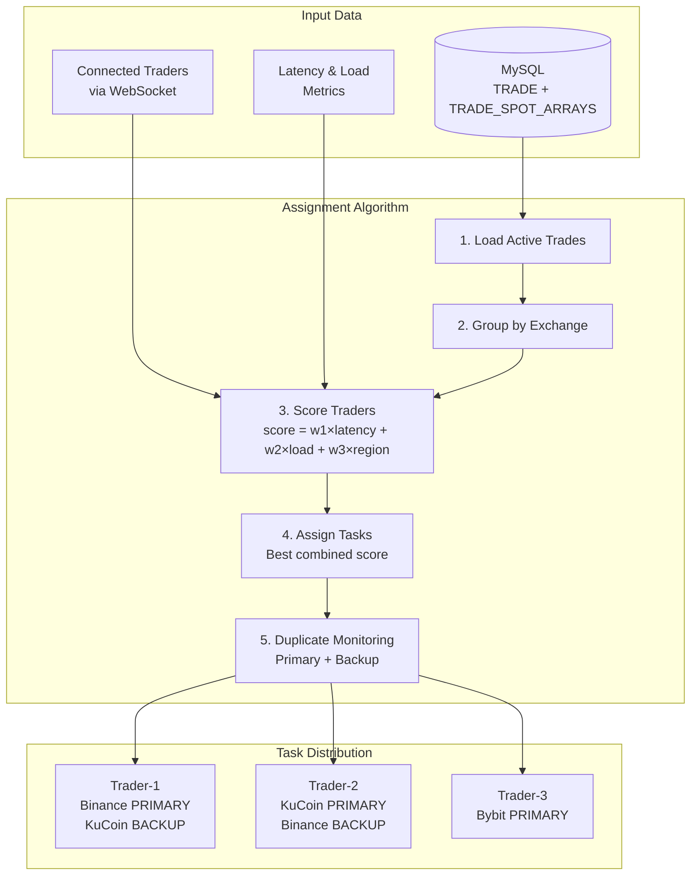

### 7.4 Failover Sequence (Mermaid)

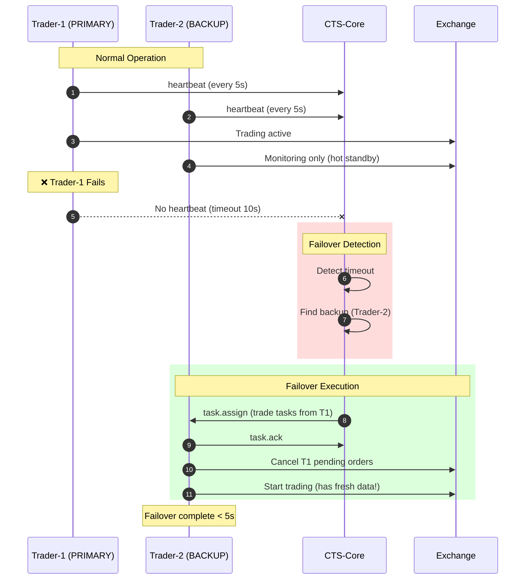

---

## 8. Отказоустойчивость

### 8.1 Failure Scenarios

| Сценарий | Детектирование | Recovery Action | RTO |
|----------|----------------|-----------------|-----|
| Trader disconnect | Heartbeat timeout (10s) | Failover to backup | <15s |
| Trader crash | TCP FIN/RST | Failover + cancel orders | <10s |
| CTS-Core crash | Trader detects disconnect | Trader pauses, waits | 30s |
| MySQL down | Connection pool error | Reconnect with backoff | <60s |
| HSM down | API timeout | Use cached DEKs | <5s |
| Exchange WS down | Ping timeout | Reconnect + re-subscribe | <30s |

### 8.2 Failure Recovery (Mermaid)

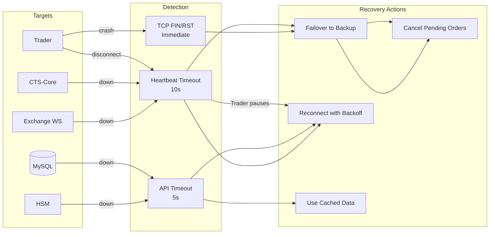

### 8.3 Trader Graceful Shutdown

```
┌─────────────────────────────────────────────────────────────────────────────────────┐
│                         TRADER GRACEFUL SHUTDOWN                                    │
├─────────────────────────────────────────────────────────────────────────────────────┤
│                                                                                     │
│  Trigger: SIGTERM, SIGINT, or shutdown request from CTS-Core                        │
│                                                                                     │
│  Phase 1: STOP ACCEPTING NEW TASKS (0-1s)                                           │
│  ┌───────────────────────────────────────────────────────────────────────────────┐ │
│  │  1. Send "trader.status = draining" to CTS-Core                                │ │
│  │  2. Stop accepting new trade assignments                                       │ │
│  │  3. Continue processing in-flight operations                                   │ │
│  └───────────────────────────────────────────────────────────────────────────────┘ │
│                                                                                     │
│  Phase 2: CANCEL PENDING ORDERS (1-10s)                                             │
│  ┌───────────────────────────────────────────────────────────────────────────────┐ │
│  │  for each active order:                                                        │ │
│  │    1. Send cancel request to exchange                                          │ │
│  │    2. Wait for cancel confirmation (with timeout)                              │ │
│  │    3. Log result                                                               │ │
│  └───────────────────────────────────────────────────────────────────────────────┘ │
│                                                                                     │
│  Phase 3: COMPLETE IN-FLIGHT REQUESTS (10-20s)                                      │
│  ┌───────────────────────────────────────────────────────────────────────────────┐ │
│  │  1. Wait for all REST API requests to complete                                 │ │
│  │  2. Process remaining WebSocket messages                                       │ │
│  │  3. Record all trade results                                                   │ │
│  └───────────────────────────────────────────────────────────────────────────────┘ │
│                                                                                     │
│  Phase 4: FLUSH DATA (20-25s)                                                       │
│  ┌───────────────────────────────────────────────────────────────────────────────┐ │
│  │  1. Send final trade.result to CTS-Core                                        │ │
│  │  2. Flush ClickHouse buffer                                                    │ │
│  │  3. Flush log buffers                                                          │ │
│  └───────────────────────────────────────────────────────────────────────────────┘ │
│                                                                                     │
│  Phase 5: DISCONNECT (25-30s)                                                       │
│  ┌───────────────────────────────────────────────────────────────────────────────┐ │
│  │  1. Close all exchange WebSocket connections                                   │ │
│  │  2. Send "trader.status = offline" to CTS-Core                                 │ │
│  │  3. Close CTS-Core WebSocket connection                                        │ │
│  │  4. Exit process                                                               │ │
│  └───────────────────────────────────────────────────────────────────────────────┘ │
│                                                                                     │
│  Timeout: 30s (configurable)                                                        │
│  Force kill after timeout                                                           │
│                                                                                     │
└─────────────────────────────────────────────────────────────────────────────────────┘
```

### 8.4 Graceful Shutdown Sequence (Mermaid)

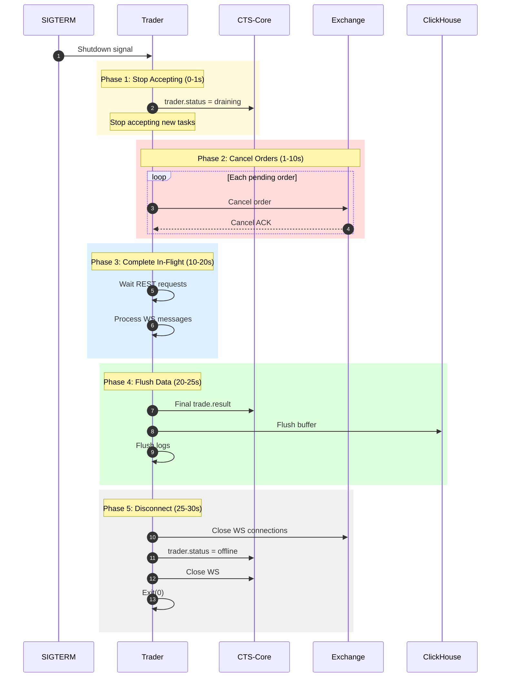

---

## 9. API Design

### 9.1 REST API (CTS-Core)

```
┌─────────────────────────────────────────────────────────────────────────────────────┐
│                              REST API ENDPOINTS                                     │
├─────────────────────────────────────────────────────────────────────────────────────┤
│                                                                                     │
│  Base URL: https://cts-core:8443/api/v1                                             │
│  Auth: mTLS + optional API key                                                      │
│                                                                                     │
│  ═══════════════════════════════════════════════════════════════════════════════   │
│                              SYSTEM STATUS                                          │
│  ═══════════════════════════════════════════════════════════════════════════════   │
│                                                                                     │
│  GET /health                                                                        │
│  Response: { "status": "healthy", "uptime_seconds": 12345 }                         │
│                                                                                     │
│  GET /metrics                                                                       │
│  Response: Prometheus format                                                        │
│                                                                                     │
│  GET /status                                                                        │
│  Response: Full system status tree (JSON)                                           │
│                                                                                     │
│  ═══════════════════════════════════════════════════════════════════════════════   │
│                              TRADERS MANAGEMENT                                     │
│  ═══════════════════════════════════════════════════════════════════════════════   │
│                                                                                     │
│  GET /traders                                                                       │
│  Response: List of all connected traders with status                                │
│                                                                                     │
│  GET /traders/{trader_id}                                                           │
│  Response: Detailed trader info (tasks, metrics, connections)                       │
│                                                                                     │
│  POST /traders/{trader_id}/shutdown                                                 │
│  Body: { "grace_period_ms": 30000 }                                                 │
│                                                                                     │
│  POST /traders/{trader_id}/tasks/{task_id}/cancel                                   │
│                                                                                     │
│  ═══════════════════════════════════════════════════════════════════════════════   │
│                              TRADING (via MySQL proxy)                              │
│  ═══════════════════════════════════════════════════════════════════════════════   │
│                                                                                     │
│  GET /trades                                                                        │
│  Response: List of active trades                                                    │
│                                                                                     │
│  GET /trades/{trade_id}                                                             │
│  Response: Trade details with assigned trader                                       │
│                                                                                     │
│  PUT /trades/{trade_id}                                                             │
│  Body: Updated trade config                                                         │
│  Effect: Propagates to assigned trader                                              │
│                                                                                     │
│  POST /trades/{trade_id}/start                                                      │
│  POST /trades/{trade_id}/stop                                                       │
│                                                                                     │
│  ═══════════════════════════════════════════════════════════════════════════════   │
│                              ARBITRAGE TRANSACTIONS                                 │
│  ═══════════════════════════════════════════════════════════════════════════════   │
│                                                                                     │
│  GET /arbitrage                                                                     │
│  Query: ?user_id=1&from=2026-01-01&to=2026-01-25                                   │
│  Response: List of arbitrage transactions                                           │
│                                                                                     │
│  GET /arbitrage/{arb_id}                                                            │
│  Response: Detailed transaction with all orders                                     │
│                                                                                     │
│  ═══════════════════════════════════════════════════════════════════════════════   │
│                              EXCHANGES                                              │
│  ═══════════════════════════════════════════════════════════════════════════════   │
│                                                                                     │
│  GET /exchanges                                                                     │
│  GET /exchanges/{exchange_id}/pairs                                                 │
│  GET /exchanges/{exchange_id}/latency                                               │
│                                                                                     │
│  ═══════════════════════════════════════════════════════════════════════════════   │
│                              STATISTICS                                             │
│  ═══════════════════════════════════════════════════════════════════════════════   │
│                                                                                     │
│  GET /stats/profit                                                                  │
│  Query: ?user_id=1&period=24h                                                       │
│                                                                                     │
│  GET /stats/orders                                                                  │
│  Query: ?exchange=binance&period=1h                                                 │
│                                                                                     │
└─────────────────────────────────────────────────────────────────────────────────────┘
```

### 9.2 WebSocket API (for Web)

```
┌─────────────────────────────────────────────────────────────────────────────────────┐
│                         WEBSOCKET API FOR WEB                                       │
├─────────────────────────────────────────────────────────────────────────────────────┤
│                                                                                     │
│  Endpoint: wss://cts-core:8443/ws/admin                                             │
│  Auth: mTLS (OU=WebAdmin)                                                           │
│                                                                                     │
│  ═══════════════════════════════════════════════════════════════════════════════   │
│                           SUBSCRIBE TO EVENTS                                       │
│  ═══════════════════════════════════════════════════════════════════════════════   │
│                                                                                     │
│  Client → Server:                                                                   │
│  {                                                                                  │
│      "action": "subscribe",                                                         │
│      "channels": [                                                                  │
│          "traders.status",          // Trader connects/disconnects                 │
│          "trades.updates",          // Trade config changes                        │
│          "arbitrage.new",           // New arbitrage transactions                  │
│          "metrics.realtime"         // Real-time metrics                           │
│      ]                                                                              │
│  }                                                                                  │
│                                                                                     │
│  Server → Client (example events):                                                  │
│  {                                                                                  │
│      "channel": "traders.status",                                                   │
│      "event": "trader.connected",                                                   │
│      "data": {                                                                      │
│          "trader_id": "trader-eu-1",                                               │
│          "region": "eu-frankfurt",                                                  │
│          "connected_at": "2026-01-25T10:00:00Z"                                    │
│      }                                                                              │
│  }                                                                                  │
│                                                                                     │
│  {                                                                                  │
│      "channel": "arbitrage.new",                                                    │
│      "event": "arbitrage.completed",                                                │
│      "data": {                                                                      │
│          "arb_id": 12345,                                                           │
│          "trade_id": 1,                                                             │
│          "profit": "15.50",                                                         │
│          "exchanges": ["binance", "kucoin"]                                        │
│      }                                                                              │
│  }                                                                                  │
│                                                                                     │
└─────────────────────────────────────────────────────────────────────────────────────┘
```

---

## 10. База данных

### 10.1 Новые таблицы для CTS-Core

```sql
-- Сессии трейдеров
CREATE TABLE `TRADER_SESSION` (
  `ID` int NOT NULL AUTO_INCREMENT,
  `TRADER_ID` varchar(64) NOT NULL,           -- Из CN сертификата
  `STATUS` enum('online','offline','draining') NOT NULL DEFAULT 'offline',
  `CONNECTED_AT` timestamp NULL,
  `DISCONNECTED_AT` timestamp NULL,
  `LAST_HEARTBEAT` timestamp NULL,
  `REGION` varchar(64) NULL,
  `VERSION` varchar(32) NULL,
  `CAPABILITIES` json NULL,                   -- Поддерживаемые биржи
  `METRICS` json NULL,                        -- Последние метрики
  PRIMARY KEY (`ID`),
  UNIQUE KEY `TRADER_SESSION_TRADER_ID_IDX` (`TRADER_ID`)
) ENGINE=InnoDB;

-- Назначения задач
CREATE TABLE `TASK_ASSIGNMENT` (
  `ID` int NOT NULL AUTO_INCREMENT,
  `TRADE_ID` int NOT NULL,
  `TRADER_ID` varchar(64) NOT NULL,
  `STATUS` enum('pending','active','completed','failed','cancelled') NOT NULL DEFAULT 'pending',
  `ASSIGNED_AT` timestamp NOT NULL DEFAULT CURRENT_TIMESTAMP,
  `STARTED_AT` timestamp NULL,
  `COMPLETED_AT` timestamp NULL,
  `IS_BACKUP` tinyint(1) NOT NULL DEFAULT 0,  -- Для дублирования мониторинга
  PRIMARY KEY (`ID`),
  KEY `TASK_ASSIGNMENT_TRADE_IDX` (`TRADE_ID`),
  KEY `TASK_ASSIGNMENT_TRADER_IDX` (`TRADER_ID`),
  CONSTRAINT `fk_task_trade` FOREIGN KEY (`TRADE_ID`) REFERENCES `TRADE` (`ID`)
) ENGINE=InnoDB;

-- Latency метрики
CREATE TABLE `TRADER_LATENCY` (
  `ID` int NOT NULL AUTO_INCREMENT,
  `TRADER_ID` varchar(64) NOT NULL,
  `EXCHANGE_ID` int NOT NULL,
  `PING_MS` int NOT NULL,
  `ORDER_LATENCY_MS` int NULL,
  `WS_LATENCY_MS` int NULL,
  `MEASURED_AT` timestamp NOT NULL DEFAULT CURRENT_TIMESTAMP,
  PRIMARY KEY (`ID`),
  KEY `TRADER_LATENCY_TRADER_IDX` (`TRADER_ID`, `EXCHANGE_ID`),
  CONSTRAINT `fk_latency_exchange` FOREIGN KEY (`EXCHANGE_ID`) REFERENCES `EXCHANGE` (`ID`)
) ENGINE=InnoDB;

-- Арбитражные транзакции (уже упомянуто в gpt.txt)
CREATE TABLE `ARBITRAGE_TRANS` (
  `ID` int NOT NULL AUTO_INCREMENT,
  `TRADE_ID` int NOT NULL,
  `USER_ID` int NOT NULL,
  `TRADER_ID` varchar(64) NULL,               -- Какой трейдер исполнял
  `STATUS` enum('pending','partial','completed','failed','cancelled') NOT NULL,
  `STRATEGY` varchar(32) NOT NULL,            -- cross_exchange, triangular, etc.
  `PROFIT` decimal(30,12) NULL,
  `FEES` decimal(30,12) NULL,
  `CREATED_AT` timestamp NOT NULL DEFAULT CURRENT_TIMESTAMP,
  `COMPLETED_AT` timestamp NULL,
  PRIMARY KEY (`ID`),
  KEY `ARB_TRANS_TRADE_IDX` (`TRADE_ID`),
  KEY `ARB_TRANS_USER_IDX` (`USER_ID`),
  CONSTRAINT `fk_arb_trade` FOREIGN KEY (`TRADE_ID`) REFERENCES `TRADE` (`ID`),
  CONSTRAINT `fk_arb_user` FOREIGN KEY (`USER_ID`) REFERENCES `USER` (`ID`)
) ENGINE=InnoDB;

-- Ордера внутри арбитражной транзакции
CREATE TABLE `ARBITRAGE_ORDER` (
  `ID` int NOT NULL AUTO_INCREMENT,
  `ARB_TRANS_ID` int NOT NULL,
  `EXCHANGE_ACCOUNT_ID` int NOT NULL,
  `PAIR_ID` int NOT NULL,
  `EXCHANGE_ORDER_ID` varchar(128) NULL,      -- ID от биржи
  `SIDE` enum('buy','sell') NOT NULL,
  `TYPE` enum('market','limit') NOT NULL,
  `PRICE` decimal(30,12) NULL,
  `QUANTITY` decimal(30,12) NOT NULL,
  `FILLED_QUANTITY` decimal(30,12) NULL,
  `AVERAGE_PRICE` decimal(30,12) NULL,
  `FEE` decimal(30,12) NULL,
  `FEE_CURRENCY` varchar(16) NULL,
  `STATUS` enum('pending','open','partial','filled','cancelled','failed') NOT NULL,
  `CREATED_AT` timestamp NOT NULL DEFAULT CURRENT_TIMESTAMP,
  `UPDATED_AT` timestamp NULL ON UPDATE CURRENT_TIMESTAMP,
  PRIMARY KEY (`ID`),
  KEY `ARB_ORDER_TRANS_IDX` (`ARB_TRANS_ID`),
  CONSTRAINT `fk_order_trans` FOREIGN KEY (`ARB_TRANS_ID`) REFERENCES `ARBITRAGE_TRANS` (`ID`),
  CONSTRAINT `fk_order_account` FOREIGN KEY (`EXCHANGE_ACCOUNT_ID`) REFERENCES `EXCHANGE_ACCOUNTS` (`ID`),
  CONSTRAINT `fk_order_pair` FOREIGN KEY (`PAIR_ID`) REFERENCES `SPOT_TRADE_PAIR` (`ID`)
) ENGINE=InnoDB;
```

---

## 11. План разработки

### 11.1 Этапы разработки CTS-Core

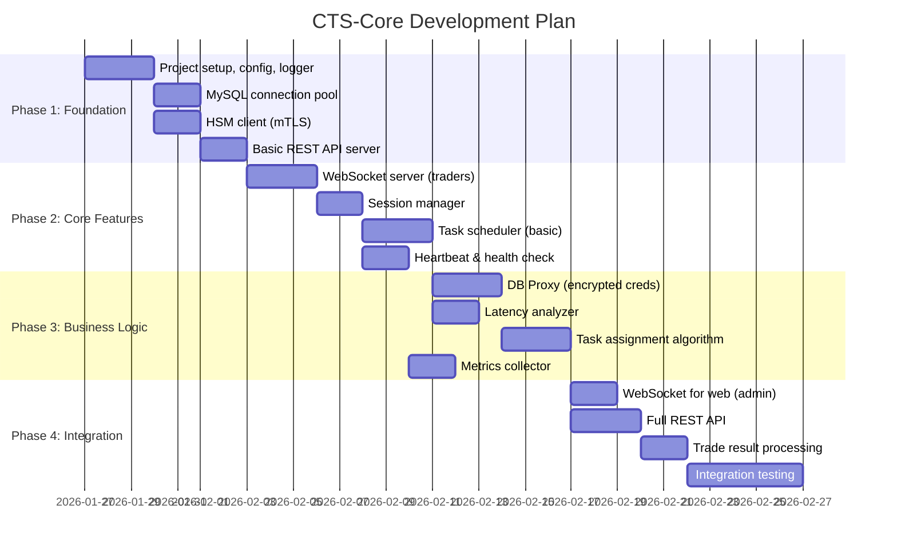

### 11.2 Этапы разработки Trader Daemon

> **Примечание:** daemon2 уже имеет базовую структуру в `/other-sub-system/daemon2/`

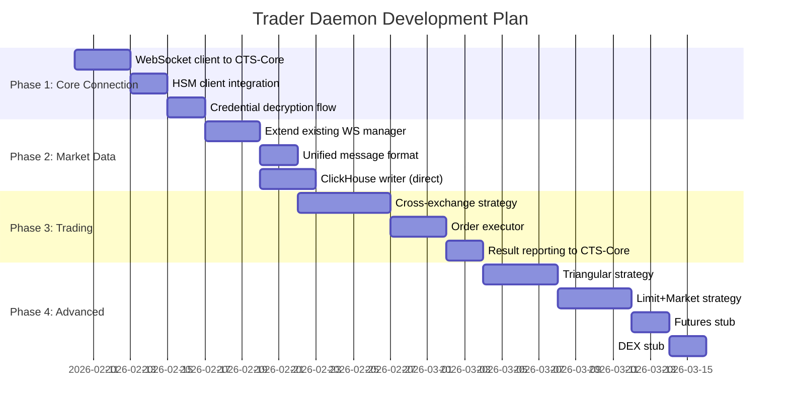

### 11.3 Фазы CTS-Core (Детально)

| Фаза | Компонент | Описание | Приоритет |
|------|-----------|----------|-----------|
| **1.1** | Project Setup | go.mod, config, logger (как в hsm-service) | 🔴 Critical |
| **1.2** | MySQL Pool | Connection pool с retry, mTLS | 🔴 Critical |
| **1.3** | HSM Client | mTLS client для hsm-service | 🔴 Critical |
| **1.4** | REST Server | Gin/Echo, /health, /metrics | 🔴 Critical |
| **2.1** | WS Server | WebSocket для трейдеров, gorilla/websocket | 🔴 Critical |
| **2.2** | Session Mgr | Регистрация, heartbeat, disconnect handling | 🔴 Critical |
| **2.3** | Task Scheduler | Загрузка TRADE из БД, базовое распределение | 🔴 Critical |
| **2.4** | Heartbeat | Ping/pong, timeout detection | 🟡 High |
| **3.1** | DB Proxy | Передача encrypted credentials | 🔴 Critical |
| **3.2** | Latency | Periodic latency tests, scoring | 🟡 High |
| **3.3** | Task Assign | Algorithm: latency + load balancing | 🟡 High |
| **3.4** | Metrics | Prometheus, сбор метрик с трейдеров | 🟢 Medium |
| **4.1** | Admin WS | WebSocket для www-go | 🟡 High |
| **4.2** | Full REST | CRUD для trades, status, statistics | 🟡 High |
| **4.3** | Trade Results | Обработка результатов, запись в БД | 🔴 Critical |
| **4.4** | Integration | E2E тесты, stress tests | 🟡 High |

### 11.4 Структура проекта CTS-Core

```
cts-core/
├── cmd/
│   └── cts-core/
│       └── main.go                 # Entry point
│
├── internal/
│   ├── config/                     # Configuration
│   │   ├── config.go
│   │   ├── types.go
│   │   └── config_test.go
│   │
│   ├── logger/                     # Logging (как в daemon2)
│   │   └── logger.go
│   │
│   ├── db/                         # Database layer
│   │   ├── mysql.go                # MySQL connection pool
│   │   ├── repository.go           # Repository pattern
│   │   └── models/                 # DB models
│   │       ├── trade.go
│   │       ├── exchange_account.go
│   │       ├── trader_session.go
│   │       └── arbitrage_trans.go
│   │
│   ├── hsm/                        # HSM client
│   │   ├── client.go               # mTLS client
│   │   └── types.go
│   │
│   ├── api/                        # API layer
│   │   ├── server.go               # HTTP server setup
│   │   ├── rest/                   # REST handlers
│   │   │   ├── health.go
│   │   │   ├── traders.go
│   │   │   ├── trades.go
│   │   │   └── stats.go
│   │   └── ws/                     # WebSocket handlers
│   │       ├── trader_handler.go   # WS for traders
│   │       ├── admin_handler.go    # WS for web admin
│   │       └── protocol.go         # Message types
│   │
│   ├── session/                    # Session management
│   │   ├── manager.go              # Session manager
│   │   ├── trader.go               # Trader session
│   │   └── heartbeat.go
│   │
│   ├── scheduler/                  # Task scheduling
│   │   ├── scheduler.go            # Main scheduler
│   │   ├── task.go                 # Task types
│   │   ├── assignment.go           # Assignment algorithm
│   │   └── latency.go              # Latency analyzer
│   │
│   ├── metrics/                    # Metrics collection
│   │   ├── collector.go
│   │   └── prometheus.go
│   │
│   └── state/                      # State management
│       └── state.go                # Persistent state
│
├── conf/
│   ├── config.yaml                 # Main config
│   └── config.example.yaml
│
├── pki/                            # Certificates
│   ├── ca/
│   ├── server/
│   └── client/
│
├── scripts/
│   └── init.sh
│
├── Dockerfile
├── docker-compose.yml
├── go.mod
├── go.sum
├── Makefile
└── README.md
```

### 11.5 Следующие шаги

1. **Утверждение архитектуры** — просмотр этого документа
2. **Создание скелета проекта** — базовая структура CTS-Core
3. **Phase 1 реализация** — config, logger, MySQL, HSM client
4. **Параллельно**: Обновление daemon2 для работы с CTS-Core

---

*Документ будет обновляться по мере разработки*
