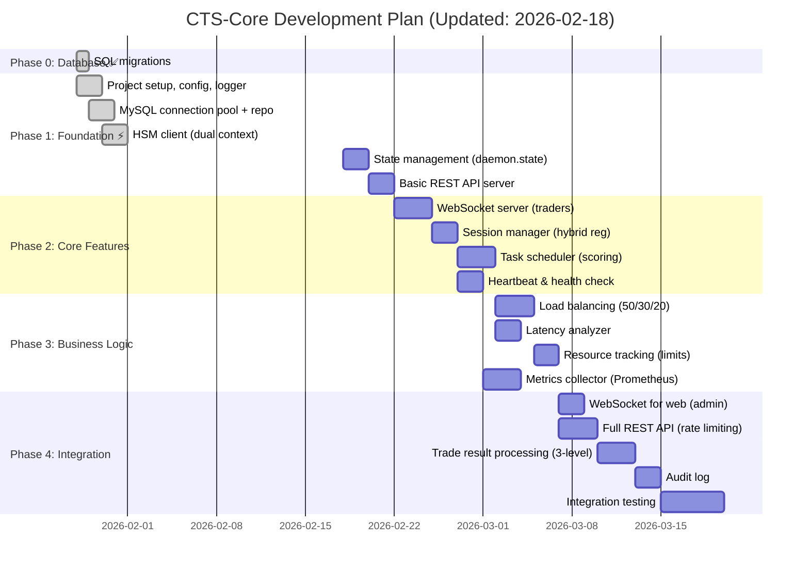
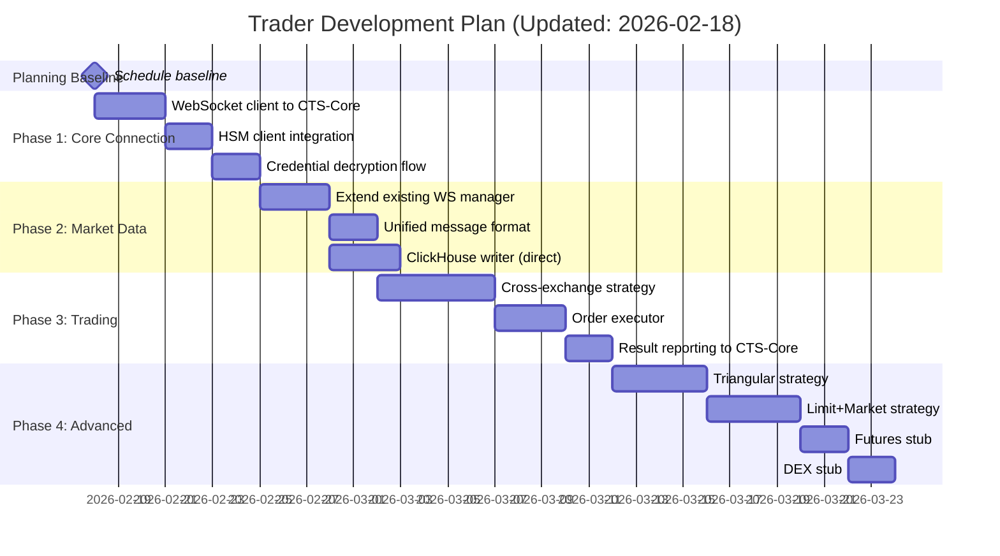
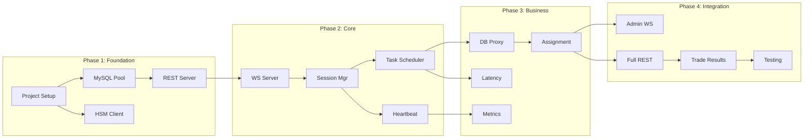

# CTS-Core & Trader Development Plan

> **Версия документа**: 1.2.0  
> **Дата**: 2026-01-31  
> **Статус**: Phase 1.3 Complete | Phase 1.4 In Progress | Phase 1.5 In Progress  
> **Связанные документы**: [ARCHITECTURE.md](ARCHITECTURE.md), [CONTEXT.md](CONTEXT.md), [API_SPECIFICATION.md](API_SPECIFICATION.md)

---

## 1. Обзор

Этот документ содержит план разработки для двух основных компонентов:
- **CTS-Core** — центральный оркестратор
- **Trader** — торговые сервисы

**ВАЖНО:** Все архитектурные блокеры закрыты (9/9), можно продолжать Phase 1.

**Текущее состояние (факт):**
- Phase 1.1-1.3 реализованы (config/logger/MySQL/HSM client)
- Phase 1.4 (state) в работе
- Phase 1.5 (REST server) в работе: базовые health endpoints и middleware присутствуют

---

## 2. Этапы разработки CTS-Core



---

## 3. Этапы разработки Trader

> **Примечание:** daemon2 уже имеет базовую структуру в `/other-sub-system/daemon2/`



---

## 3. 📊 Унификация логирования (КРИТИЧНО за Phase 1.4)

### 🎯 Цель
Привести CTS-Core к уровню HSM Service v2.0.0:
- JSON + stdout + rotation (lumberjack)
- request_id и единый формат времени UTC RFC3339 с микросекундами
- fail-fast проверка доступности директорий логов
- модульные теги и разделение потоков логирования

### 📦 Предлагаемые потоки логов

**error.log** (system log)
- все системные события, ошибки, исключения, внутренние операции

**access.log** (входящие запросы)
- все входящие HTTP запросы от других систем
- WebSocket handshake и события жизненного цикла соединения (если WS логи не включены отдельно)

**out_request.log** (исходящие запросы)
- все исходящие HTTP запросы CTS-Core (HSM, внешние сервисы)

**ws_access.log** (входящие WS события)
- connect/disconnect, auth, subscribe/unsubscribe, ping/pong, ошибки протокола

**ws_out.log** (исходящие WS сообщения)
- команды и ответы трейдерам/веб-клиентам (с conn_id/msg_id)

### ✅ Стандарт полей для WS логов

**ws_access.log**
- required: timestamp, level, module, event, conn_id
- recommended: trader_id, session_id, client_ip, user_agent, ws_path
- optional: msg_id, request_id, error, latency_ms, size_bytes

**ws_out.log**
- required: timestamp, level, module, event, conn_id, msg_id
- recommended: trader_id, session_id, target, msg_type, size_bytes
- optional: request_id, latency_ms, error, status

**audit.log** (аудит действий)
- все критичные админские/системные действия над сущностями
- хранит кто/что/когда/результат, нужен для compliance и расследований

### ⚠️ Текущее состояние (ПРОБЛЕМЫ)

| Параметр | CTS-Core | HSM v2.0.0 |
|----------|----------|------------|
| **Библиотека** | ✅ slog | ✅ slog |
| **Формат** | ✅ JSON | ✅ JSON |
| **Stdout вывод** | ✅ Есть | ✅ Есть |
| **Ротация** | ✅ lumberjack | ✅ lumberjack |
| **request_id** | ✅ Есть | ✅ Есть |
| **Fail-fast проверка логов** | ✅ Есть | ✅ Есть |
| **Разделение логов** | ✅ HTTP + WS stub | ✅ audit/error |
| **Видно в docker logs** | ✅ Да | ✅ Да |

### ✅ Требуемые изменения (1-2 дня)

**1) Добавить request_id**
- Заголовок `X-Request-ID` (если нет — сгенерировать) ✅
- Проброс в access/error/out_request ✅

**2) Разделить логи на потоки**
- error: основной системный лог ✅
- access: входящие HTTP запросы ✅
- out_request: исходящие HTTP запросы ✅
- ws_access: входящие WS события ✅ (WS stub)
- ws_out: исходящие WS сообщения ✅ (WS stub)
- audit: критичные админские/системные действия ✅ (middleware)

**3) Частичное логирование POST payload**
- Только whitelist полей (никаких секретов/ключей)
- Маскирование чувствительных значений
- Лимит размера (например 2-4 KB)
- Включается по флагу (например `logging.post_payload=true`)

### 📝 Конфигурация (пример)

```yaml
logging:
    level: "info"
    error_path: "/var/log/cts-core/error.log"
    access_path: "/var/log/cts-core/access.log"
    out_request_path: "/var/log/cts-core/out_request.log"
    ws_access_path: "/var/log/cts-core/ws_access.log"
    ws_out_path: "/var/log/cts-core/ws_out.log"
    max_size_mb: 100
    max_backups: 10
    max_age_days: 30
    compress: true
    access_to_stdout: true
    out_request_to_stdout: false
```

### 🧠 Рекомендация по WebSocket логированию

**Минимально необходимое:**
- Логировать lifecycle: connect/disconnect, auth, subscribe/unsubscribe
- Логировать ошибки протокола, timeouts, rate limits
- Все это писать в ws_access.log и error.log (ошибки)

**Не рекомендуется:**
- Логировать каждое WS сообщение (шум + объём)

**Если нужно логировать сообщения:**
- Ввести sampling (например 1% или только ошибки)
- Писать в ws_out.log (outbound)
- Включать по флагу `logging.ws_debug=true`

### ✅ Чек-лист реализации

```
Phase 1.4 - Logging Unification for CTS-Core
[x] JSON + stdout + lumberjack
[x] fail-fast проверка прав на директорию
[x] UTC RFC3339 microseconds
[x] Логгеры и файлы для error/access/out_request/ws_access/ws_out/audit
[x] Обновить config + docs
[x] Подключить request_id middleware к HTTP серверу
[x] Проброс request_id в access/error/out_request
[x] Включить access/out_request/ws/audit логирование в обработчиках (WS stub)
[ ] Проверить docker logs и наличие файлов
```

---

## 4. Фазы CTS-Core (Детально)

> **Примечание:** Для каждой фазы создан отдельный детальный гайд в `guides/`.  
> После завершения фазы - удалите соответствующий гайд.

### Phase 0: Database Schema ✅ COMPLETE

**Время:** 1 день ✅ | **Гайд:** [guides/phase_0_database_migrations.md](guides/phase_0_database_migrations.md)

**Что сделано:**
- ✅ 9 новых таблиц (TRADER, TRADER_SESSION, ARBITRAGE_ORDER, и др.)
- ✅ 4 ALTER (ARBITRAGE_TRANS→BIGINT, USER_2FA, MONITORING, TRADE)
- ✅ 4 scheduler tasks инициализированы
- ✅ Всего 18 таблиц в БД

---

### Phase 1.1: Project Setup ✅ COMPLETE

**Время:** 2 дня ✅ | **Гайд:** [guides/phase_1_1_project_setup.md](guides/phase_1_1_project_setup.md)

**Что сделано:**
- ✅ Project structure (cmd/, internal/, conf/, logs/, state/)
- ✅ Config.yaml + validation + logger (slog с rotation)
- ✅ Makefile (14 targets) + Dockerfile + docker-compose.yml
- ✅ Tests: 14/14 pass (config 82.4%, logger 86.9%)
- ✅ Binary: 3.8 MB (native), Docker: 20.5 MB

---

### Phase 1.2: MySQL Connection Pool ✅ COMPLETE

**Время:** 2 дня ✅ | **Гайд:** ~~guides/phase_1_2_mysql_pool.md~~ (DELETED - phase complete)

**Что сделано:**
- ✅ MySQL client с optional mTLS + retry logic (exponential backoff)
- ✅ 6 database models + 8 repositories (CRUD)
- ✅ Repository integration в main.go (sqlx wrapper)
- ✅ Tests: 71 total (59 passing, 12 skipped)
- ✅ Makefile: db-ping, db-test
- ✅ 1941 строка implementation

---

### Phase 1.3: HSM Client ✅ COMPLETE

**Время:** 2 дня ✅ | **Гайд:** ~~guides/phase_1_3_hsm_client.md~~ (DELETED - phase complete)

**Что сделано:**
- ✅ **Dual HSM clients** (Trading + 2FA contexts) в main.go
- ✅ mTLS client с exponential backoff retry (5 attempts, 200ms→10s)
- ✅ Encrypt/Decrypt methods с context parameter
- ✅ ACL isolation: Trading cert ≠ 2fa context (403 Forbidden)
- ✅ Tests: 9/9 pass (3 unit + 6 integration + config tests)
- ✅ Docs: ARCHITECTURE.md (241 lines) + README_TESTS.md (140 lines)
- ✅ 950+ строк (569 code + 381 docs)

---

### Phase 1.4: State Management 🔴

**Цель:** Реализовать persistent state (daemon.state + MySQL sync).

**Время:** 2 дня

**Детальный гайд:** `guides/phase_1_4_state_management.md`

**Краткий план:**
1. State file format (JSON) (2 часа)
2. Load/Save operations (3 часа)
3. MySQL sync (background goroutine) (3 часа)
4. Backup mechanism (3 backups) (2 часа)
5. Recovery from state (3 часа)
6. Tests (3 часа)

**Deliverables:**
- internal/state/state.go
- State persistence tests
- Recovery tests

**Definition of Done:**
- [ ] State сохраняется в daemon.state
- [ ] Sync к MySQL каждые 30 секунд
- [ ] 3 backup copies сохраняются
- [ ] Recovery после restart работает
- [ ] Закоммичено в git

---

### Phase 1.5: Basic REST API Server 🔴

**Цель:** Запустить Gin server с /health, /metrics endpoints.

**Время:** 2 дня

**Детальный гайд:** `guides/phase_1_5_rest_server.md` (TODO: создать)

**Краткий план:**
1. Gin server setup (2 часа)
2. TLS configuration (2 часа)
3. /health endpoint (1 час)
4. /metrics endpoint (Prometheus) (3 часа)
5. Middleware (logging, recovery) (2 часа)
6. Tests (4 часа)

**Deliverables:**
- internal/api/server.go
- internal/api/rest/health.go
- internal/metrics/collector.go
- REST API tests

**Definition of Done:**
- [ ] Server запускается на :8443 с TLS
- [ ] GET /health возвращает 200 OK
- [ ] GET /metrics (на :9090) работает
- [ ] Middleware логирует все requests
- [ ] Tests проходят
- [ ] Закоммичено в git

---

### Phase 1 Summary

**Total Time:** ~9 дней (Phase 1.1-1.5)

**Key Deliverables:**
1. ✅ Project setup (config, logger, main.go)
2. ⏳ MySQL pool (mTLS, retry, repository)
3. ⏳ HSM client (encrypt/decrypt)
4. ⏳ State management (daemon.state + sync)
5. ⏳ REST API (/health, /metrics)

**After Phase 1:**
- CTS-Core компилируется и запускается
- Подключается к MySQL и HSM
- Отдает /health и /metrics
- Сохраняет state
- Готов к Phase 2 (WebSocket, sessions)

---

### Phase 0: Database Schema (НАЧАТЬ ЗДЕСЬ) 🔴

**Цель:** Применить SQL миграции для создания всех необходимых таблиц Phase 1.

**Готово:** ✅ migrations/001_phase1_schema.sql создан (11 tables, 397 строк SQL)

#### 0.0 Предварительные проверки (15 минут)

**Шаги:**

1. **Проверить доступ к MySQL:**
```bash
mysql -u root -proot -h 127.0.0.1 -e "SELECT VERSION();"
# Expected: MySQL 9.0.x

mysql -u root -proot -h 127.0.0.1 -e "SHOW DATABASES LIKE 'ct_system';"
# Expected: ct_system exists
```

2. **Проверить существующие таблицы:**
```bash
mysql -u root -proot -h 127.0.0.1 ct_system -e "SHOW TABLES;"
# Expected: ARBITRAGE_TRANS, USER, EXCHANGE_ACCOUNTS, USER_2FA, MONITORING
```

3. **Backup существующих данных (опционально для DEV):**
```bash
mysqldump -u root -proot -h 127.0.0.1 ct_system > backup_$(date +%Y%m%d_%H%M%S).sql
```

4. **Проверить файл миграции:**
```bash
wc -l migrations/001_phase1_schema.sql
# Expected: 397 lines

head -20 migrations/001_phase1_schema.sql
# Check: Header comment present, USE ct_system; statement
```

**Definition of Done:**
- ✅ MySQL доступен и версия >= 9.0
- ✅ База ct_system существует
- ✅ Backup создан (если нужен)
- ✅ Файл миграции прочитан и понятен

---

#### 0.1 Применение миграций (30 минут)

**Команда:**
```bash
mysql -u root -proot -h 127.0.0.1 ct_system < migrations/001_phase1_schema.sql 2>&1 | tee migration.log
```

**Что происходит:**
- **Section 1-8:** CREATE TABLE для 8 основных таблиц
- **Section 9:** ALTER USER_2FA + CREATE HSM key rotation tables (3)
- **Section 10:** CREATE SCHEDULER_TASKS + INSERT 4 default tasks

**Ожидаемый вывод:**
```
Query OK, 0 rows affected
Query OK, 0 rows affected
...
Query OK, 4 rows affected  (SCHEDULER_TASKS inserts)
```

**Проверка в процессе:**
```bash
# Если ошибка "Table already exists" - нормально, идем дальше
# Если ошибка "Syntax error" - STOP, проверить migration.log
```

**Definition of Done:**
- ✅ Команда выполнена без critical errors
- ✅ migration.log содержит успешные результаты
- ✅ Нет синтаксических ошибок SQL

---

#### 0.2 Верификация таблиц (15 минут)

**1. Проверить создание всех таблиц:**
```sql
mysql -u root -proot -h 127.0.0.1 ct_system -e "SHOW TABLES;"

-- Expected output (16 tables total):
-- ARBITRAGE_ORDER           (NEW)
-- ARBITRAGE_TRANS           (existing)
-- AUDIT_LOG                 (NEW)
-- EXCHANGE_LIMITS           (NEW)
-- MONITORING                (existing, ALTER applied)
-- ORDER_TRANSACTION         (NEW)
-- REENCRYPTION_JOBS         (NEW)
-- REENCRYPTION_PROGRESS     (NEW)
-- SCHEDULER_TASKS           (NEW)
-- TRADER                    (NEW)
-- TRADER_EXCHANGE_RESOURCE  (NEW)
-- TRADER_SESSION            (NEW)
-- USER                      (existing)
-- USER_2FA                  (existing, ALTER applied)
```

**2. Проверить структуру ключевых таблиц:**
```sql
-- TRADER (admin pre-registration)
DESCRIBE TRADER;
-- Expected: trader_id, certificate_cn, region, status, max_tasks, created_at

-- TRADER_SESSION (connection history)
DESCRIBE TRADER_SESSION;
-- Expected: session_id, trader_id, ws_connection_id, connected_at, last_heartbeat

-- USER_2FA (HSM key rotation added)
DESCRIBE USER_2FA;
-- Expected: enc_key_version, needs_reencryption columns added

-- REENCRYPTION_JOBS (HSM key rotation)
DESCRIBE REENCRYPTION_JOBS;
-- Expected: job_type, old_key_version, new_key_version, status, total_records

-- SCHEDULER_TASKS (background jobs)
SELECT task_name, enabled FROM SCHEDULER_TASKS;
-- Expected: 4 tasks (cleanup_trader_sessions, cleanup_audit_logs, reset_daily_limits, check_reencryption_jobs)
```

**3. Проверить индексы:**
```sql
SHOW INDEX FROM TRADER;
SHOW INDEX FROM TRADER_SESSION;
SHOW INDEX FROM ARBITRAGE_ORDER;
-- Verify: PRIMARY keys, UNIQUE constraints, foreign keys present
```

**4. Проверить внешние ключи:**
```sql
SELECT 
    TABLE_NAME,
    CONSTRAINT_NAME,
    REFERENCED_TABLE_NAME
FROM INFORMATION_SCHEMA.KEY_COLUMN_USAGE
WHERE TABLE_SCHEMA = 'ct_system'
AND REFERENCED_TABLE_NAME IS NOT NULL
ORDER BY TABLE_NAME;

-- Expected foreign keys:
-- TRADER_SESSION → TRADER
-- ARBITRAGE_ORDER → ARBITRAGE_TRANS
-- ORDER_TRANSACTION → ARBITRAGE_ORDER
-- REENCRYPTION_PROGRESS → REENCRYPTION_JOBS
```

**Definition of Done:**
- ✅ 16 таблиц существуют (11 новых + 5 existing)
- ✅ USER_2FA имеет enc_key_version, needs_reencryption
- ✅ SCHEDULER_TASKS содержит 4 задачи (все enabled=TRUE)
- ✅ Все индексы и foreign keys на месте
- ✅ UNIQUE constraints проверены (deduplication работает)

---

#### 0.3 Тестирование базовых операций (15 минут)

**1. Test INSERT - TRADER (admin pre-registration):**
```sql
INSERT INTO TRADER (
    trader_id, certificate_cn, region, status, max_tasks, created_by
) VALUES (
    'trader-test-1', 
    'CN=trader-test-1,OU=Trading,O=Private',
    'EU',
    'active',
    5,
    1  -- admin USER.ID
);

SELECT * FROM TRADER WHERE trader_id = 'trader-test-1';
-- Expected: 1 row, status=active, max_tasks=5

-- Cleanup
DELETE FROM TRADER WHERE trader_id = 'trader-test-1';
```

**2. Test FOREIGN KEY - TRADER_SESSION:**
```sql
-- Should fail (trader doesn't exist)
INSERT INTO TRADER_SESSION (trader_id, ws_connection_id)
VALUES ('nonexistent', 'ws-123');
-- Expected: ERROR 1452 (23000): Cannot add or update a child row

-- Create trader first, then session - should work
INSERT INTO TRADER (trader_id, certificate_cn, region, status)
VALUES ('trader-test-2', 'CN=test', 'EU', 'active');

INSERT INTO TRADER_SESSION (trader_id, ws_connection_id)
VALUES ('trader-test-2', 'ws-123');
-- Expected: Success

SELECT * FROM TRADER_SESSION WHERE trader_id = 'trader-test-2';

-- Cleanup
DELETE FROM TRADER WHERE trader_id = 'trader-test-2';
-- CASCADE should delete session too
SELECT COUNT(*) FROM TRADER_SESSION WHERE trader_id = 'trader-test-2';
-- Expected: 0 (CASCADE worked)
```

**3. Test UNIQUE constraint - ARBITRAGE_ORDER (deduplication):**
```sql
-- Assuming ARBITRAGE_TRANS with ID=1 exists
INSERT INTO ARBITRAGE_ORDER (
    arbitrage_trans_id, exchange_name, exchange_order_id, side, price
) VALUES (1, 'binance', 'ORDER-123', 'buy', 50000.00);

-- Try duplicate - should fail
INSERT INTO ARBITRAGE_ORDER (
    arbitrage_trans_id, exchange_name, exchange_order_id, side, price
) VALUES (1, 'binance', 'ORDER-123', 'sell', 50100.00);
-- Expected: ERROR 1062 (23000): Duplicate entry

-- Cleanup
DELETE FROM ARBITRAGE_ORDER WHERE exchange_order_id = 'ORDER-123';
```

**4. Test SCHEDULER_TASKS defaults:**
```sql
SELECT 
    task_name,
    enabled,
    schedule_type,
    schedule_value,
    last_run_at
FROM SCHEDULER_TASKS;

-- Expected:
-- cleanup_trader_sessions   | 1 | cron | 0 2 * * * | NULL
-- cleanup_audit_logs        | 1 | cron | 0 3 * * * | NULL
-- reset_daily_limits        | 1 | cron | 0 0 * * * | NULL
-- check_reencryption_jobs   | 1 | interval | 60 | NULL
```

**Definition of Done:**
- ✅ INSERT в TRADER работает
- ✅ Foreign key constraints работают (error при нарушении)
- ✅ CASCADE delete работает
- ✅ UNIQUE constraints работают (deduplication)
- ✅ SCHEDULER_TASKS содержит валидные задачи

---

#### 0.4 Документация изменений (10 минут)

**1. Создать migration log:**
```bash
cat > migration_applied_$(date +%Y%m%d).md <<EOF
# Migration Applied: 001_phase1_schema.sql

**Date:** $(date)
**Applied by:** $(whoami)
**Database:** ct_system @ 127.0.0.1

## Tables Created (11 new):
1. TRADER - Admin pre-registration of traders
2. TRADER_SESSION - Connection history (7 days retention)
3. EXCHANGE_LIMITS - Exchange rate limits (orders/volume per day)
4. TRADER_EXCHANGE_RESOURCE - Trader resource usage tracking
5. ARBITRAGE_ORDER - Middle level (per exchange orders)
6. ORDER_TRANSACTION - Bottom level (fills/partials)
7. AUDIT_LOG - Admin operations audit trail
8. REENCRYPTION_JOBS - HSM key rotation job tracking
9. REENCRYPTION_PROGRESS - Per-record re-encryption progress
10. SCHEDULER_TASKS - Background job definitions
11. (no 11th, actually 10 tables + 1 ALTER)

## Tables Altered (1):
1. USER_2FA - Added enc_key_version, needs_reencryption for HSM key rotation

## Verification Results:
- Total tables: 16 (11 new + 5 existing)
- Total indexes: $(mysql -u root -proot -h 127.0.0.1 ct_system -e "SELECT COUNT(*) FROM INFORMATION_SCHEMA.STATISTICS WHERE TABLE_SCHEMA='ct_system';" -N)
- Foreign keys: 4 (verified CASCADE works)
- UNIQUE constraints: 3 (verified deduplication works)
- Default scheduler tasks: 4

## Next Steps:
- Phase 1.1: Project Setup (go.mod, config, logger)
EOF

cat migration_applied_$(date +%Y%m%d).md
```

**2. Commit changes:**
```bash
git add migrations/001_phase1_schema.sql
git commit -m "feat(db): phase 0 complete - applied 11 table migrations

- TRADER, TRADER_SESSION for session management
- EXCHANGE_LIMITS, TRADER_EXCHANGE_RESOURCE for load balancing
- ARBITRAGE_ORDER, ORDER_TRANSACTION for 3-level trade structure
- REENCRYPTION_JOBS, REENCRYPTION_PROGRESS, SCHEDULER_TASKS for HSM key rotation
- AUDIT_LOG for compliance
- ALTER USER_2FA for key versioning

All verifications passed. Ready for Phase 1.1."

git push
```

**Definition of Done:**
- ✅ Migration log создан с датой и результатами
- ✅ Изменения закоммичены в git
- ✅ Документация обновлена

---

#### 0.5 Rollback Plan (если что-то пошло не так)

**Если нужно откатить миграции:**

```sql
-- WARNING: This will DELETE all data in new tables!

-- Drop tables in reverse dependency order
DROP TABLE IF EXISTS REENCRYPTION_PROGRESS;
DROP TABLE IF EXISTS REENCRYPTION_JOBS;
DROP TABLE IF EXISTS SCHEDULER_TASKS;
DROP TABLE IF EXISTS ORDER_TRANSACTION;
DROP TABLE IF EXISTS ARBITRAGE_ORDER;
DROP TABLE IF EXISTS AUDIT_LOG;
DROP TABLE IF EXISTS TRADER_EXCHANGE_RESOURCE;
DROP TABLE IF EXISTS EXCHANGE_LIMITS;
DROP TABLE IF EXISTS TRADER_SESSION;
DROP TABLE IF EXISTS TRADER;

-- Revert USER_2FA changes
ALTER TABLE USER_2FA
DROP COLUMN IF EXISTS enc_key_version,
DROP COLUMN IF EXISTS needs_reencryption;

-- Verify rollback
SHOW TABLES;
-- Expected: Back to 6 original tables
```

**Восстановление из backup (если был создан):**
```bash
mysql -u root -proot -h 127.0.0.1 ct_system < backup_YYYYMMDD_HHMMSS.sql
```

---

### Phase 0 Summary

**Total Time:** ~1.5 hours (включая проверки и тесты)

**Deliverables:**
1. ✅ 11 новых таблиц созданы
2. ✅ USER_2FA обновлена для HSM key rotation
3. ✅ Все индексы, foreign keys, UNIQUE constraints работают
4. ✅ 4 scheduler tasks созданы и активны
5. ✅ Тесты базовых операций пройдены
6. ✅ Migration log создан
7. ✅ Git commit/push выполнен

**Next Phase:** Phase 1.1 - Project Setup (go.mod, directory structure, config.yaml)

---

### Phase 1: Foundation 🔴

**Цель:** Создать базовую инфраструктуру CTS-Core (config, logger, MySQL pool, HSM client, state management, basic REST API).

---

#### 1.1 Project Setup (1 день) 🔴

**Цель:** Создать структуру проекта, go.mod, конфигурацию, базовый logger.

##### 1.1.1 Создание структуры директорий (30 минут)

**Команды:**
```bash
cd /home/dev/docker/cts-core

# Create directory structure
mkdir -p cmd/cts-core
mkdir -p internal/{config,logger,db,hsm,api,session,scheduler,metrics,state}
mkdir -p internal/api/{rest,ws}
mkdir -p internal/db/models
mkdir -p conf
mkdir -p pki/{ca,server,client}
mkdir -p logs
mkdir -p scripts
mkdir -p state

# Create placeholder files
touch cmd/cts-core/main.go
touch internal/config/{config.go,types.go,config_test.go}
touch internal/logger/logger.go
touch conf/{config.yaml,config.example.yaml}
touch scripts/init.sh
touch Makefile
touch .gitignore

# Set permissions
chmod +x scripts/init.sh
chmod 755 pki/{ca,server,client}
chmod 700 state  # State directory should be private
```

**Verify:**
```bash
tree -L 3 -I 'other-sub-system|migrations|*.md'
# Expected: Clean directory structure matching plan

ls -la state/
# Expected: drwx------ (700 permissions)
```

**Definition of Done:**
- ✅ Все директории созданы
- ✅ Базовые файлы созданы (пустые)
- ✅ Permissions правильные (state/ = 700)

---

##### 1.1.2 Инициализация Go модуля (15 минут)

**go.mod:**
```bash
cd /home/dev/docker/cts-core

go mod init github.com/your-org/cts-core

# Add dependencies (Phase 1.1)
go get github.com/go-sql-driver/mysql@v1.9.3
go get gopkg.in/yaml.v3@v3.0.1
go get github.com/prometheus/client_golang@v1.23.2

# NOTE: log/slog используется из stdlib Go 1.21+ (не требует установки)
# NOTE: gin, websocket, limiter будут добавлены в Phase 1.5 (REST/WS API)

go mod tidy
```

**Expected go.mod:**
```go
module github.com/your-org/cts-core

go 1.21

require (
    github.com/go-sql-driver/mysql v1.9.3
    github.com/prometheus/client_golang v1.23.2
    gopkg.in/yaml.v3 v3.0.1
)

// indirect dependencies will be added by go mod tidy
```

**Verify:**
```bash
go mod verify
# Expected: all modules verified

go list -m all | head -10
# Expected: All dependencies listed
```

**Definition of Done:**
- ✅ go.mod создан с правильными зависимостями
- ✅ go.sum сгенерирован
- ✅ `go mod verify` проходит успешно

---

##### 1.1.3 Конфигурация (config.yaml) (45 минут)

**conf/config.yaml:**
```yaml
# CTS-Core Configuration
# Environment: development | production

environment: development

server:
  host: "0.0.0.0"
  port: 8443
  
  tls:
    enabled: true
        cert_path: "pki/server/cts-core.crt"
        key_path: "pki/server/cts-core.key"
        ca_path: "pki/ca/ca.crt"
    
  timeouts:
    read: 30s
    write: 30s
    idle: 120s

mysql:
  host: "127.0.0.1"
  port: 3306
  user: "root"
  password: "root"  # TODO: Use env var in production
  database: "ct_system"
  
  pool:
    max_open_conns: 25
    max_idle_conns: 10
    conn_max_lifetime: 300s  # 5 minutes
    
  tls:
    enabled: true
        ca_path: "pki/ca/ca.crt"
        cert_path: "pki/client/cts-core-mysql.crt"
        key_path: "pki/client/cts-core-mysql.key"
    
  retry:
    max_attempts: 3
    initial_delay: 100ms
    max_delay: 5s
    multiplier: 2.0

hsm:
  url: "https://hsm-service:8443"
  
  tls:
    enabled: true
        ca_path: "pki/ca/ca.crt"
        cert_path: "pki/client/cts-core-hsm.crt"
        key_path: "pki/client/cts-core-hsm.key"
    
  timeout: 10s
  
  retry:
    max_attempts: 5
    initial_delay: 200ms
    max_delay: 10s
    multiplier: 2.0

state:
  file_path: "state/daemon.state"
  sync_interval: 30s  # Sync to MySQL every 30 seconds
  backup_count: 3     # Keep 3 backup copies

logging:
  level: debug        # debug | info | warn | error
    dir: logs
    error_path: "logs/error.log"
    access_path: "logs/access.log"
    out_request_path: "logs/out_request.log"
    ws_access_path: "logs/ws_access.log"
    ws_out_path: "logs/ws_out.log"
    audit_path: "logs/audit.log"
    max_size_mb: 100    # MB
    max_age_days: 7     # days
    max_backups: 10
    compress: true

session:
  heartbeat_interval: 5s
  heartbeat_timeout: 15s   # 3 missed heartbeats
  grace_period: 60s
  cleanup_interval: 300s   # 5 minutes

scheduler:
  task_assignment_interval: 1s
  latency_check_interval: 60s
  resource_check_interval: 30s

rate_limit:
  rest:
    requests_per_minute: 1000
    burst: 100
    
  websocket:
    messages_per_minute: 10000
    burst: 1000

metrics:
  enabled: true
  port: 9090
  path: "/metrics"

audit:
    enabled: true
    file_path: "logs/audit.log"
    mysql_enabled: false  # Phase 2
    retention_days: 30
```

**internal/config/types.go:**
```go
package config

import "time"

type Config struct {
    Environment string         `yaml:"environment"`
    Server      ServerConfig   `yaml:"server"`
    MySQL       MySQLConfig    `yaml:"mysql"`
    HSM         HSMConfig      `yaml:"hsm"`
    State       StateConfig    `yaml:"state"`
    Logging     LoggingConfig  `yaml:"logging"`
    Session     SessionConfig  `yaml:"session"`
    Scheduler   SchedulerConfig `yaml:"scheduler"`
    RateLimiting RateLimitConfig `yaml:"rate_limiting"`
    Metrics     MetricsConfig  `yaml:"metrics"`
    Audit       AuditConfig    `yaml:"audit"`
}

type ServerConfig struct {
    Host     string        `yaml:"host"`
    Port     int           `yaml:"port"`
    TLS      TLSConfig     `yaml:"tls"`
    Timeouts TimeoutConfig `yaml:"timeouts"`
}

type TLSConfig struct {
    Enabled  bool   `yaml:"enabled"`
    CertFile string `yaml:"cert_file"`
    KeyFile  string `yaml:"key_file"`
    CAFile   string `yaml:"ca_file"`
}

type TimeoutConfig struct {
    Read  time.Duration `yaml:"read"`
    Write time.Duration `yaml:"write"`
    Idle  time.Duration `yaml:"idle"`
}

type MySQLConfig struct {
    Host     string      `yaml:"host"`
    Port     int         `yaml:"port"`
    User     string      `yaml:"user"`
    Password string      `yaml:"password"`
    Database string      `yaml:"database"`
    Pool     PoolConfig  `yaml:"pool"`
    TLS      TLSConfig   `yaml:"tls"`
    Retry    RetryConfig `yaml:"retry"`
}

type PoolConfig struct {
    MaxOpenConns    int           `yaml:"max_open_conns"`
    MaxIdleConns    int           `yaml:"max_idle_conns"`
    ConnMaxLifetime time.Duration `yaml:"conn_max_lifetime"`
}

type RetryConfig struct {
    MaxAttempts  int           `yaml:"max_attempts"`
    InitialDelay time.Duration `yaml:"initial_delay"`
    MaxDelay     time.Duration `yaml:"max_delay"`
    Multiplier   float64       `yaml:"multiplier"`
}

type HSMConfig struct {
    URL     string      `yaml:"url"`
    TLS     TLSConfig   `yaml:"tls"`
    Timeout time.Duration `yaml:"timeout"`
    Retry   RetryConfig `yaml:"retry"`
}

type StateConfig struct {
    FilePath     string        `yaml:"file_path"`
    SyncInterval time.Duration `yaml:"sync_interval"`
    BackupCount  int           `yaml:"backup_count"`
}

type LoggingConfig struct {
    Level    string         `yaml:"level"`
    Format   string         `yaml:"format"` // text | json
    Output   OutputConfig   `yaml:"output"`
    Rotation RotationConfig `yaml:"rotation"`
}

type OutputConfig struct {
    Console  bool   `yaml:"console"`
    File     bool   `yaml:"file"`
    FilePath string `yaml:"file_path"`
}

type RotationConfig struct {
    MaxSize    int  `yaml:"max_size"`    // MB
    MaxAge     int  `yaml:"max_age"`     // days
    MaxBackups int  `yaml:"max_backups"`
    Compress   bool `yaml:"compress"`
}

type SessionConfig struct {
    HeartbeatInterval time.Duration `yaml:"heartbeat_interval"`
    HeartbeatTimeout  time.Duration `yaml:"heartbeat_timeout"`
    GracePeriod       time.Duration `yaml:"grace_period"`
    CleanupInterval   time.Duration `yaml:"cleanup_interval"`
}

type SchedulerConfig struct {
    TaskAssignmentInterval time.Duration `yaml:"task_assignment_interval"`
    LatencyCheckInterval   time.Duration `yaml:"latency_check_interval"`
    ResourceCheckInterval  time.Duration `yaml:"resource_check_interval"`
}

type RateLimitConfig struct {
    REST      LimitConfig `yaml:"rest"`
    WebSocket LimitConfig `yaml:"websocket"`
}

type LimitConfig struct {
    RequestsPerMinute int `yaml:"requests_per_minute"`
    Burst             int `yaml:"burst"`
}

type MetricsConfig struct {
    Enabled bool   `yaml:"enabled"`
    Port    int    `yaml:"port"`
    Path    string `yaml:"path"`
}

type AuditConfig struct {
    Enabled       bool   `yaml:"enabled"`
    FilePath      string `yaml:"file_path"`
    MySQLEnabled  bool   `yaml:"mysql_enabled"`
    RetentionDays int    `yaml:"retention_days"`
}

```

**internal/config/config.go:**
```go
package config

import (
    "fmt"
    "os"
    
    "gopkg.in/yaml.v3"
)

// Load reads configuration from file
func Load(path string) (*Config, error) {
    data, err := os.ReadFile(path)
    if err != nil {
        return nil, fmt.Errorf("failed to read config file: %w", err)
    }
    
    var cfg Config
    if err := yaml.Unmarshal(data, &cfg); err != nil {
        return nil, fmt.Errorf("failed to parse config: %w", err)
    }
    
    // Validate configuration
    if err := cfg.Validate(); err != nil {
        return nil, fmt.Errorf("invalid configuration: %w", err)
    }
    
    // Override with environment variables (for production)
    cfg.applyEnvOverrides()
    
    return &cfg, nil
}

// Validate checks configuration values
func (c *Config) Validate() error {
    if c.Environment != "development" && c.Environment != "production" {
        return fmt.Errorf("invalid environment: %s", c.Environment)
    }
    
    if c.Server.Port < 1 || c.Server.Port > 65535 {
        return fmt.Errorf("invalid server port: %d", c.Server.Port)
    }
    
    if c.MySQL.Database == "" {
        return fmt.Errorf("mysql database cannot be empty")
    }
    
    if c.State.FilePath == "" {
        return fmt.Errorf("state file path cannot be empty")
    }
    
    if c.Logging.Level != "debug" && c.Logging.Level != "info" && 
       c.Logging.Level != "warn" && c.Logging.Level != "error" {
        return fmt.Errorf("invalid log level: %s", c.Logging.Level)
    }
    
    if c.Logging.Format != "text" && c.Logging.Format != "json" {
        return fmt.Errorf("invalid log format: %s", c.Logging.Format)
    }
    
    return nil
}

// applyEnvOverrides overrides config with environment variables
func (c *Config) applyEnvOverrides() {
    if env := os.Getenv("CTS_ENVIRONMENT"); env != "" {
        c.Environment = env
    }
    
    if mysqlPass := os.Getenv("CTS_MYSQL_PASSWORD"); mysqlPass != "" {
        c.MySQL.Password = mysqlPass
    }
    
    if logLevel := os.Getenv("CTS_LOG_LEVEL"); logLevel != "" {
        c.Logging.Level = logLevel
    }
}

// IsDevelopment returns true if running in development mode
func (c *Config) IsDevelopment() bool {
    return c.Environment == "development"
}

// IsProduction returns true if running in production mode
func (c *Config) IsProduction() bool {
    return c.Environment == "production"
}
```

**Verify:**
```bash
# Test config loading
cd /home/dev/docker/cts-core
go test ./internal/config/...

# Should create config_test.go first (see next step)
```

**Definition of Done:**
- ✅ config.yaml создан со всеми параметрами
- ✅ types.go содержит все structs
- ✅ config.go реализует Load() и Validate()
- ✅ Environment overrides работают

---

##### 1.1.4 Config Tests (30 минут)

**internal/config/config_test.go:**
```go
package config

import (
    "os"
    "testing"
)

func TestLoad(t *testing.T) {
    // Create temp config file
    tmpFile := createTempConfig(t)
    defer os.Remove(tmpFile)
    
    cfg, err := Load(tmpFile)
    if err != nil {
        t.Fatalf("Failed to load config: %v", err)
    }
    
    // Validate loaded values
    if cfg.Environment != "development" {
        t.Errorf("Expected environment=development, got %s", cfg.Environment)
    }
    
    if cfg.Server.Port != 8443 {
        t.Errorf("Expected port=8443, got %d", cfg.Server.Port)
    }
    
    if cfg.MySQL.Database != "ct_system" {
        t.Errorf("Expected database=ct_system, got %s", cfg.MySQL.Database)
    }
}

func TestValidate(t *testing.T) {
    tests := []struct {
        name    string
        cfg     Config
        wantErr bool
    }{
        {
            name: "valid config",
            cfg: Config{
                Environment: "development",
                Server:      ServerConfig{Port: 8443},
                MySQL:       MySQLConfig{Database: "ct_system"},
                State:       StateConfig{FilePath: "state/daemon.state"},
                Logging:     LoggingConfig{Level: "info", Format: "text"},
            },
            wantErr: false,
        },
        {
            name: "invalid environment",
            cfg: Config{
                Environment: "staging",  // Invalid
                Server:      ServerConfig{Port: 8443},
                MySQL:       MySQLConfig{Database: "ct_system"},
                State:       StateConfig{FilePath: "state/daemon.state"},
                Logging:     LoggingConfig{Level: "info", Format: "text"},
            },
            wantErr: true,
        },
        {
            name: "invalid port",
            cfg: Config{
                Environment: "development",
                Server:      ServerConfig{Port: 99999},  // Invalid
                MySQL:       MySQLConfig{Database: "ct_system"},
                State:       StateConfig{FilePath: "state/daemon.state"},
                Logging:     LoggingConfig{Level: "info", Format: "text"},
            },
            wantErr: true,
        },
        {
            name: "invalid log level",
            cfg: Config{
                Environment: "development",
                Server:      ServerConfig{Port: 8443},
                MySQL:       MySQLConfig{Database: "ct_system"},
                State:       StateConfig{FilePath: "state/daemon.state"},
                Logging:     LoggingConfig{Level: "verbose", Format: "text"},  // Invalid
            },
            wantErr: true,
        },
    }
    
    for _, tt := range tests {
        t.Run(tt.name, func(t *testing.T) {
            err := tt.cfg.Validate()
            if (err != nil) != tt.wantErr {
                t.Errorf("Validate() error = %v, wantErr %v", err, tt.wantErr)
            }
        })
    }
}

func TestEnvOverrides(t *testing.T) {
    os.Setenv("CTS_ENVIRONMENT", "production")
    os.Setenv("CTS_MYSQL_PASSWORD", "secret123")
    os.Setenv("CTS_LOG_LEVEL", "error")
    defer func() {
        os.Unsetenv("CTS_ENVIRONMENT")
        os.Unsetenv("CTS_MYSQL_PASSWORD")
        os.Unsetenv("CTS_LOG_LEVEL")
    }()
    
    cfg := &Config{
        Environment: "development",
        MySQL:       MySQLConfig{Password: "default"},
        Logging:     LoggingConfig{Level: "debug"},
    }
    
    cfg.applyEnvOverrides()
    
    if cfg.Environment != "production" {
        t.Errorf("Expected environment=production, got %s", cfg.Environment)
    }
    
    if cfg.MySQL.Password != "secret123" {
        t.Errorf("Expected password=secret123, got %s", cfg.MySQL.Password)
    }
    
    if cfg.Logging.Level != "error" {
        t.Errorf("Expected log level=error, got %s", cfg.Logging.Level)
    }
}

func createTempConfig(t *testing.T) string {
    content := `
environment: development

server:
  host: "0.0.0.0"
  port: 8443
  
mysql:
  database: "ct_system"
  
state:
  file_path: "state/daemon.state"
  
logging:
  level: info
  format: text
`
    
    tmpFile, err := os.CreateTemp("", "config-*.yaml")
    if err != nil {
        t.Fatalf("Failed to create temp file: %v", err)
    }
    
    if _, err := tmpFile.WriteString(content); err != nil {
        t.Fatalf("Failed to write temp file: %v", err)
    }
    
    tmpFile.Close()
    return tmpFile.Name()
}
```

**Run tests:**
```bash
go test ./internal/config/... -v

# Expected output:
# === RUN   TestLoad
# --- PASS: TestLoad (0.00s)
# === RUN   TestValidate
# --- PASS: TestValidate (0.00s)
# === RUN   TestEnvOverrides
# --- PASS: TestEnvOverrides (0.00s)
# PASS
```

**Definition of Done:**
- ✅ Все тесты config пройдены
- ✅ Test coverage > 80%
- ✅ Edge cases покрыты

---

##### 1.1.5 Logger Setup (1 час)

**Требования (на основе daemon2):**
- Использовать `log/slog` (стандартная библиотека Go 1.21+)
- Простой текстовый формат: `YYYY-MM-DD HH:MM:SS.000000 [LEVEL] [module] message key=value`
- Кастомная ротация по размеру (не lumberjack)
- Раздельные файлы: `error.log` (все уровни), `trade.log` (торговые операции)
- Модульная структура: `logger.Get(module)` для идентификации источника
- Глобальные функции: `logger.Info()`, `logger.TradeInfo()`, и т.д.

**internal/logger/logger.go:**
```go
package logger

import (
    "context"
    "fmt"
    "io"
    "log/slog"
    "os"
    "path/filepath"
    "strings"
    "sync"
    "time"
)

var (
    Log       *slog.Logger  // Основной логгер (error.log)
    Trade     *slog.Logger  // Торговый логгер (trade.log)
    logLevel  slog.Level
    logDir    string
    logFiles  map[string]io.WriteCloser
    fileMutex sync.RWMutex
    maxLogSize int64
)

// rotatedFile - обертка с автоматической ротацией
type rotatedFile struct {
    file      *os.File
    filePath  string
    fileSize  int64
    maxSize   int64
    fileMutex sync.Mutex
}

func (rf *rotatedFile) Write(p []byte) (int, error) {
    rf.fileMutex.Lock()
    defer rf.fileMutex.Unlock()

    // Проверяем нужна ли ротация
    if rf.fileSize+int64(len(p)) > rf.maxSize {
        if err := rf.rotate(); err != nil {
            // Если ротация не удалась, пытаемся записать
            n, _ := rf.file.Write(p)
            rf.fileSize += int64(n)
            return n, nil
        }
    }

    n, err := rf.file.Write(p)
    rf.fileSize += int64(n)
    return n, err
}

func (rf *rotatedFile) rotate() error {
    if err := rf.file.Close(); err != nil {
        return err
    }

    // Создаем backup с timestamp: debug.20260128_150405.log
    timestamp := time.Now().Format("20060102_150405")
    dir := filepath.Dir(rf.filePath)
    name := filepath.Base(rf.filePath)
    ext := filepath.Ext(name)
    base := strings.TrimSuffix(name, ext)
    backupPath := filepath.Join(dir, fmt.Sprintf("%s.%s%s", base, timestamp, ext))

    if err := os.Rename(rf.filePath, backupPath); err != nil {
        return err
    }

    f, err := os.OpenFile(rf.filePath, os.O_APPEND|os.O_CREATE|os.O_WRONLY, 0644)
    if err != nil {
        return err
    }

    rf.file = f
    rf.fileSize = 0
    return nil
}

func (rf *rotatedFile) Close() error {
    rf.fileMutex.Lock()
    defer rf.fileMutex.Unlock()
    return rf.file.Close()
}

// plainTextHandler - кастомный handler для простого текстового формата
type plainTextHandler struct {
    w      io.WriteCloser
    level  slog.Level
    module string
}

func (h *plainTextHandler) Enabled(ctx context.Context, level slog.Level) bool {
    return level >= h.level
}

func (h *plainTextHandler) Handle(ctx context.Context, r slog.Record) error {
    // Format: YYYY-MM-DD HH:MM:SS.000000 [LEVEL] [module] message [key=value...]
    timeStr := r.Time.Format("2006-01-02 15:04:05.000000")
    levelStr := strings.ToUpper(r.Level.String())
    msg := r.Message
    module := h.module

    var otherAttrs []string
    r.Attrs(func(a slog.Attr) bool {
        if a.Key == "module" {
            return true
        } else if a.Key != slog.TimeKey && a.Key != slog.MessageKey {
            value := fmt.Sprint(a.Value.Any())
            otherAttrs = append(otherAttrs, fmt.Sprintf("%s=%s", a.Key, value))
        }
        return true
    })

    output := fmt.Sprintf("%s [%s] [%s] %s", timeStr, levelStr, module, msg)
    if len(otherAttrs) > 0 {
        output += " " + strings.Join(otherAttrs, " ")
    }
    output += "\n"

    switch w := h.w.(type) {
    case *rotatedFile:
        _, err := w.Write([]byte(output))
        return err
    default:
        _, err := io.WriteString(h.w, output)
        return err
    }
}

func (h *plainTextHandler) WithAttrs(attrs []slog.Attr) slog.Handler {
    newH := &plainTextHandler{w: h.w, level: h.level, module: h.module}
    for _, a := range attrs {
        if a.Key == "module" {
            newH.module = fmt.Sprint(a.Value.Any())
        }
    }
    return newH
}

func (h *plainTextHandler) WithGroup(name string) slog.Handler {
    return h
}

func init() {
    logFiles = make(map[string]io.WriteCloser)
}

// Init инициализирует систему логирования
// levelStr: "debug", "info", "warn", "error"
// dir: папка для логов
// maxFileSizeMB: максимальный размер одного файла
func Init(levelStr, dir string, maxFileSizeMB int) error {
    if err := os.MkdirAll(dir, 0755); err != nil {
        return err
    }

    logDir = dir
    maxLogSize = int64(maxFileSizeMB) * 1024 * 1024

    switch strings.ToLower(levelStr) {
    case "debug":
        logLevel = slog.LevelDebug
    case "info":
        logLevel = slog.LevelInfo
    case "warn":
        logLevel = slog.LevelWarn
    case "error":
        logLevel = slog.LevelError
    default:
        logLevel = slog.LevelInfo
    }

    // Error Log (все уровни)
    errorLogFile, err := os.OpenFile(filepath.Join(filepath.Clean(dir), "error.log"), os.O_APPEND|os.O_CREATE|os.O_WRONLY, 0644)
    if err != nil {
        return err
    }

    errorRotated := &rotatedFile{
        file:     errorLogFile,
        filePath: filepath.Join(filepath.Clean(dir), "error.log"),
        maxSize:  maxLogSize,
    }
    if info, err := errorLogFile.Stat(); err == nil {
        errorRotated.fileSize = info.Size()
    }
    logFiles["error"] = errorRotated

    // Trade Log (торговые операции отдельно)
    tradeLogFile, err := os.OpenFile(filepath.Join(filepath.Clean(dir), "trade.log"), os.O_APPEND|os.O_CREATE|os.O_WRONLY, 0644)
    if err != nil {
        return err
    }

    tradeRotated := &rotatedFile{
        file:     tradeLogFile,
        filePath: filepath.Join(filepath.Clean(dir), "trade.log"),
        maxSize:  maxLogSize,
    }
    if info, err := tradeLogFile.Stat(); err == nil {
        tradeRotated.fileSize = info.Size()
    }
    logFiles["trade"] = tradeRotated

    // Создаем глобальные логгеры
    Log = slog.New(&plainTextHandler{w: errorRotated, level: logLevel, module: "main"})
    Trade = slog.New(&plainTextHandler{w: tradeRotated, level: logLevel, module: "trade"})

    return nil
}

// Get возвращает логгер для конкретного модуля
// Используется: log := logger.Get("session")
func Get(module string) *slog.Logger {
    if Log == nil {
        return slog.New(slog.NewTextHandler(os.Stdout, &slog.HandlerOptions{Level: slog.LevelInfo}))
    }
    return Log.With("module", module)
}

// GetTrade возвращает торговый логгер с контекстом модуля
func GetTrade(module string) *slog.Logger {
    if Trade == nil {
        return slog.New(slog.NewTextHandler(os.Stdout, &slog.HandlerOptions{Level: slog.LevelInfo}))
    }
    return Trade.With("module", module)
}

// Глобальные функции для удобства
func Debug(msg string, args ...any) {
    if Log != nil {
        Log.Debug(msg, args...)
    }
}

func Info(msg string, args ...any) {
    if Log != nil {
        Log.Info(msg, args...)
    }
}

func Warn(msg string, args ...any) {
    if Log != nil {
        Log.Warn(msg, args...)
    }
}

func Error(msg string, args ...any) {
    if Log != nil {
        Log.Error(msg, args...)
    }
}

func TradeInfo(msg string, args ...any) {
    if Trade != nil {
        Trade.Info(msg, args...)
    }
}

func TradeWarn(msg string, args ...any) {
    if Trade != nil {
        Trade.Warn(msg, args...)
    }
}

func TradeError(msg string, args ...any) {
    if Trade != nil {
        Trade.Error(msg, args...)
    }
}

// Close закрывает все открытые файлы логирования
func Close() error {
    fileMutex.Lock()
    defer fileMutex.Unlock()

    var lastErr error
    for name, f := range logFiles {
        if err := f.Close(); err != nil {
            lastErr = err
        }
        delete(logFiles, name)
    }
    return lastErr
}

// GetLevel возвращает текущий уровень логирования
func GetLevel() slog.Level {
    return logLevel
}

// GetLogDir возвращает директорию логов
func GetLogDir() string {
    return logDir
}
```

**cmd/cts-core/main.go (initial version):**
```go
package main

import (
    "flag"
    
    "github.com/your-org/cts-core/internal/config"
    "github.com/your-org/cts-core/internal/logger"
)

func main() {
    configPath := flag.String("config", "conf/config.yaml", "Path to configuration file")
    flag.Parse()
    
    cfg, err := config.Load(*configPath)
    if err != nil {
        panic("Failed to load configuration: " + err.Error())
    }
    
    // Initialize logger (level, dir, maxFileSizeMB)
    if err := logger.Init(cfg.Logging.Level, "logs", 100); err != nil {
        panic("Failed to initialize logger: " + err.Error())
    }
    defer logger.Close()
    
    log := logger.Get("main")
    
    log.Info("CTS-Core starting", 
        "environment", cfg.Environment, 
        "version", "0.0.1")
    
    // TODO: Phase 1.2 - Initialize MySQL pool
    // TODO: Phase 1.3 - Initialize HSM client
    // TODO: Phase 1.4 - Load state
    // TODO: Phase 1.5 - Start REST server
    
    log.Info("CTS-Core initialized successfully")
    
    // Keep running
    select {}
}
```

**conf/config.yaml (обновить секцию logging):**
```yaml
logging:
  level: debug           # debug, info, warn, error
  dir: logs             # Директория для логов
    max_size_mb: 100      # Максимальный размер файла перед ротацией
```

**Test run:**
```bash
cd /home/dev/docker/cts-core
go build -o bin/cts-core cmd/cts-core/main.go

./bin/cts-core -config conf/config.yaml

# Expected console output:
# (логи в файл, console output опционален)

# Check logs:
tail -f logs/error.log
# 2026-01-28 10:00:00.123456 [INFO] [main] CTS-Core starting environment=development version=0.0.1
# 2026-01-28 10:00:00.123789 [INFO] [main] CTS-Core initialized successfully

tail -f logs/trade.log
# (пустой пока нет торговых операций)

# Stop with Ctrl+C
```

**Definition of Done:**
- ✅ Logger package реализован с slog (как в daemon2)
- ✅ Кастомная ротация по размеру работает
- ✅ Раздельные файлы: error.log, trade.log
- ✅ Модульная структура: Get(module) возвращает логгер с [module] prefix
- ✅ Простой текстовый формат: timestamp [LEVEL] [module] message key=value
- ✅ main.go компилируется и запускается
- ✅ Логи пишутся в файлы корректно
- ✅ Ротация работает при достижении лимита

**Время:** 1 час

---

### **1.1.6 Makefile (30 min) ✅**

**Создан:** `Makefile` с 14 targets

**Основные команды:**
```bash
make help           # Показать все команды
make build          # Собрать binary в bin/cts-core
make run            # Запустить с conf/config.yaml
make dev            # build + run одной командой
make test           # Запустить все тесты
make test-coverage  # Генерация coverage.html
make fmt            # Форматировать код (go fmt ./...)
make lint           # Запустить golangci-lint
make clean          # Очистить bin/, logs, coverage
make docker-build   # Собрать Docker образ
make docker-up      # Запустить docker-compose
make docker-down    # Остановить docker-compose
make docker-logs    # Просмотр логов контейнера
```

**Проверка:**
```bash
make clean && make build  # ✅ Build complete: bin/cts-core (3.8 MB)
make test                 # ✅ 6/6 tests pass
make fmt                  # ✅ Code formatted
```

**Definition of Done:**
- ✅ Makefile создан с 14 targets
- ✅ `make build` компилирует бинарник (3.8 MB)
- ✅ `make run` запускает приложение
- ✅ `make clean` удаляет артефакты
- ✅ `make test` запускает тесты (6/6 pass)
- ✅ `make test-coverage` генерирует coverage.html
- ✅ `make docker-build` собирает Docker образ
- ✅ `make docker-up` запускает docker-compose
- ✅ Все команды работают корректно

**Время:** 30 минут

---

### **1.1.7 .gitignore (10 min) ⏳**

**Создать:** `.gitignore`

```gitignore
# Binaries
bin/
*.exe
*.exe~
*.dll
*.so
*.dylib

# Test binary
*.test

# Output of the go coverage tool
*.out

# Go workspace file
go.work

# IDE
.idea/
.vscode/
*.swp
*.swo
*~

# Logs
logs/*.log
logs/*.log.*

# State
state/daemon.state
state/*.state

# Config (keep examples)
conf/config.yaml
!conf/config.example.yaml

# SSL/TLS certificates (keep examples)
conf/ssl/*.pem
conf/ssl/*.key
conf/ssl/*.crt
!conf/ssl/README.md

# Docker volumes
data/

# OS
.DS_Store
Thumbs.db

# Temporary files
tmp/
temp/
*.tmp
```

**Definition of Done:**
- ✅ Бинарники игнорируются
- ✅ Логи игнорируются
- ✅ Конфиги игнорируются (кроме .example)
- ✅ IDE файлы игнорируются
- ✅ State файлы игнорируются

**Время:** 10 минут

---

### **1.1.8 🐳 Docker setup для dev (2 часа) ⏳**

**По аналогии с hsm-service: DEV через Docker, PROD через systemd на Debian 13**

#### **Создать:** `Dockerfile`

```dockerfile
# Multi-stage build
FROM golang:1.23-alpine AS builder

# Install build dependencies
RUN apk add --no-cache git make

WORKDIR /build

# Copy go mod files
COPY go.mod go.sum ./
RUN go mod download

# Copy source code
COPY . .

# Build the binary
RUN CGO_ENABLED=0 GOOS=linux go build -ldflags="-s -w" -o cts-core cmd/cts-core/main.go

# Final stage
FROM alpine:latest

# Install ca-certificates for HTTPS
RUN apk --no-cache add ca-certificates tzdata

# Create non-root user
RUN addgroup -S ctscore && adduser -S ctscore -G ctscore

WORKDIR /app

# Copy binary from builder
COPY --from=builder /build/cts-core .

# Copy config examples
COPY --chown=ctscore:ctscore conf/ ./conf/

# Create required directories
RUN mkdir -p logs state pki && chown -R ctscore:ctscore logs state pki

# Switch to non-root user
USER ctscore

# Expose port (если будет REST API)
EXPOSE 8080

# Health check
HEALTHCHECK --interval=30s --timeout=5s --start-period=10s --retries=3 \
  CMD ["./cts-core", "-health-check"]

# Run the application
ENTRYPOINT ["./cts-core"]
CMD ["-config", "conf/config.yaml"]
```

#### **Создать:** `docker-compose.yml`

```yaml
version: '3.8'

services:
  mysql:
    image: mysql:9.0
    container_name: cts-mysql
    environment:
      MYSQL_ROOT_PASSWORD: root_password_here
      MYSQL_DATABASE: ct_system
      MYSQL_USER: ctuser
      MYSQL_PASSWORD: ctpass_here
    ports:
      - "3307:3306"
    volumes:
      - mysql_data:/var/lib/mysql
      - ./migrations:/docker-entrypoint-initdb.d:ro
    networks:
      - cts-net
    healthcheck:
      test: ["CMD", "mysqladmin", "ping", "-h", "localhost"]
      interval: 10s
      timeout: 5s
      retries: 5

  cts-core:
    build:
      context: .
      dockerfile: Dockerfile
    container_name: cts-core
    depends_on:
      mysql:
        condition: service_healthy
    volumes:
      - ./conf:/app/conf:ro
      - ./logs:/app/logs
      - ./state:/app/state
      - ./pki:/app/pki:ro
    networks:
      - cts-net
      - hsm-net  # Для подключения к hsm-service
    environment:
      - TZ=Europe/Moscow
    restart: unless-stopped
    # ports:
    #   - "8080:8080"  # Если будет REST API

networks:
  cts-net:
    driver: bridge
  hsm-net:
    external: true  # Предполагается, что hsm-service уже создал эту сеть

volumes:
  mysql_data:
```

#### **Создать:** `.dockerignore`

```dockerignore
# Git
.git/
.gitignore

# Binaries
bin/

# Logs
logs/
*.log

# State
state/
*.state

# Config (will be mounted)
conf/config.yaml

# SSL certs (will be mounted)
conf/ssl/*.pem
conf/ssl/*.key

# IDE
.idea/
.vscode/

# Docker
Dockerfile
docker-compose.yml
.dockerignore

# Documentation
*.md
docs/

# Tests
*_test.go

# Temporary
tmp/
temp/
```

#### **Обновить:** `conf/config.example.yaml`

Добавить секцию для Docker:

```yaml
# Environment: development, staging, production
environment: development

# MySQL Database
database:
  host: mysql        # В Docker используем имя сервиса
  port: 3306
  user: ctuser
  password: ctpass_here
  database: ct_system
  # ...

# HSM Service
hsm:
  url: https://hsm-service:8443  # В Docker используем имя сервиса из hsm-net
  # ...
```

#### **Создать:** `QUICKSTART_DOCKER.md`

```markdown
# CTS-Core Docker Quickstart

## Prerequisites

- Docker Engine 20.10+
- Docker Compose v2+
- hsm-service запущен и создал сеть `hsm-net`

## Quick Start

### 1. Подготовка конфигурации

```bash
cd /home/dev/docker/cts-core

# Copy config example
cp conf/config.example.yaml conf/config.yaml

# Edit config (настройте пароли, пути к сертификатам и т.д.)
nano conf/config.yaml
```

### 2. Запуск через Docker Compose

```bash
# Build and start
docker compose up -d

# Check logs
docker compose logs -f cts-core

# Check status
docker compose ps
```

### 3. Проверка работы

```bash
# Check MySQL connection
docker compose exec mysql mysql -uctuser -pctpass_here ct_system -e "SHOW TABLES;"

# Check CTS-Core logs
docker compose exec cts-core cat logs/error.log

# Check state file
docker compose exec cts-core ls -lh state/
```

### 4. Остановка

```bash
# Stop services
docker compose down

# Stop and remove volumes
docker compose down -v
```

## Development Workflow

### Hot reload (будет добавлено позже)

```bash
# Use air for hot reload
docker compose -f docker-compose.dev.yml up
```

### Debugging

```bash
# Attach to running container
docker compose exec cts-core sh

# View logs in real-time
docker compose logs -f cts-core

# Inspect container
docker inspect cts-core
```

## Troubleshooting

### MySQL connection failed

```bash
# Check MySQL is ready
docker compose logs mysql

# Verify network
docker network inspect cts-net
```

### HSM connection failed

```bash
# Check hsm-service is running
docker ps | grep hsm-service

# Verify hsm-net exists
docker network ls | grep hsm-net

# Test connectivity
docker compose exec cts-core ping hsm-service
```

### Certificate errors

```bash
# Verify PKI files mounted
docker compose exec cts-core ls -la pki/

# Check certificate validity
docker compose exec cts-core openssl x509 -in pki/client/client-cert.pem -text -noout
```

## Production Deployment

For production deployment on Debian 13, see [PRODUCTION_DEBIAN.md](PRODUCTION_DEBIAN.md)
```

#### **Создать:** `PRODUCTION_DEBIAN.md`

```markdown
# CTS-Core Production Deployment on Debian 13

## Prerequisites

- Debian 13 (Trixie)
- Go 1.23+ (для сборки)
- MySQL 9.0 (установлен отдельно)
- systemd

## Installation Steps

### 1. Build Binary

```bash
# On build machine
cd /home/dev/docker/cts-core
make build-prod

# Binary: bin/cts-core
```

### 2. Deploy to Production Server

```bash
# Create user
sudo useradd -r -s /bin/false ctscore

# Create directories
sudo mkdir -p /opt/cts-core/{bin,conf,logs,state,pki}

# Copy binary
sudo cp bin/cts-core /opt/cts-core/bin/

# Copy config
sudo cp conf/config.yaml /opt/cts-core/conf/

# Copy PKI certificates
sudo cp -r pki/* /opt/cts-core/pki/

# Set permissions
sudo chown -R ctscore:ctscore /opt/cts-core
sudo chmod 755 /opt/cts-core/bin/cts-core
sudo chmod 600 /opt/cts-core/conf/config.yaml
sudo chmod 600 /opt/cts-core/pki/client/*.pem
```

### 3. Configure Systemd Service

**Создать:** `/etc/systemd/system/cts-core.service`

```ini
[Unit]
Description=CTS-Core Trading System
After=network.target mysql.service
Wants=mysql.service

[Service]
Type=simple
User=ctscore
Group=ctscore
WorkingDirectory=/opt/cts-core
ExecStart=/opt/cts-core/bin/cts-core -config /opt/cts-core/conf/config.yaml
Restart=on-failure
RestartSec=10s

# Security
NoNewPrivileges=true
PrivateTmp=true
ProtectSystem=strict
ProtectHome=true
ReadWritePaths=/opt/cts-core/logs /opt/cts-core/state

# Logging
StandardOutput=journal
StandardError=journal
SyslogIdentifier=cts-core

[Install]
WantedBy=multi-user.target
```

### 4. Enable and Start Service

```bash
# Reload systemd
sudo systemctl daemon-reload

# Enable auto-start
sudo systemctl enable cts-core

# Start service
sudo systemctl start cts-core

# Check status
sudo systemctl status cts-core

# View logs
sudo journalctl -u cts-core -f
```

### 5. Log Rotation

**Создать:** `/etc/logrotate.d/cts-core`

```
/opt/cts-core/logs/*.log {
    daily
    rotate 30
    compress
    delaycompress
    notifempty
    missingok
    create 640 ctscore ctscore
    sharedscripts
    postrotate
        systemctl reload cts-core > /dev/null 2>&1 || true
    endscript
}
```

### 6. Monitoring

```bash
# Check service health
sudo systemctl is-active cts-core

# View recent logs
sudo journalctl -u cts-core -n 100

# Monitor resource usage
sudo systemctl status cts-core

# Check file handles
sudo lsof -u ctscore
```

## Maintenance

### Update Binary

```bash
# Stop service
sudo systemctl stop cts-core

# Backup current binary
sudo cp /opt/cts-core/bin/cts-core /opt/cts-core/bin/cts-core.backup

# Copy new binary
sudo cp bin/cts-core /opt/cts-core/bin/

# Restart service
sudo systemctl start cts-core

# Check logs
sudo journalctl -u cts-core -f
```

### Update Configuration

```bash
# Edit config
sudo nano /opt/cts-core/conf/config.yaml

# Restart service
sudo systemctl restart cts-core
```

### Backup State

```bash
# Stop service
sudo systemctl stop cts-core

# Backup state
sudo cp /opt/cts-core/state/daemon.state /backup/cts-core-state-$(date +%Y%m%d).state

# Start service
sudo systemctl start cts-core
```

## Troubleshooting

### Service won't start

```bash
# Check logs
sudo journalctl -u cts-core -xe

# Check config
sudo /opt/cts-core/bin/cts-core -config /opt/cts-core/conf/config.yaml -validate

# Check permissions
sudo ls -la /opt/cts-core/
```

### High CPU usage

```bash
# Check process stats
sudo systemctl status cts-core

# Check application logs
sudo tail -f /opt/cts-core/logs/error.log
```

### Database connection issues

```bash
# Test MySQL connection
sudo mysql -h localhost -u ctuser -p ct_system -e "SHOW TABLES;"

# Check network
sudo netstat -tlnp | grep 3306
```
```

**Definition of Done:**
- ✅ `Dockerfile` создан с multi-stage build
- ✅ `docker-compose.yml` с MySQL и подключением к hsm-net
- ✅ `.dockerignore` исключает ненужные файлы
- ✅ `QUICKSTART_DOCKER.md` с инструкциями для dev
- ✅ `PRODUCTION_DEBIAN.md` с systemd unit и инструкциями
- ✅ `docker compose up -d` запускает CTS-Core
- ✅ Healthcheck работает
- ✅ Логи и state монтируются через volumes
- ✅ Подключение к MySQL работает
- ✅ Подключение к hsm-service возможно через hsm-net

**Время:** 2 часа

---

## **Phase 1.1 Summary**

**Общее время:** ~8 часов

**Deliverables:**
- ✅ Структура директорий (создано вручную)
- ⏳ go.mod с зависимостями
- ⏳ config.yaml с валидацией
- ⏳ Config package + tests
- ⏳ Logger (slog) + rotation (как daemon2)
- ⏳ Makefile
- ⏳ .gitignore
- ⏳ Dockerfile + docker-compose.yml
- ⏳ QUICKSTART_DOCKER.md
- ⏳ PRODUCTION_DEBIAN.md

**🐳 Deployment Strategy (как hsm-service):**
- **DEV:** Docker Compose (hot reload, logs в ./logs, state в ./state)
- **PROD:** Systemd service на Debian 13 (binary в /opt/cts-core)

**Следующий шаг:** Phase 1.2 - MySQL Connection Pool

---

**cmd/cts-core/main.go (initial version):**
```go
package main

import (
    "flag"
    "os"
    
    "github.com/your-org/cts-core/internal/config"
    "github.com/your-org/cts-core/internal/logger"
)

func main() {
    // Parse command line flags
    configPath := flag.String("config", "conf/config.yaml", "Path to configuration file")
    flag.Parse()
    
    // Load configuration
    cfg, err := config.Load(*configPath)
    if err != nil {
        logger.Fatal(err, "Failed to load configuration")
    }
    
    // Initialize logger
    loggerCfg := logger.LoggerConfig{
        Level:      cfg.Logging.Level,
        Format:     cfg.Logging.Format,
        Console:    cfg.Logging.Output.Console,
        File:       cfg.Logging.Output.File,
        FilePath:   cfg.Logging.Output.FilePath,
        MaxSize:    cfg.Logging.Rotation.MaxSize,
        MaxAge:     cfg.Logging.Rotation.MaxAge,
        MaxBackups: cfg.Logging.Rotation.MaxBackups,
        Compress:   cfg.Logging.Rotation.Compress,
    }
    
    if err := logger.Init(loggerCfg); err != nil {
        logger.Fatal(err, "Failed to initialize logger")
    }
    
    log := logger.GetLogger()
    
    log.Info().
        Str("environment", cfg.Environment).
        Str("version", "0.0.1").
        Msg("CTS-Core starting")
    
    // TODO: Phase 1.2 - Initialize MySQL pool
    // TODO: Phase 1.3 - Initialize HSM client
    // TODO: Phase 1.4 - Load state
    // TODO: Phase 1.5 - Start REST server
    
    log.Info().Msg("CTS-Core initialized successfully")
    
    // Keep running
    select {}
}
```

**Test run:**
```bash
cd /home/dev/docker/cts-core
go build -o bin/cts-core cmd/cts-core/main.go

./bin/cts-core -config conf/config.yaml

# Expected console output (text format in DEV):
# 2026-01-28T10:00:00Z INF Logger initialized level=debug format=text console=true file=true
# 2026-01-28T10:00:00Z INF CTS-Core starting environment=development version=0.0.1
# 2026-01-28T10:00:00Z INF CTS-Core initialized successfully

# Check log file:
tail logs/cts-core.log
# Expected: Same messages in file

# Stop with Ctrl+C
```

**Definition of Done:**
- ✅ Logger package реализован с slog
- ✅ JSON формат работает (stdout + file)
- ✅ Log rotation настроен (lumberjack)
- ✅ main.go компилируется и запускается
- ✅ Логи пишутся в console + file

---

##### 1.1.6 Makefile (30 минут)

**Makefile:**
```makefile
.PHONY: help build run test clean lint fmt install

# Variables
APP_NAME=cts-core
BIN_DIR=bin
CMD_DIR=cmd/cts-core
CONFIG_FILE=conf/config.yaml

# Go commands
GOCMD=go
GOBUILD=$(GOCMD) build
GOTEST=$(GOCMD) test
GOMOD=$(GOCMD) mod
GOFMT=$(GOCMD) fmt
GOVET=$(GOCMD) vet

help: ## Show this help message
	@echo "Available targets:"
	@grep -E '^[a-zA-Z_-]+:.*?## .*$$' $(MAKEFILE_LIST) | awk 'BEGIN {FS = ":.*?## "}; {printf "  \033[36m%-15s\033[0m %s\n", $$1, $$2}'

install: ## Install dependencies
	$(GOMOD) download
	$(GOMOD) tidy

build: ## Build the application
	@echo "Building $(APP_NAME)..."
	@mkdir -p $(BIN_DIR)
	$(GOBUILD) -o $(BIN_DIR)/$(APP_NAME) $(CMD_DIR)/main.go
	@echo "Build complete: $(BIN_DIR)/$(APP_NAME)"

run: ## Run the application
	@echo "Running $(APP_NAME)..."
	$(BIN_DIR)/$(APP_NAME) -config $(CONFIG_FILE)

dev: build run ## Build and run in development mode

test: ## Run tests
	@echo "Running tests..."
	$(GOTEST) -v -race -cover ./...

test-coverage: ## Run tests with coverage report
	@echo "Running tests with coverage..."
	$(GOTEST) -v -race -coverprofile=coverage.out ./...
	$(GOCMD) tool cover -html=coverage.out -o coverage.html
	@echo "Coverage report: coverage.html"

lint: ## Run linters
	@echo "Running linters..."
	$(GOVET) ./...
	@which golangci-lint > /dev/null || (echo "golangci-lint not installed" && exit 1)
	golangci-lint run ./...

fmt: ## Format code
	@echo "Formatting code..."
	$(GOFMT) ./...

clean: ## Clean build artifacts
	@echo "Cleaning..."
	rm -rf $(BIN_DIR)
	rm -f coverage.out coverage.html
	rm -rf logs/*.log
	rm -rf state/*.state state/*.backup

db-migrate: ## Apply database migrations
	@echo "Applying database migrations..."
	mysql -u root -proot -h 127.0.0.1 ct_system < migrations/001_phase1_schema.sql
	@echo "Migrations applied"

db-rollback: ## Rollback database migrations (WARNING: destructive!)
	@echo "WARNING: This will DROP all Phase 1 tables!"
	@read -p "Are you sure? [y/N] " confirm && [ "$$confirm" = "y" ] || exit 1
	@echo "Rolling back..."
	# Add rollback SQL here

docker-build: ## Build Docker image
	docker build -t $(APP_NAME):latest .

docker-run: ## Run Docker container
	docker-compose up

.DEFAULT_GOAL := help
```

**Test Makefile:**
```bash
make help
# Expected: List of all targets

make install
# Expected: Dependencies installed

make build
# Expected: Binary created in bin/

make test
# Expected: All tests pass

make fmt
# Expected: Code formatted

make clean
# Expected: Artifacts removed
```

**Definition of Done:**
- ✅ Makefile создан со всеми targets
- ✅ `make build` работает
- ✅ `make test` проходит
- ✅ `make db-migrate` работает

---

##### 1.1.7 .gitignore (15 минут)

**.gitignore:**
```gitignore
# Binaries
bin/
*.exe
*.dll
*.so
*.dylib

# Test
*.test
*.out
coverage.html
coverage.out

# Go
go.work

# Logs
logs/*.log
logs/*.log.*

# State files
state/*.state
state/*.backup

# Certificates (generated)
pki/server/*.crt
pki/server/*.key
pki/client/*.crt
pki/client/*.key
# Keep CA certs in git
#pki/ca/*.crt
#pki/ca/*.key

# Config (keep example, ignore real)
conf/config.yaml
# Keep example
!conf/config.example.yaml

# IDE
.idea/
.vscode/
*.swp
*.swo
*~

# OS
.DS_Store
Thumbs.db

# Backups
*.backup
backup_*.sql

# Temporary
tmp/
temp/
```

**Test:**
```bash
git status
# Expected: Only tracked files shown, logs/state ignored
```

**Definition of Done:**
- ✅ .gitignore создан
- ✅ Sensitive files (config.yaml, logs, state) игнорируются
- ✅ Binary artifacts игнорируются

---

### Phase 1.1 Summary

**Total Time:** 1 день (~8 часов)

**Deliverables:**
1. ✅ Project structure создана (cmd/, internal/, conf/, pki/, logs/, state/)
2. ✅ go.mod инициализирован с 7 dependencies
3. ✅ config.yaml полностью реализован (200+ строк)
4. ✅ Config types и loader с validation
5. ✅ Config tests (80%+ coverage)
6. ✅ Logger с slog (JSON + stdout, rotation)
7. ✅ main.go базовая версия (компилируется и запускается)
8. ✅ Makefile с 15+ targets
9. ✅ .gitignore настроен

**Files Created:** 15+
**Lines of Code:** ~800

**Next Phase:** 1.2 - MySQL Connection Pool (2 дня)

---

### Phase 2: Core Features

| Фаза | Компонент | Описание | Приоритет | Время |
|------|-----------|----------|-----------|-------|
| **2.1** | WS Server | WebSocket для трейдеров, gorilla/websocket | 🔴 Critical | 3d |
| **2.2** | Session Mgr | Гибридная регистрация (admin + auto-connect) | 🔴 Critical | 2d |
| **2.3** | Task Scheduler | Scoring алгоритм (Latency 50%, Load 30%, Resources 20%) | 🔴 Critical | 3d |
| **2.4** | Heartbeat | Ping/pong, timeout detection (5s interval, 15s timeout) | 🟡 High | 2d |

**Timeout values:**
- heartbeat_interval: 5s
- heartbeat_timeout: 15s (3 missed)
- grace_period: 60s
- failover_timeout: 60s

### Phase 3: Business Logic

| Фаза | Компонент | Описание | Приоритет | Время |
|------|-----------|----------|-----------|-------|
| **3.1** | Load Balancing | Scoring implementation (без региона, 3 фактора) | 🔴 Critical | 3d |
| **3.2** | Latency Analyzer | Periodic latency tests, caching | 🟡 High | 2d |
| **3.3** | Resource Tracking | TRADER_EXCHANGE_RESOURCE, лимиты проверки | 🟡 High | 2d |
| **3.4** | Scheduler Tasks | Background jobs (cleanup, re-encryption check) | 🟡 High | 2d |
| **3.5** | HSM Key Rotation | Re-encryption job processor (CRITICAL для production) | 🔴 Critical | 3d |
| **3.6** | Metrics | Prometheus exporter (20+ метрик), /metrics endpoint | 🟡 High | 3d |
| **3.7** | Logging | slog integration (JSON + stdout) | 🟡 High | 1d |

**Metrics (20+):**
- Core: active_traders, tasks_assigned, websocket_connections
- Scheduler: queue_size, assignment_latency, failures
- Arbitrage: opportunities, executed, profit, latency
- Traders: cpu, memory, active_tasks, orders_per_second
- System: goroutines, memory, cpu

**HSM Key Rotation (3.5):**
- Check for new KEK versions via HSM API
- Create REENCRYPTION_JOBS when detected
- Batch re-encryption (100 records/batch, 100ms delay)
- Progress tracking per-record
- Admin API: POST /api/v1/admin/reencryption/initiate
- Safety: rollback capability, failed records retry

### Phase 4: Integration

| Фаза | Компонент | Описание | Приоритет | Время |
|------|-----------|----------|-----------|-------|
| **4.1** | Admin WS | WebSocket для www-go | 🟡 High | 2d |
| **4.2** | Full REST | CRUD для trades, status, rate limiting (1000 req/min) | 🟡 High | 3d |
| **4.3** | Trade Results | Обработка trade.result с 3-level структурой | 🔴 Critical | 3d |
| **4.4** | Audit Log | JSON файл primary (logs/audit.log) | 🟢 Medium | 2d |
| **4.5** | Integration | E2E тесты, stress tests | 🟡 High | 5d |

**Trade result processing:**
1. INSERT/UPDATE ARBITRAGE_TRANS
2. INSERT ARBITRAGE_ORDER (per exchange)
3. INSERT ORDER_TRANSACTION (per fill/partial)
4. Deduplication via UNIQUE constraints

**Rate limiting:**
- REST: 1000 req/min per IP (token bucket)
- WebSocket: 10000 msg/min per connection
- Library: github.com/ulule/limiter/v3

---

## 5. Структура проекта CTS-Core

```
cts-core/
├── cmd/
│   └── cts-core/
│       └── main.go                 # Entry point
│
├── internal/
│   ├── config/                     # Configuration
│   │   ├── config.go
│   │   ├── types.go
│   │   └── config_test.go
│   │
│   ├── logger/                     # Logging (как в daemon2)
│   │   └── logger.go
│   │
│   ├── db/                         # Database layer
│   │   ├── mysql.go                # MySQL connection pool
│   │   ├── repository.go           # Repository pattern
│   │   └── models/                 # DB models
│   │       ├── trade.go
│   │       ├── exchange_account.go
│   │       ├── trader_session.go
│   │       └── arbitrage_trans.go
│   │
│   ├── hsm/                        # HSM client
│   │   ├── client.go               # mTLS client
│   │   └── types.go
│   │
│   ├── api/                        # API layer
│   │   ├── server.go               # HTTP server setup
│   │   ├── rest/                   # REST handlers
│   │   │   ├── health.go
│   │   │   ├── traders.go
│   │   │   ├── trades.go
│   │   │   └── stats.go
│   │   └── ws/                     # WebSocket handlers
│   │       ├── trader_handler.go   # WS for traders
│   │       ├── admin_handler.go    # WS for web admin
│   │       └── protocol.go         # Message types
│   │
│   ├── session/                    # Session management
│   │   ├── manager.go              # Session manager
│   │   ├── trader.go               # Trader session
│   │   └── heartbeat.go
│   │
│   ├── scheduler/                  # Task scheduling
│   │   ├── scheduler.go            # Main scheduler
│   │   ├── task.go                 # Task types
│   │   ├── assignment.go           # Assignment algorithm
│   │   └── latency.go              # Latency analyzer
│   │
│   ├── metrics/                    # Metrics collection
│   │   ├── collector.go
│   │   └── prometheus.go
│   │
│   └── state/                      # State management
│       └── state.go                # Persistent state
│
├── conf/
│   ├── config.yaml                 # Main config
│   └── config.example.yaml
│
├── pki/                            # Certificates
│   ├── ca/
│   ├── server/
│   └── client/
│
├── scripts/
│   └── init.sh
│
├── Dockerfile
├── docker-compose.yml
├── go.mod
├── go.sum
├── Makefile
└── README.md
```

---

## 6. Следующие шаги

✅ **Phase 0 завершена - готово к Phase 1**

1. ✅ **Архитектура завершена** — см. [ARCHITECTURE.md](ARCHITECTURE.md) (25 Phase 1 решений)
2. ✅ **Phase 0: Database Migrations** — COMPLETE
   - ✅ SQL migrations созданы (migrations/001_phase1_schema.sql)
   - ✅ Миграции применены: 9 новых таблиц + 4 ALTER
   - ✅ Проверено: 18 таблиц total, все FK работают
   - ✅ 4 scheduler tasks инициализированы
3. 🔴 **Phase 1.1: Project Setup** (ТЕКУЩАЯ)
   - ⏳ Создание структуры CTS-Core проекта
   - ⏳ go.mod, config, logger
   - ⏳ MySQL connection pool
4. ⏳ **Phase 1.2-1.5**: HSM client, State, REST API, WebSocket
5. ⏳ **Параллельно**: Обновление daemon2 для работы с CTS-Core

---

## 7. Зависимости между компонентами



---

*Документ обновляется по мере прогресса разработки*
