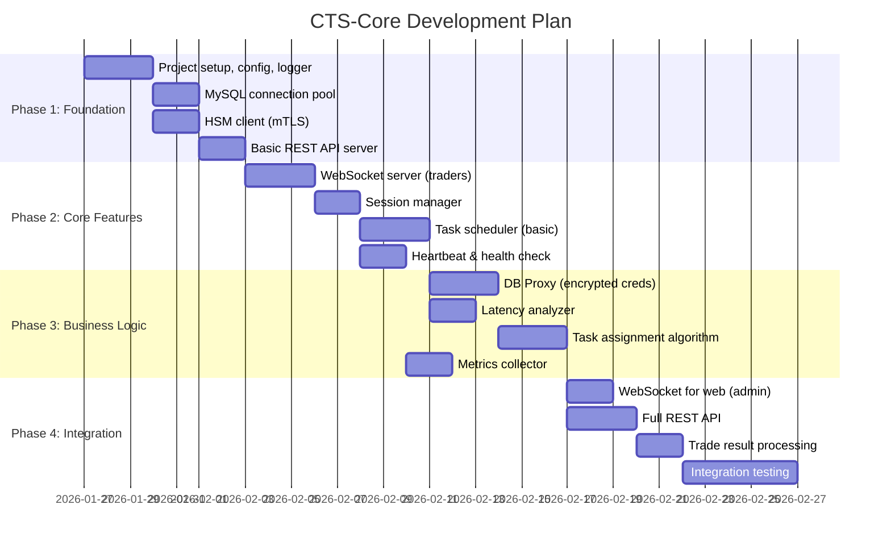
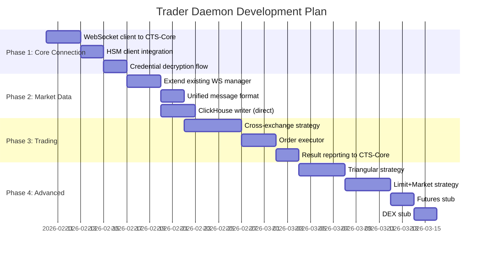
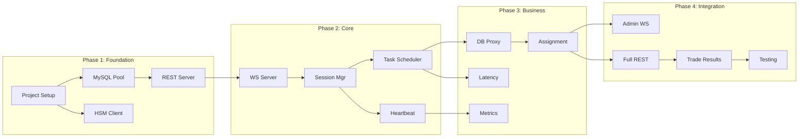

# CTS-Core & Trader Daemon Development Plan

> **Версия документа**: 1.0.0  
> **Дата**: 2026-01-26  
> **Статус**: Готов к реализации  
> **Связанные документы**: [ARCHITECTURE.md](ARCHITECTURE.md), [CONTEXT.md](CONTEXT.md)

---

## 1. Обзор

Этот документ содержит план разработки для двух основных компонентов:
- **CTS-Core** — центральный оркестратор
- **Trader Daemon** — торговые демоны

---

## 2. Этапы разработки CTS-Core



---

## 3. Этапы разработки Trader Daemon

> **Примечание:** daemon2 уже имеет базовую структуру в `/other-sub-system/daemon2/`



---

## 4. Фазы CTS-Core (Детально)

| Фаза | Компонент | Описание | Приоритет |
|------|-----------|----------|-----------|
| **1.1** | Project Setup | go.mod, config, logger (как в hsm-service) | 🔴 Critical |
| **1.2** | MySQL Pool | Connection pool с retry, mTLS | 🔴 Critical |
| **1.3** | HSM Client | mTLS client для hsm-service | 🔴 Critical |
| **1.4** | REST Server | Gin/Echo, /health, /metrics | 🔴 Critical |
| **2.1** | WS Server | WebSocket для трейдеров, gorilla/websocket | 🔴 Critical |
| **2.2** | Session Mgr | Регистрация, heartbeat, disconnect handling | 🔴 Critical |
| **2.3** | Task Scheduler | Загрузка TRADE из БД, базовое распределение | 🔴 Critical |
| **2.4** | Heartbeat | Ping/pong, timeout detection | 🟡 High |
| **3.1** | DB Proxy | Передача encrypted credentials | 🔴 Critical |
| **3.2** | Latency | Periodic latency tests, scoring | 🟡 High |
| **3.3** | Task Assign | Algorithm: latency + load balancing | 🟡 High |
| **3.4** | Metrics | Prometheus, сбор метрик с трейдеров | 🟢 Medium |
| **4.1** | Admin WS | WebSocket для www-go | 🟡 High |
| **4.2** | Full REST | CRUD для trades, status, statistics | 🟡 High |
| **4.3** | Trade Results | Обработка результатов, запись в БД | 🔴 Critical |
| **4.4** | Integration | E2E тесты, stress tests | 🟡 High |

---

## 5. Структура проекта CTS-Core

```
cts-core/
├── cmd/
│   └── cts-core/
│       └── main.go                 # Entry point
│
├── internal/
│   ├── config/                     # Configuration
│   │   ├── config.go
│   │   ├── types.go
│   │   └── config_test.go
│   │
│   ├── logger/                     # Logging (как в daemon2)
│   │   └── logger.go
│   │
│   ├── db/                         # Database layer
│   │   ├── mysql.go                # MySQL connection pool
│   │   ├── repository.go           # Repository pattern
│   │   └── models/                 # DB models
│   │       ├── trade.go
│   │       ├── exchange_account.go
│   │       ├── trader_session.go
│   │       └── arbitrage_trans.go
│   │
│   ├── hsm/                        # HSM client
│   │   ├── client.go               # mTLS client
│   │   └── types.go
│   │
│   ├── api/                        # API layer
│   │   ├── server.go               # HTTP server setup
│   │   ├── rest/                   # REST handlers
│   │   │   ├── health.go
│   │   │   ├── traders.go
│   │   │   ├── trades.go
│   │   │   └── stats.go
│   │   └── ws/                     # WebSocket handlers
│   │       ├── trader_handler.go   # WS for traders
│   │       ├── admin_handler.go    # WS for web admin
│   │       └── protocol.go         # Message types
│   │
│   ├── session/                    # Session management
│   │   ├── manager.go              # Session manager
│   │   ├── trader.go               # Trader session
│   │   └── heartbeat.go
│   │
│   ├── scheduler/                  # Task scheduling
│   │   ├── scheduler.go            # Main scheduler
│   │   ├── task.go                 # Task types
│   │   ├── assignment.go           # Assignment algorithm
│   │   └── latency.go              # Latency analyzer
│   │
│   ├── metrics/                    # Metrics collection
│   │   ├── collector.go
│   │   └── prometheus.go
│   │
│   └── state/                      # State management
│       └── state.go                # Persistent state
│
├── conf/
│   ├── config.yaml                 # Main config
│   └── config.example.yaml
│
├── pki/                            # Certificates
│   ├── ca/
│   ├── server/
│   └── client/
│
├── scripts/
│   └── init.sh
│
├── Dockerfile
├── docker-compose.yml
├── go.mod
├── go.sum
├── Makefile
└── README.md
```

---

## 6. Следующие шаги

⚠️ **ВАЖНО: См. [BEFORE_START.md](BEFORE_START.md) - критические вопросы требуют решения ПЕРЕД началом**

1. ✅ **Утверждение архитектуры** — см. [ARCHITECTURE.md](ARCHITECTURE.md)
2. 🔴 **Phase 0.5: Architecture Hardening** (1-2 недели) — БЛОКЕР
   - Решение всех вопросов из BEFORE_START.md
   - SQL migrations для TRADER, MONITOR_PAIR, EXCHANGE_LIMITS
   - Финализация API specification
   - State management design
3. ⏳ **Создание скелета проекта** — базовая структура CTS-Core
4. ⏳ **Phase 1 реализация** — config, logger, MySQL, HSM client
5. ⏳ **Параллельно**: Обновление daemon2 для работы с CTS-Core

---

## 7. Зависимости между компонентами



---

*Документ обновляется по мере прогресса разработки*
