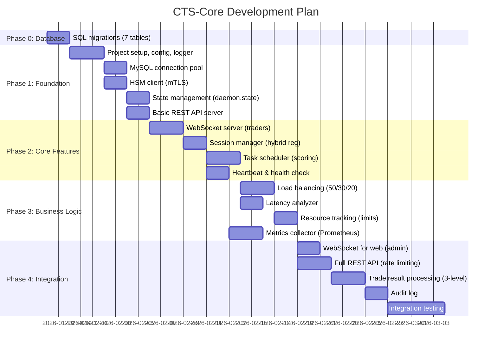
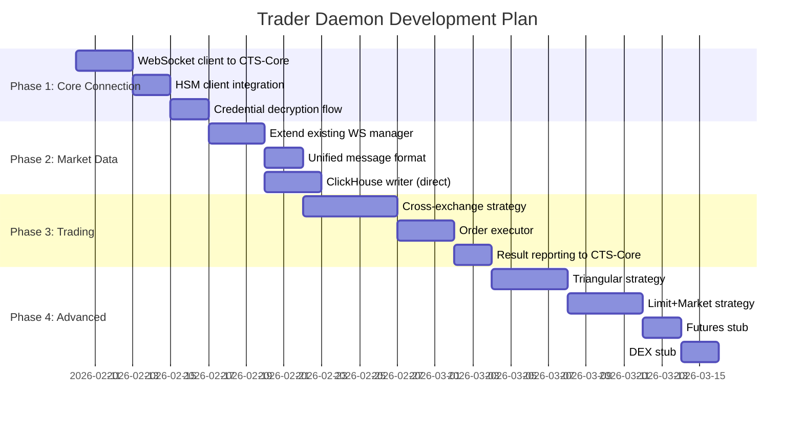
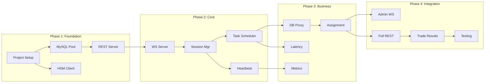

# CTS-Core & Trader Daemon Development Plan

> **Версия документа**: 1.1.0  
> **Дата**: 2026-01-28  
> **Статус**: Готов к реализации (все архитектурные решения приняты)  
> **Связанные документы**: [ARCHITECTURE.md](ARCHITECTURE.md), [CONTEXT.md](CONTEXT.md), [API_SPECIFICATION.md](API_SPECIFICATION.md)

---

## 1. Обзор

Этот документ содержит план разработки для двух основных компонентов:
- **CTS-Core** — центральный оркестратор
- **Trader Daemon** — торговые демоны

**ВАЖНО:** Все архитектурные блокеры закрыты (9/9), можно начинать Phase 1.

---

## 2. Этапы разработки CTS-Core



---

## 3. Этапы разработки Trader Daemon

> **Примечание:** daemon2 уже имеет базовую структуру в `/other-sub-system/daemon2/`



---

## 4. Фазы CTS-Core (Детально)

### Phase 0: Database Schema (НАЧАТЬ ЗДЕСЬ)

| Задача | Описание | Приоритет | Время |
|--------|----------|-----------|-------|
| **0.1** | CREATE TABLE TRADER | Регистрация трейдеров (admin pre-registration) | 🔴 Critical | 1h |
| **0.2** | CREATE TABLE TRADER_SESSION | История подключений (7 days retention) | 🔴 Critical | 1h |
| **0.3** | ALTER TABLE MONITORING | Добавить поля назначения (trader_id, assigned_at) | 🔴 Critical | 30m |
| **0.4** | CREATE TABLE EXCHANGE_LIMITS | Лимиты бирж (orders/volume per day) | 🔴 Critical | 1h |
| **0.5** | CREATE TABLE TRADER_EXCHANGE_RESOURCE | Использование ресурсов трейдером | 🔴 Critical | 1h |
| **0.6** | CREATE TABLE ARBITRAGE_ORDER | Ордера на биржах (средний уровень) | 🔴 Critical | 1h |
| **0.7** | CREATE TABLE ORDER_TRANSACTION | Fills/partials (нижний уровень) | 🔴 Critical | 1h |
| **0.8** | CREATE TABLE AUDIT_LOG | Для Phase 2, можно отложить | 🟢 Medium | 30m |

**Итого:** ~7 часов работы

### Phase 1: Foundation

| Фаза | Компонент | Описание | Приоритет | Время |
|------|-----------|----------|-----------|-------|
| **1.1** | Project Setup | go.mod, config.yaml, logger (zerolog hybrid) | 🔴 Critical | 1d |
| **1.2** | MySQL Pool | Connection pool с retry, mTLS | 🔴 Critical | 2d |
| **1.3** | HSM Client | mTLS client для hsm-service | 🔴 Critical | 2d |
| **1.4** | State Management | daemon.state (local file) + MySQL sync | 🔴 Critical | 2d |
| **1.5** | REST Server | Gin, /health, /metrics (Prometheus) | 🔴 Critical | 2d |

**Архитектурные решения реализованы:**
- Config: DEV (text logs, debug), PROD (JSON logs, info)
- State: Local file primary, MySQL secondary
- Retry policies: exponential backoff (API: 5 retry, DB: 3 retry)
- Error codes: 27 стандартизированных

### Phase 2: Core Features

| Фаза | Компонент | Описание | Приоритет | Время |
|------|-----------|----------|-----------|-------|
| **2.1** | WS Server | WebSocket для трейдеров, gorilla/websocket | 🔴 Critical | 3d |
| **2.2** | Session Mgr | Гибридная регистрация (admin + auto-connect) | 🔴 Critical | 2d |
| **2.3** | Task Scheduler | Scoring алгоритм (Latency 50%, Load 30%, Resources 20%) | 🔴 Critical | 3d |
| **2.4** | Heartbeat | Ping/pong, timeout detection (5s interval, 15s timeout) | 🟡 High | 2d |

**Timeout values:**
- heartbeat_interval: 5s
- heartbeat_timeout: 15s (3 missed)
- grace_period: 60s
- failover_timeout: 60s

### Phase 3: Business Logic

| Фаза | Компонент | Описание | Приоритет | Время |
|------|-----------|----------|-----------|-------|
| **3.1** | Load Balancing | Scoring implementation (без региона, 3 фактора) | 🔴 Critical | 3d |
| **3.2** | Latency Analyzer | Periodic latency tests, caching | 🟡 High | 2d |
| **3.3** | Resource Tracking | TRADER_EXCHANGE_RESOURCE, лимиты проверки | 🟡 High | 2d |
| **3.4** | Scheduler Tasks | Background jobs (cleanup, re-encryption check) | 🟡 High | 2d |
| **3.5** | HSM Key Rotation | Re-encryption job processor (CRITICAL для production) | 🔴 Critical | 3d |
| **3.6** | Metrics | Prometheus exporter (20+ метрик), /metrics endpoint | 🟡 High | 3d |
| **3.7** | Logging | Zerolog integration (hybrid format) | 🟡 High | 1d |

**Metrics (20+):**
- Core: active_traders, tasks_assigned, websocket_connections
- Scheduler: queue_size, assignment_latency, failures
- Arbitrage: opportunities, executed, profit, latency
- Traders: cpu, memory, active_tasks, orders_per_second
- System: goroutines, memory, cpu

**HSM Key Rotation (3.5):**
- Check for new KEK versions via HSM API
- Create REENCRYPTION_JOBS when detected
- Batch re-encryption (100 records/batch, 100ms delay)
- Progress tracking per-record
- Admin API: POST /api/v1/admin/reencryption/initiate
- Safety: rollback capability, failed records retry

### Phase 4: Integration

| Фаза | Компонент | Описание | Приоритет | Время |
|------|-----------|----------|-----------|-------|
| **4.1** | Admin WS | WebSocket для www-go | 🟡 High | 2d |
| **4.2** | Full REST | CRUD для trades, status, rate limiting (1000 req/min) | 🟡 High | 3d |
| **4.3** | Trade Results | Обработка trade.result с 3-level структурой | 🔴 Critical | 3d |
| **4.4** | Audit Log | JSON файл primary (logs/audit.log) | 🟢 Medium | 2d |
| **4.5** | Integration | E2E тесты, stress tests | 🟡 High | 5d |

**Trade result processing:**
1. INSERT/UPDATE ARBITRAGE_TRANS
2. INSERT ARBITRAGE_ORDER (per exchange)
3. INSERT ORDER_TRANSACTION (per fill/partial)
4. Deduplication via UNIQUE constraints

**Rate limiting:**
- REST: 1000 req/min per IP (token bucket)
- WebSocket: 10000 msg/min per connection
- Library: github.com/ulule/limiter/v3

---

## 5. Структура проекта CTS-Core

```
cts-core/
├── cmd/
│   └── cts-core/
│       └── main.go                 # Entry point
│
├── internal/
│   ├── config/                     # Configuration
│   │   ├── config.go
│   │   ├── types.go
│   │   └── config_test.go
│   │
│   ├── logger/                     # Logging (как в daemon2)
│   │   └── logger.go
│   │
│   ├── db/                         # Database layer
│   │   ├── mysql.go                # MySQL connection pool
│   │   ├── repository.go           # Repository pattern
│   │   └── models/                 # DB models
│   │       ├── trade.go
│   │       ├── exchange_account.go
│   │       ├── trader_session.go
│   │       └── arbitrage_trans.go
│   │
│   ├── hsm/                        # HSM client
│   │   ├── client.go               # mTLS client
│   │   └── types.go
│   │
│   ├── api/                        # API layer
│   │   ├── server.go               # HTTP server setup
│   │   ├── rest/                   # REST handlers
│   │   │   ├── health.go
│   │   │   ├── traders.go
│   │   │   ├── trades.go
│   │   │   └── stats.go
│   │   └── ws/                     # WebSocket handlers
│   │       ├── trader_handler.go   # WS for traders
│   │       ├── admin_handler.go    # WS for web admin
│   │       └── protocol.go         # Message types
│   │
│   ├── session/                    # Session management
│   │   ├── manager.go              # Session manager
│   │   ├── trader.go               # Trader session
│   │   └── heartbeat.go
│   │
│   ├── scheduler/                  # Task scheduling
│   │   ├── scheduler.go            # Main scheduler
│   │   ├── task.go                 # Task types
│   │   ├── assignment.go           # Assignment algorithm
│   │   └── latency.go              # Latency analyzer
│   │
│   ├── metrics/                    # Metrics collection
│   │   ├── collector.go
│   │   └── prometheus.go
│   │
│   └── state/                      # State management
│       └── state.go                # Persistent state
│
├── conf/
│   ├── config.yaml                 # Main config
│   └── config.example.yaml
│
├── pki/                            # Certificates
│   ├── ca/
│   ├── server/
│   └── client/
│
├── scripts/
│   └── init.sh
│
├── Dockerfile
├── docker-compose.yml
├── go.mod
├── go.sum
├── Makefile
└── README.md
```

---

## 6. Следующие шаги

✅ **Архитектура готова - все решения приняты и задокументированы**

1. ✅ **Архитектура завершена** — см. [ARCHITECTURE.md](ARCHITECTURE.md) (25 Phase 1 решений)
2. ✅ **Phase 0: Database Migrations** (ТЕКУЩАЯ)
   - ✅ SQL migrations созданы (migrations/001_phase1_schema.sql)
   - ⏳ Применить миграции: `mysql < migrations/001_phase1_schema.sql`
   - ⏳ Проверить создание 11 таблиц
3. ⏳ **Создание скелета проекта** — базовая структура CTS-Core (Phase 1.1)
4. ⏳ **Phase 1 реализация** — config, logger, MySQL, HSM client
5. ⏳ **Параллельно**: Обновление daemon2 для работы с CTS-Core

---

## 7. Зависимости между компонентами



---

*Документ обновляется по мере прогресса разработки*
